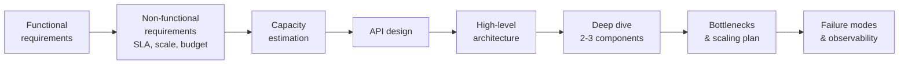

# 00 · What is HLD & Napkin Math

## TL;DR
- **HLD is not box-drawing.** It is *defending trade-offs under explicit constraints*. Interviewers and design reviewers grade on *why you picked X over Y*, not on the diagram.
- **Napkin math exists because the wrong mental model about latency/throughput ships wrong architectures.** You cannot intuit whether "cache it in Redis" is worth it without knowing SSD is ~100× slower than RAM and same-DC RTT ~500µs.
- **Memorize ~10 latency numbers.** Every capacity estimate decomposes into them + a multiplication.
- **Always state assumptions.** In an interview, stating `DAU = 100M, peak = 3× avg, read:write = 100:1` earns half the credit before you write one number.
- **Goal of napkin math = order of magnitude, not exactness.** "~1 PB/year, therefore single node is out" beats "exactly 932 TB" every time.

---

## Why it exists

**The history, in three acts.**

**Act 1 — Pre-2005: design ≈ language + framework choice.** If your workload fit on one machine (and most did), "design" meant picking MySQL or Oracle, Java or PHP. "Scalability" meant buying a bigger box — vertical scaling. There was no widespread need for distributed-systems reasoning because the internet's top sites ran on a handful of servers.

**Act 2 — 2004–2010: Google's paper trilogy detonates.** GFS (2003), MapReduce (2004), Bigtable (2006), Dynamo (Amazon, 2007), and the Chubby/Paxos papers made distributed architectures mainstream. Suddenly every mid-stage startup had to decide: shard? replicate? eventually consistent? Engineers trained on single-box systems started shipping obviously broken designs — e.g., "just cache everything in memcached" without realizing cross-DC RTT made the cache slower than the DB for some workloads.

**Act 3 — Jeff Dean's "Numbers Everyone Should Know" (Stanford talk, ~2009–2011).** Dean gave a now-legendary talk arguing that *every* engineer at scale must reason in orders of magnitude: L1 vs RAM vs SSD vs network, locally vs cross-DC. The talk became canon because it showed concretely that the same algorithm is *200× faster* with one choice vs another, and choosing blindly is how you build systems that appear to work in staging and melt at prod scale.

**Why it persists in interviews.** Top-tier tech companies learned the hard way that engineers who can't do this math ship architectures that look plausible and fail at 10× load. The design round exists specifically to filter for engineers who reason about constraints, not engineers who recite vocabulary.

---

## Mental model

Think of HLD as **structural reasoning under explicit constraints**, decomposed into a repeatable 6-step loop:

```
Requirements   →   Capacity   →   Components   →   Trade-offs   →   Bottlenecks   →   Evolution
   (what)         (how much)      (which tools)    (why these)     (what breaks)   (how scales)
```

**Napkin math is Fermi estimation for engineers.** Fermi famously asked students "how many piano tuners in Chicago?" with no data. The technique: decompose into factors you *can* estimate, multiply, get an order-of-magnitude answer. Same here: you don't know Twitter's exact QPS, but you can estimate `500M DAU × 5 tweets read/day × 3 peak multiplier / 86400s` in your head.

**Every distributed-systems decision collapses to three dimensions:**
- **Latency** — how long a single op takes
- **Throughput** — how many ops per second
- **Cost** — `$`/op or `$`/GB

Storage vs compute vs network: every component you pick buys you one at the expense of the others.

---

## How it works (internals)

### 1. Latency numbers every engineer should know (modernized for ~2025 hardware)

| Operation | Time | Scaled (1 cycle = 1 second) |
|---|---|---|
| L1 cache reference | **0.5 ns** | 0.5 s |
| Branch mispredict | 5 ns | 5 s |
| L2 cache reference | 7 ns | 7 s |
| Mutex lock/unlock | 25 ns | 25 s |
| Main memory reference | **100 ns** | ~2 minutes |
| Compress 1KB (Snappy/Zstd) | 2 µs | 33 minutes |
| Send 1KB over 10Gbps NIC | ~1 µs | 16 minutes |
| Read 1MB sequentially from RAM | 250 µs | ~3 days |
| **SSD random read (NVMe)** | **~15–100 µs** | ~4 hours–1 day |
| **Round trip same DC** | **~500 µs** | ~6 days |
| Read 1MB sequentially from SSD | ~1 ms | ~12 days |
| **HDD seek** | **~10 ms** | ~4 months |
| Round trip US-coast-to-coast | ~70 ms | ~2 years |
| **Round trip cross-continent (US ↔ EU)** | **~150 ms** | ~5 years |

**Distilled rules of thumb you must burn into muscle memory:**
- RAM is ~**100×** faster than SSD
- SSD is ~**100×** faster than HDD seek
- Same-DC RTT (~500µs) is **~100×** slower than SSD read — **network dominates everything**
- Cross-continent RTT (~150ms) is **~300×** slower than same-DC

**Why this matters for design:** When someone proposes "just replicate synchronously across 3 regions for strong consistency" — you should immediately translate that to "every write now costs 150ms per RTT × however many rounds of consensus, so p99 write latency is ≥450ms, which violates your <100ms SLA."

### 2. QPS (queries per second) estimation

The canonical decomposition:

```
QPS_avg  = DAU × actions_per_user_per_day / 86,400 seconds
QPS_peak = QPS_avg × peak_multiplier
```

**Peak multipliers you should default to** (state these as assumptions):
- Consumer social app: **3×–5×** (traffic spikes at lunch / evening)
- Ride-hailing: **4×–10×** (Friday night surge, airport peaks)
- E-commerce: **10×–100×** (Black Friday, flash sales)
- B2B SaaS: **2×** (business hours, flatter curve)

**Read:write ratios** — memorize the archetypes:
| System | R:W ratio | Why |
|---|---|---|
| Twitter / Instagram feed | ~100:1 | Tiny % of users post; everyone scrolls |
| Google Search | ~1000:1+ | Index built offline; reads dominate |
| Payment / banking | ~1:1 | Every read needs a write trail |
| Chat (WhatsApp) | ~1:1 | You read what others wrote; roughly symmetric |
| Uber request dispatch | ~10:1 | Rider polls location updates; driver publishes position |

**Worked example — sizing Twitter reads:**
- DAU = 500M (public figure)
- Each user opens app 3×/day, loads 50 tweets each time → 150 tweets read/day/user
- Avg QPS: `500M × 150 / 86400 ≈ 870K reads/s`
- Peak 3×: **~2.6M reads/s**
- Writes (100:1 ratio): ~26K writes/s peak

You don't need the real Twitter numbers — the *discipline of decomposing* is the deliverable.

### 3. Storage estimation

```
Storage/year = records_per_second × seconds_per_year × bytes_per_record × replication_factor × (1 + index_overhead)
```

Key constants:
- Seconds per year ≈ **31.5M** (3 × 10⁷ is the common shortcut)
- Default replication factor: **3** (matches HDFS, Cassandra, most clouds' default)
- Index overhead: **30–50%** for B-tree indexes on typical workloads
- Compression ratio: **2–5×** for text/JSON, ~1× for already-compressed media

**Worked example — a URL shortener's storage:**
- 100M new URLs/day = ~1160 writes/s
- Record ≈ 500 bytes (short code + long URL + metadata)
- Raw: `100M × 500B × 365 = 18.3 TB/year`
- With 3× replication + 30% index: `18.3 × 3 × 1.3 ≈ 71 TB/year`
- Conclusion: fits comfortably on a sharded SQL or DynamoDB setup. Doesn't need HDFS.

### 4. Bandwidth estimation

```
Bandwidth = QPS × avg_payload_size  (per direction: ingress and egress)
```

**Critical unit trap — commit this to memory:**
- **1 Gbps = 125 MB/s**, not 1 GB/s. (Network is measured in bits; storage in bytes; 1 byte = 8 bits.)
- 10 Gbps (typical modern server NIC) = 1.25 GB/s
- 100 Gbps (spine switches, high-end) = 12.5 GB/s

**Worked example — video streaming egress:**
- Netflix serves ~250M subs, peak ~80M concurrent streams (guesstimate; real number is on public record around this range)
- HD stream ≈ 5 Mbps
- Peak egress: `80M × 5 Mbps = 400 Tbps = 50 TB/s`
- Conclusion: no single DC can serve this. **This is why Netflix built Open Connect** — their CDN appliances are co-located inside ISPs.

### 5. Java: a tiny capacity calculator

When code helps, it helps. Here's the skeleton you'd riff on in a coding-adjacent design round:

```java
public record CapacityEstimate(
        long qpsAvg,
        long qpsPeak,
        long storagePerYearBytes,
        long bandwidthBytesPerSec) {

    public static CapacityEstimate of(
            long dailyActiveUsers,
            double actionsPerUserPerDay,
            double peakMultiplier,
            int bytesPerRecord,
            int replicationFactor,
            double indexOverhead) {

        long qpsAvg = (long) (dailyActiveUsers * actionsPerUserPerDay / 86_400);
        long qpsPeak = (long) (qpsAvg * peakMultiplier);
        long storagePerYear = (long) (qpsAvg * 31_536_000L
                * bytesPerRecord * replicationFactor * (1 + indexOverhead));
        long bandwidth = qpsPeak * bytesPerRecord;
        return new CapacityEstimate(qpsAvg, qpsPeak, storagePerYear, bandwidth);
    }
}
```

Use this mentally, not literally in the interview — but the structure is what you want to reproduce on the whiteboard.

### 6. The "design loop" visualized



Every design round at every top-tier company follows some variant of this. If you can't produce the capacity numbers (step C), every decision downstream is unmoored.

---

## Trade-offs

| Dimension | Napkin math (estimate) | Precise load testing |
|---|---|---|
| Speed | Minutes | Days–weeks |
| Accuracy | Order of magnitude | Within 10% |
| When useful | Early design, interviews, proposals | Final capacity planning, SRE runbooks |
| Cost | Free | Infra + engineer time |
| Risk | Over/under-provision by 2–3× | Very low, but slow |

| HLD granularity | Too shallow | Too deep |
|---|---|---|
| Symptom | "Use Kafka and Redis" with no numbers | Debating Kafka page cache settings before picking a DB |
| Signal | You can't answer "why not SQS?" | You missed the 30-min mark with no architecture diagram |
| Interview outcome | Fail — no reasoning | Fail — can't prioritize |

---

## When to use / avoid

**Use napkin math when:**
- Scoping a new system before any code exists
- Sanity-checking a proposal ("this needs 100 Cassandra nodes" → does the write load actually justify it?)
- Design interviews — **every single time**
- Explaining to a PM why feature X is technically infeasible on current infra

**Avoid (or distrust the result) when:**
- Doing final capacity planning for prod — always load test, never ship on napkin math alone
- Modeling highly bursty / long-tailed workloads (e.g., hot-key effects in social media) — averages lie
- Workloads where cache hit ratio is the dominant variable — tiny changes in hit ratio blow estimates up by 10×

---

## Real-world examples

- **Jeff Dean at Google** popularized latency numbers in a Stanford talk and has publicly cited using them to veto a proposed design that assumed main-memory-speed access to data that was actually on SSD — the proposal was 200× off.
- **Jay Kreps at LinkedIn (2011)** sized the original Kafka deployment using napkin math on LinkedIn's activity-stream event volumes. The numbers drove the "log-structured, append-only, partitioned" design — a queue would not have kept up, so they built a log. (See *I Heart Logs* / Kafka's design docs.)
- **Uber's DISCO matching service** has publicly discussed that early designs put all active rider/driver state in a single Redis instance. Napkin math on peak concurrent rides (~hundreds of thousands at rush hour) × geo-grid cells showed this wouldn't fit; they moved to sharded Redis keyed by geospatial S2 cells. The math forced the redesign.
- **Netflix Open Connect** — as shown above, the napkin math on peak egress bandwidth makes it mathematically impossible to serve from AWS alone; ergo the ISP-co-located appliance strategy.
- **Amazon Dynamo paper (2007)** opens with capacity numbers: millions of ops/s, 99.9th percentile SLA. Every design decision in the paper is justified against those numbers. This is the template for how principal-level engineers write design docs.

---

## Common mistakes

- **Bits vs bytes confusion.** 1 Gbps ≠ 1 GB/s. Off by 8×. This mistake in an interview is an instant red flag.
- **Averaging when you need peak.** "QPS is 10K/s" — averaged over 24 hours. At peak it may be 50K/s. Components must be sized for peak, not average, or they fail exactly when users are watching.
- **Forgetting replication factor.** Storage estimates that ignore 3× replication are 67% undersized.
- **Ignoring the long tail.** Averages hide p99 latency blow-ups. A system with 10ms avg latency may have 500ms p99 under load.
- **Picking a component before doing the math.** "We'll use Cassandra" → interviewer: "why not Postgres?" → you have no answer because you skipped capacity estimation.
- **Over-engineering.** If the workload is 100 writes/s, a single Postgres instance is fine. Proposing Kafka+Cassandra+Spark is a red flag — it shows you're resume-driven, not requirements-driven.
- **Under-stating assumptions.** "500M DAU" without saying "I'm assuming Twitter-scale" — the interviewer will follow up with "what if it's 5M instead?" If you haven't framed your assumption explicitly, you flounder.

---

## Interview insights

**How this shows up in design rounds:**
- **First 5 minutes of every design round are this topic.** "Let's estimate the QPS, storage, bandwidth." If you skip this step, senior interviewers mark you down before you've drawn anything.
- Expect interviewer to challenge numbers: *"Where did 500M DAU come from?"* — correct response is *"I'm assuming X because Y; if it's actually Z, the design changes in this way [...]"*.

**Follow-ups interviewers love:**
- *"What's the ratio of peak to average? How did you get that number?"*
- *"If the read:write ratio flipped to 1:1, what breaks first?"*
- *"Give me the p99 latency budget — how do you spend it?"* (Answer: DNS + TLS + LB + app + DB + network RTT, each ~Xms.)
- *"What's the bandwidth on the write path if you do 3-region sync replication?"*

**Red flags to avoid saying:**
- *"Let's just use Cassandra."* → Without capacity math first.
- *"It'll scale horizontally."* → Every distributed system "scales horizontally" until it doesn't (coordinator bottleneck, hot shard, etc.). Be specific.
- *"A few million users."* → Vague; always convert to QPS.
- *"We'll cache it."* → Cache hit ratio? Invalidation strategy? What's the memory budget?

**What "interview-ready" looks like on this topic:**
You can, in under 3 minutes, take "Design Twitter" and produce:
- DAU assumption (stated explicitly)
- Peak QPS for reads and writes
- Storage/year with replication
- Peak egress bandwidth
- One sentence of implication per number ("so we need sharded storage" / "so we need a CDN")

---

## Related topics

- **01 · Networking primer** — latency numbers above are half the story; protocol overheads (TCP handshake, TLS, HTTP/2 multiplexing) are the other half.
- **05 · Partitioning & sharding** — capacity estimates drive the decision of whether to shard.
- **06 · CAP / PACELC** — latency numbers make the L in PACELC concrete.
- **All case studies** start with this loop. Treat this as a subroutine, not a one-time topic.

---

## Further reading

- **Jeff Dean — "Designs, Lessons and Advice from Building Large Distributed Systems"** (Stanford / LADIS talk slides). The source of the latency-numbers canon.
- **"Latency Numbers Every Programmer Should Know"** — Colin Scott's interactive version (colin-scott.github.io/personal_website/research/interactive_latency.html); shows how numbers have evolved by year.
- **Amazon Dynamo paper (2007)** — for how principal engineers use napkin math to justify design. Read the intro and capacity sections closely.
- **"Designing Data-Intensive Applications" — Martin Kleppmann**, Ch. 1 (Reliable, Scalable, Maintainable). The modern textbook treatment.
- **Google SRE Book**, Ch. 4 — "Service Level Objectives." How the numbers become SLAs become design constraints.
