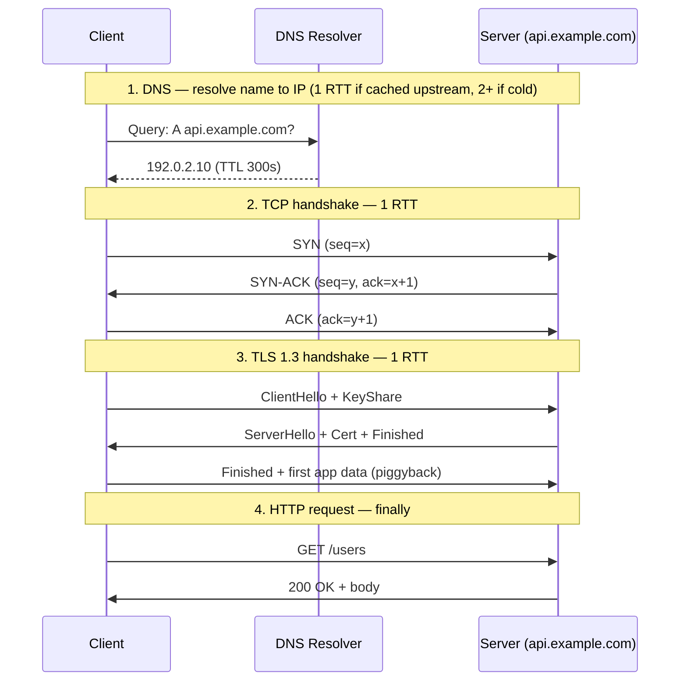
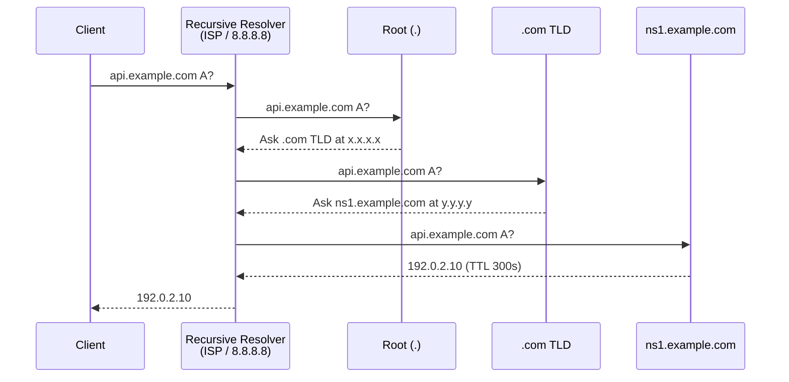

# 01 · Networking Primer — Part 1: TCP + DNS + TLS

> **Session sequence (announced upfront):**
> - **Part 1 (this note):** TCP + DNS + TLS — the connection-setup foundation. Everything else builds on this.
> - **Part 2 (next):** HTTP/1.1 → HTTP/2 → HTTP/3 / QUIC — head-of-line blocking, multiplexing, and why the stack keeps re-inventing itself.
> - **Part 3 (after):** gRPC, WebSocket, SSE, long-polling — how real-time systems keep connections alive in production.

---

## TL;DR

- **Every HTTP request is the tip of an iceberg.** Before your app sends 1 byte, you pay: 1× DNS (1–2 RTTs) + 1× TCP handshake (1 RTT) + 1× TLS handshake (1–2 RTTs). First request to a new host costs **3–5 RTTs**, i.e., ~450ms–750ms cross-continent before any data moves.
- **Connection reuse is the whole point.** A well-configured client pools TCP/TLS connections so the second request costs ~0 RTTs of setup. If you're paying 3+ RTTs on *every* request, your architecture is broken — not your network.
- **DNS is multi-layer cached infrastructure, not a "lookup."** TTL is a tunable between freshness and resilience. Set it too low and you DDoS your resolver; too high and failover takes hours. The 2016 Dyn attack took down Twitter/Netflix/Reddit because DNS is the internet's single most fragile layer.
- **TCP's guarantee (reliable, ordered byte stream) has a dark side:** head-of-line blocking. One lost packet stalls every higher-layer stream sharing that TCP connection. This is *the* reason QUIC/HTTP/3 exists.
- **TLS is no longer optional, but not free either.** TLS 1.3 (2018) cut the handshake from 2 RTTs to 1 RTT (and 0-RTT with session resumption, with replay caveats). If you're still on TLS 1.2, you're paying a full RTT extra on every new connection.

---

## Why it exists

**TCP (1974, Cerf & Kahn).** ARPANET's original protocols (NCP) assumed the network was reliable. When packet loss showed up in the real world, they needed a protocol that could **pretend the network is reliable, even when it isn't.** TCP is that abstraction: reliable, ordered, byte-stream delivery over an unreliable packet network (IP). Every reliability property you take for granted — retransmission, ACKs, ordering, flow control, congestion control — was bolted into TCP because IP offered none of them.

**DNS (1983, Paul Mockapetris).** Before DNS, every host on the internet maintained a `HOSTS.TXT` file listing every other host, distributed via FTP from a single machine at SRI. Obviously this stopped scaling at ~a few hundred hosts. Mockapetris's insight: **make name resolution hierarchical and cacheable** so no single server has to know about every host, and so repeated lookups amortize across a cache. DNS is the first at-scale distributed system the internet ran on, and virtually every design pattern you'll learn (hierarchical partitioning, TTL-based caching, anycast) has DNS lineage.

**TLS (1999, originally SSL by Netscape in 1994).** E-commerce was impossible on an internet where anyone on the path could read credit card numbers. SSL/TLS retrofits confidentiality, integrity, and authentication onto TCP — without changing the sockets API. The reason TLS sits *above* TCP (not inside it) is pragmatic: it could be rolled out incrementally, one app at a time, without rewriting the kernel. That layering choice is also why the handshake costs extra RTTs — you can't avoid setting up TCP first, then negotiating TLS on top.

The pattern across all three: **protocols get designed around the constraints of their era, then accumulate retrofits for concerns (security, performance, mobility) that didn't exist at v1.** Today's QUIC and HTTP/3 are exactly the next iteration.

---

## Mental model

When your browser fetches `https://api.example.com/users`, walk this timeline (cross-continent RTT = 150ms assumed):



**Budget math with 150ms RTT:**

| Step | RTTs | Cost |
|---|---|---|
| DNS (uncached upstream) | 1–2 | 150–300 ms |
| TCP handshake | 1 | 150 ms |
| TLS 1.3 handshake | 1 | 150 ms |
| HTTP request + response | 1 | 150 ms |
| **Total first request** | **4–5** | **~600–750 ms** |

**The second request on the same pooled connection:**

| Step | RTTs | Cost |
|---|---|---|
| DNS | 0 (cached) | 0 ms |
| TCP / TLS | 0 (reused) | 0 ms |
| HTTP request + response | 1 | 150 ms |
| **Total** | **1** | **~150 ms** |

**This is the single most important thing to internalize about networking:** connection setup is expensive, connection reuse is free. Every production client should pool. If you've ever `curl`ed an API in a loop without keep-alive and wondered why it was slow — this is why.

---

## How it works — internals

### 1. TCP

**The 3-way handshake (setup):**

```
Client                    Server
  | ── SYN (seq=x) ──────────> |        (1) I want to talk, my seq starts at x
  | <─── SYN-ACK (seq=y,       |        (2) OK, my seq starts at y, I got your x
  |       ack=x+1) ─────────── |
  | ── ACK (ack=y+1) ────────> |        (3) Got it — connection established
```

After step 3, both sides have state: sequence numbers, receive buffers, congestion window. TCP is *stateful* at both endpoints — this is the core difference from UDP.

**Reliability mechanics:**
- Every byte has a sequence number
- Receiver sends cumulative ACKs ("I've received everything up to byte N")
- Missing bytes trigger retransmit (RTO timeout, or fast retransmit on 3 duplicate ACKs)
- Receive window flows back-pressure to sender (sliding window)

**Congestion control (this matters for capacity math):**
- **Slow start:** after connection open, congestion window starts at ~10 MSS (~14KB). Doubles every RTT until loss detected. Why your first kilobyte is fast but your first *megabyte* is slow — you're ramping.
- **AIMD (Additive Increase, Multiplicative Decrease):** on loss, halve the window, then grow linearly. This is Reno / CUBIC.
- **BBR (Google, 2016):** models bandwidth and RTT directly instead of treating loss as the congestion signal. Deployed widely at Google, increasingly elsewhere.
- **Why it matters:** a "1 Gbps link" doesn't give you 1 Gbps instantly; you ramp up over seconds. For short flows (a 10KB HTTP response), you may never leave slow start. This is why CDN edges reuse connections aggressively.

**Connection teardown — the hidden operational trap:**

```
A ──── FIN ───> B       "I'm done sending"
A <─── ACK ──── B
A <─── FIN ──── B       "I'm done too"
A ──── ACK ───> B
```

After sending the final ACK, the *initiator* (whoever closed first) enters **TIME_WAIT** for 2×MSL (Maximum Segment Lifetime, typically 60–120 seconds). The socket is not fully freed.

**Why this bites in production:** a service making outbound connections that close quickly (e.g., short-lived HTTP without keep-alive) can accumulate tens of thousands of sockets in `TIME_WAIT`, exhausting the ephemeral port range (default ~28K ports). Symptom: "cannot assign requested address" errors. Fix: connection pooling. This is a top-10 cause of "mysterious 5pm outages" in microservice architectures.

**TCP's dark side — head-of-line blocking:**

TCP delivers bytes *in order*. If one packet is lost mid-stream, everything arriving after it buffers on the receiver side until the retransmit fills the gap — even if the delayed bytes are independent of the lost ones. For a single-request flow, this is fine. For a connection **multiplexing many streams** (which is what HTTP/2 does), a single loss stalls *all* streams. This is the core motivation for QUIC (covered in Part 2).

### 2. DNS

**The hierarchy:**

```
                     . (root, 13 anycasted "letters": a.root-servers.net ... m.)
                    /         \
                 .com        .org        ...     (TLDs)
                /     \
          example.com   google.com                (authoritative servers)
         /     |      \
       www    api     mail                        (records)
```

**Query flow (cold cache):**



That's **4 round trips** on a cold miss. In practice, resolvers cache aggressively so most queries hit only the recursive resolver (1 RTT).

**Records that matter for HLD:**

| Record | Purpose |
|---|---|
| `A` | Name → IPv4 |
| `AAAA` | Name → IPv6 |
| `CNAME` | Name → another name (alias; extra lookup) |
| `MX` | Name → mail server |
| `TXT` | Arbitrary string (SPF, DKIM, domain verification) |
| `NS` | Which nameservers are authoritative for this zone |
| `SOA` | Zone metadata (serial, refresh intervals) |

**TTL — the single most consequential knob in DNS:**

- **High TTL (hours/days):** fewer queries (good for cost, resolver load), but **slow failover**. If your primary DC dies and you need to redirect via DNS, you wait for TTLs to expire globally. Cloudflare's 2020 outage postmortem called out DNS TTLs as part of the recovery timeline.
- **Low TTL (seconds):** fast failover, but every client re-resolves constantly. Your authoritative DNS infrastructure becomes a bottleneck, and you're vulnerable to DNS-layer DDoS (Dyn, 2016 — Mirai botnet knocked Dyn's DNS offline; because low-TTL-dependent services couldn't resolve, half the US internet went dark for hours).
- **Typical choice:** 60–300 seconds for production services, 3600+ for static assets.

**Why DNS mostly uses UDP (not TCP):**
- DNS responses are usually <512 bytes → one UDP packet, no handshake cost, no connection state.
- Fallback to TCP when responses exceed 512B (large records, DNSSEC signatures, zone transfers).
- DoH (DNS-over-HTTPS) and DoT (DNS-over-TLS) are recent privacy additions that run DNS *over* TCP+TLS — they fix the "ISP can snoop every DNS query" problem at the cost of connection setup overhead.

**Anycast — why 13 root servers can serve the whole planet:**
Root servers advertise the same IP from dozens of physical locations via BGP. Your packets route to the topologically-closest instance. Anycast gives you geographic distribution without application-layer load balancing — and it's exactly the same pattern CDNs use (covered in Phase 2).

### 3. TLS

**TLS 1.2 handshake (2 RTTs, still widespread):**

```
Client                                   Server
  |── ClientHello (cipher suites) ──────>|
  |<── ServerHello + Certificate ────────|
  |── ClientKeyExchange + Finished ─────>|
  |<── Finished ─────────────────────────|
  | (now symmetric encryption) |
```

**TLS 1.3 (2018) — the single biggest networking upgrade of the decade:**

```
Client                                   Server
  |── ClientHello + KeyShare ───────────>|
  |<── ServerHello + Cert + Finished ────|
  |── Finished + app data (piggyback) ──>|
```

Key changes in 1.3:
- Handshake is **1 RTT** (down from 2). Saves 150ms cross-continent per new connection.
- Removed every legacy cipher that had been broken (MD5, SHA-1 signing, RC4, static RSA, etc.) — the negotiation surface is drastically smaller.
- **0-RTT resumption:** if the client has seen this server before and has a valid PSK, it can send app data *with* the ClientHello. Zero handshake RTT. **Caveat:** 0-RTT data is vulnerable to replay attacks, so it must be used only for idempotent requests (think GET, not POST). Cloudflare's public defaults gate 0-RTT to GET.

**What actually happens in the handshake (mechanics):**
1. Client + server agree on a cipher suite (e.g., TLS_AES_256_GCM_SHA384).
2. They perform an **ephemeral Diffie-Hellman** key exchange, producing a shared symmetric key unknown to any passive observer.
3. Server proves identity via a **certificate** signed by a trusted CA. Client validates the full chain up to a root CA in its trust store.
4. Both sides derive session keys and switch to symmetric encryption (AES-GCM typically). From here, the expensive asymmetric crypto is done — symmetric crypto is extremely fast (GB/s on modern CPUs with AES-NI).

**Perfect Forward Secrecy (PFS):**
Because the session key comes from ephemeral DH, **even if the server's long-term private key leaks in the future**, past recorded sessions cannot be decrypted. The key was computed from ephemeral values that no longer exist. This is why every modern TLS config mandates ephemeral cipher suites and rejects the old static-RSA key exchange.

**SNI (Server Name Indication):**
TLS certificate selection happens *before* the application knows which vhost you want — because HTTP headers are encrypted. SNI is a plaintext field in ClientHello announcing "I'm trying to reach api.example.com, pick the right cert." **Security leak:** SNI is plaintext, so network observers can see which domain you're visiting even over HTTPS. **ESNI/ECH (Encrypted Client Hello)** is the in-flight fix — partially deployed, major browsers and Cloudflare support it.

---

## Trade-offs

| Dimension | TCP | UDP |
|---|---|---|
| Reliability | Guaranteed, ordered | None — app must implement |
| Setup | 1 RTT handshake | None |
| State | Per-connection at both ends | Stateless |
| HoL blocking | Yes (one loss stalls stream) | No (packets independent) |
| Use cases | HTTP, SSH, DBs, most of the web | DNS, video/voice real-time, QUIC, gaming |

| DNS TTL | Low (e.g. 60s) | High (e.g. 24h) |
|---|---|---|
| Failover speed | Fast | Slow (hours) |
| Resolver load | High | Low |
| DDoS resistance | Worse (authoritative hit more often) | Better |
| Typical use | Production apps with active failover | Static/rarely-changing infra |

| TLS version | 1.2 | 1.3 |
|---|---|---|
| Handshake RTTs | 2 | 1 (0 with resumption) |
| Cipher surface | Large, some legacy broken | Minimal, modern-only |
| Forward secrecy | Optional | Mandatory |
| Adoption (2024+) | ~20% of web | ~80% and rising |

---

## When to use / avoid

**Use TCP when:**
- You need reliability/ordering and can afford the handshake (most of the web)
- The workload has medium-to-long flows that amortize setup cost
- You can pool connections

**Reach for UDP when:**
- App-layer protocol can tolerate or recover from loss (DNS, real-time video, game state)
- Latency on setup matters more than reliability (VoIP, live streaming)
- You're building on top of QUIC — which is UDP-based specifically to escape TCP's kernel constraints

**DNS: favor lower TTLs when:**
- You actively use DNS for failover or blue/green deployments
- Your authoritative DNS infra can handle the QPS

**Favor higher TTLs when:**
- Your service topology is static
- You want more resilience against your authoritative DNS being knocked out

**Always-on TLS 1.3 unless:**
- Constrained IoT devices that can't do modern crypto (still TLS 1.2 often; even then, revisit — modern ARM cores handle it fine)
- Legacy internal services you control the client for (though even there, turning TLS on by default is the 2024 norm)

---

## Real-world examples

- **Google QUIC (2012+, now HTTP/3, 2022 IETF standard).** Google measured that ~15% of their user-facing request latency was wasted on TCP+TLS handshakes. They built QUIC on UDP, combined TCP+TLS into a single 1-RTT (or 0-RTT) setup, and made each stream independent at the transport layer to kill head-of-line blocking. Gmail, YouTube, Google Search have served the bulk of their traffic over QUIC for years.
- **Dyn DDoS attack, October 2016.** The Mirai IoT botnet flooded Dyn's authoritative DNS servers with ~1.2 Tbps of traffic. Because Twitter, Spotify, Reddit, Netflix, and GitHub used Dyn and set moderate TTLs, clients that had recently cached DNS kept working; everyone else couldn't resolve. The postmortem is a textbook on why DNS-layer redundancy matters.
- **Cloudflare's 2018 TLS 1.3 rollout.** One of the first large-scale 0-RTT deployments. They published extensive postmortems on the replay-attack mitigations (only allowing 0-RTT for safe methods; per-client anti-replay caches with bloom filters).
- **Netflix's custom BBR tuning.** They operate globally with highly variable network conditions (cellular, satellite, fiber). BBR's ability to model bandwidth directly — not infer it from loss — gave them measurably better throughput on lossy links, which is why streaming bitrate adapts more smoothly over congested mobile networks.
- **TCP TIME_WAIT incident pattern (generic).** Countless microservice postmortems read: "service X was making uncapped outbound HTTP connections without keep-alive; TIME_WAIT sockets exhausted the ephemeral port range; new connections failed with EADDRNOTAVAIL; cascading failure across the mesh." Fix is always the same: connection pool + keep-alive.

---

## Common mistakes

- **Thinking HTTPS is "HTTP + a flag."** It's HTTP after 3–5 RTTs of setup. That cost is amortized *only* with connection reuse.
- **Forgetting that TLS 1.2 costs 1 extra RTT per new connection vs 1.3.** Upgrading is often a free latency win.
- **Setting DNS TTL to 5 seconds "for fast failover."** You'll hammer your authoritative DNS for no net benefit if your clients aren't actually configured to retry fast.
- **No connection pooling in HTTP clients.** Default Java `HttpURLConnection` pools; `HttpClient` (JDK 11+) pools; but naive usage patterns (new client per request) bypass pooling. Always reuse the client.
- **Believing "TCP is reliable" means "messages are guaranteed delivered."** TCP guarantees reliable byte delivery on a connection that *remains open*. On a network partition, TCP will happily buffer and eventually time out — the app must handle it.
- **Confusing DNS caching with DNS propagation.** You cannot *force* other resolvers to drop your cached record. When you hear "DNS takes 24h to propagate," that's really "some resolvers respected my TTL, some didn't."
- **Enabling TLS 0-RTT for POST endpoints.** 0-RTT data is replayable. Only use it for idempotent GETs unless you fully understand the implications.

---

## Interview insights

**Typical questions:**

- *"Trace what happens when I type `https://api.example.com/users` and hit enter — from keystroke to response."* (Classic warm-up. If you can't list DNS → TCP → TLS → HTTP with RTT costs for each, you're not ready.)
- *"Your service is making 10K outbound HTTPS requests/second and latency is 200ms even to a nearby service. What's wrong?"* (Answer path: check connection pooling; likely paying full handshake per request. Verify with netstat → lots of TIME_WAIT.)
- *"Why is TLS 1.3 faster than 1.2? Explain the handshake."*
- *"When would you choose UDP over TCP?"* (DNS, real-time, QUIC. Follow-up: what does the app layer have to handle instead?)
- *"Your DNS TTL is 60 seconds; what's the blast radius if your authoritative DNS server goes offline for 10 minutes?"* (Every client whose cache expires during the outage fails. Much worse than TTL=3600.)

**Follow-ups interviewers love:**

- *"How would you measure how many RTTs a client actually pays?"* (Answer: Wireshark / tcpdump / Chrome Network panel's timing breakdown.)
- *"What's the first thing you'd tune on a Java HTTP client to improve tail latency to a remote service?"* (Connection pool size, keep-alive timeout, idle-timeout tuning.)
- *"How does anycast work at the network layer?"* (BGP advertises the same IP from multiple PoPs. Routers pick the topologically nearest. Answer is the same for DNS root servers and CDN edges.)

**Red flags to avoid saying:**

- *"Just add TLS, no perf impact."* → Interviewer: "No? What's the handshake cost? TLS 1.2 or 1.3?"
- *"DNS is just a lookup."* → Ignore the caching hierarchy at your peril.
- *"TCP is always better than UDP."* → False. DNS, video, QUIC, gaming all exist for reasons.
- *"We'll just shorten DNS TTL to handle failover."* → Sure. Now what happens when your DNS infra itself gets DDoSed?

**What interview-ready looks like on this topic:**

You can, in 3 minutes, draw the sequence diagram from keystroke to first byte of response, label every RTT, explain what's happening at each layer, and identify which step is optimized by: connection pooling, DNS caching, TLS 1.3, HTTP/2, QUIC. Then defend why.

---

## Related topics

- **00 · Napkin math** — this is where those RTT numbers become testable. Latency of a handshake is the concrete application of the numbers from that topic.
- **01 Part 2 — HTTP/1.1 → H2 → H3:** layered on top of what's here. Why H2 "solves" head-of-line blocking at the app layer and why H3/QUIC goes deeper by replacing TCP entirely.
- **01 Part 3 — gRPC, WebSocket, SSE:** all of these live or die by how well they exploit persistent connections.
- **11 · CDN:** anycast + edge-terminated TLS + connection reuse are the CDN value props, all rooted in this note.
- **21 · Load balancing:** L4 vs L7 balancers fundamentally differ in whether they terminate TCP/TLS or pass it through.

---

## Further reading

- **RFC 9000 (QUIC) and RFC 9114 (HTTP/3)** — the authoritative specs; read the intros.
- **Ilya Grigorik, *High Performance Browser Networking*** — free online; still the best single source on TCP/TLS/HTTP performance.
- **Cloudflare blog on TLS 1.3 and 0-RTT** — clearest public writeup of the replay-attack mitigations.
- **Dan Kaminsky's 2008 DNS poisoning talk** — historical context for why DNS is fragile and why DNSSEC exists.
- **Google BBR paper (2016)** — model-based congestion control, applied at global scale.
