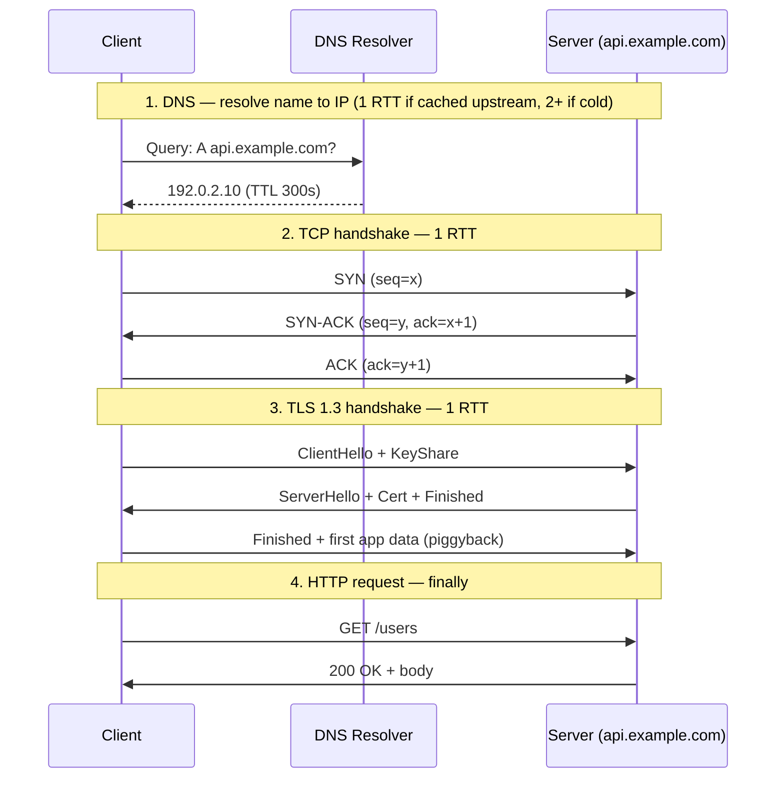
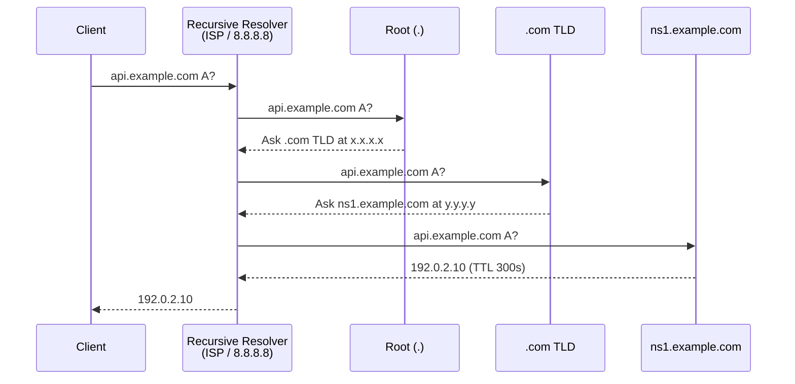
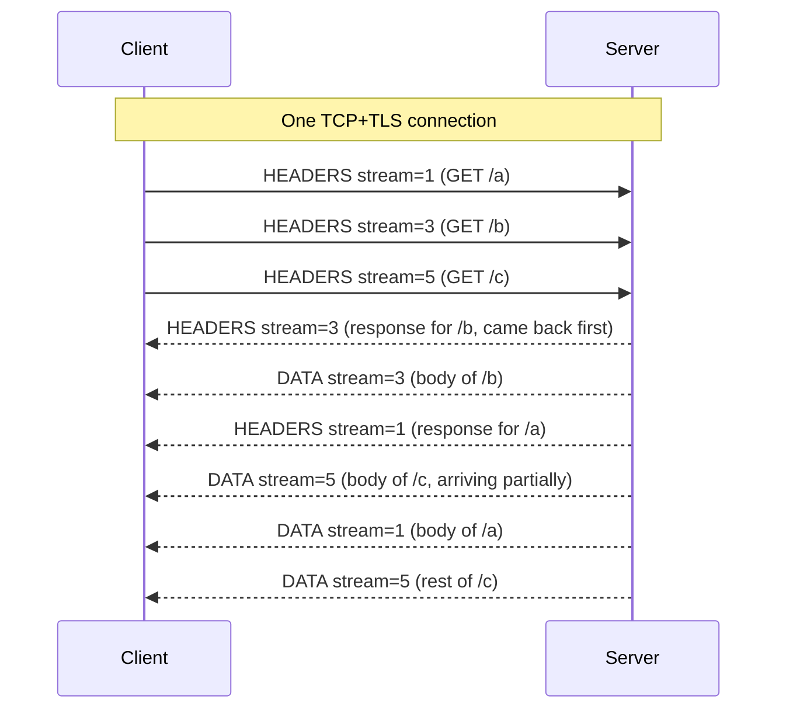

# 01 · Networking Primer — Part 1: TCP + DNS + TLS

> **Session sequence (announced upfront):**
> - **Part 1 (this note):** TCP + DNS + TLS — the connection-setup foundation. Everything else builds on this.
> - **Part 2 (next):** HTTP/1.1 → HTTP/2 → HTTP/3 / QUIC — head-of-line blocking, multiplexing, and why the stack keeps re-inventing itself.
> - **Part 3 (after):** gRPC, WebSocket, SSE, long-polling — how real-time systems keep connections alive in production.

---

## TL;DR

- **Every HTTP request is the tip of an iceberg.** Before your app sends 1 byte, you pay: 1× DNS (1–2 RTTs) + 1× TCP handshake (1 RTT) + 1× TLS handshake (1–2 RTTs). First request to a new host costs **3–5 RTTs**, i.e., ~450ms–750ms cross-continent before any data moves.
- **Connection reuse is the whole point.** A well-configured client pools TCP/TLS connections so the second request costs ~0 RTTs of setup. If you're paying 3+ RTTs on *every* request, your architecture is broken — not your network.
- **DNS is multi-layer cached infrastructure, not a "lookup."** TTL is a tunable between freshness and resilience. Set it too low and you DDoS your resolver; too high and failover takes hours. The 2016 Dyn attack took down Twitter/Netflix/Reddit because DNS is the internet's single most fragile layer.
- **TCP's guarantee (reliable, ordered byte stream) has a dark side:** head-of-line blocking. One lost packet stalls every higher-layer stream sharing that TCP connection. This is *the* reason QUIC/HTTP/3 exists.
- **TLS is no longer optional, but not free either.** TLS 1.3 (2018) cut the handshake from 2 RTTs to 1 RTT (and 0-RTT with session resumption, with replay caveats). If you're still on TLS 1.2, you're paying a full RTT extra on every new connection.

---

## Why it exists

**TCP (1974, Cerf & Kahn).** ARPANET's original protocols (NCP) assumed the network was reliable. When packet loss showed up in the real world, they needed a protocol that could **pretend the network is reliable, even when it isn't.** TCP is that abstraction: reliable, ordered, byte-stream delivery over an unreliable packet network (IP). Every reliability property you take for granted — retransmission, ACKs, ordering, flow control, congestion control — was bolted into TCP because IP offered none of them.

**DNS (1983, Paul Mockapetris).** Before DNS, every host on the internet maintained a `HOSTS.TXT` file listing every other host, distributed via FTP from a single machine at SRI. Obviously this stopped scaling at ~a few hundred hosts. Mockapetris's insight: **make name resolution hierarchical and cacheable** so no single server has to know about every host, and so repeated lookups amortize across a cache. DNS is the first at-scale distributed system the internet ran on, and virtually every design pattern you'll learn (hierarchical partitioning, TTL-based caching, anycast) has DNS lineage.

**TLS (1999, originally SSL by Netscape in 1994).** E-commerce was impossible on an internet where anyone on the path could read credit card numbers. SSL/TLS retrofits confidentiality, integrity, and authentication onto TCP — without changing the sockets API. The reason TLS sits *above* TCP (not inside it) is pragmatic: it could be rolled out incrementally, one app at a time, without rewriting the kernel. That layering choice is also why the handshake costs extra RTTs — you can't avoid setting up TCP first, then negotiating TLS on top.

The pattern across all three: **protocols get designed around the constraints of their era, then accumulate retrofits for concerns (security, performance, mobility) that didn't exist at v1.** Today's QUIC and HTTP/3 are exactly the next iteration.

---

## Mental model

When your browser fetches `https://api.example.com/users`, walk this timeline (cross-continent RTT = 150ms assumed):



**Budget math with 150ms RTT:**

| Step | RTTs | Cost |
|---|---|---|
| DNS (uncached upstream) | 1–2 | 150–300 ms |
| TCP handshake | 1 | 150 ms |
| TLS 1.3 handshake | 1 | 150 ms |
| HTTP request + response | 1 | 150 ms |
| **Total first request** | **4–5** | **~600–750 ms** |

**The second request on the same pooled connection:**

| Step | RTTs | Cost |
|---|---|---|
| DNS | 0 (cached) | 0 ms |
| TCP / TLS | 0 (reused) | 0 ms |
| HTTP request + response | 1 | 150 ms |
| **Total** | **1** | **~150 ms** |

**This is the single most important thing to internalize about networking:** connection setup is expensive, connection reuse is free. Every production client should pool. If you've ever `curl`ed an API in a loop without keep-alive and wondered why it was slow — this is why.

---

## How it works — internals

### 1. TCP

**The 3-way handshake (setup):**

```
Client                    Server
  | ── SYN (seq=x) ──────────> |        (1) I want to talk, my seq starts at x
  | <─── SYN-ACK (seq=y,       |        (2) OK, my seq starts at y, I got your x
  |       ack=x+1) ─────────── |
  | ── ACK (ack=y+1) ────────> |        (3) Got it — connection established
```

After step 3, both sides have state: sequence numbers, receive buffers, congestion window. TCP is *stateful* at both endpoints — this is the core difference from UDP.

**Reliability mechanics:**
- Every byte has a sequence number
- Receiver sends cumulative ACKs ("I've received everything up to byte N")
- Missing bytes trigger retransmit (RTO timeout, or fast retransmit on 3 duplicate ACKs)
- Receive window flows back-pressure to sender (sliding window)

**Congestion control (this matters for capacity math):**
- **Slow start:** after connection open, congestion window starts at ~10 MSS (~14KB). Doubles every RTT until loss detected. Why your first kilobyte is fast but your first *megabyte* is slow — you're ramping.
- **AIMD (Additive Increase, Multiplicative Decrease):** on loss, halve the window, then grow linearly. This is Reno / CUBIC.
- **BBR (Google, 2016):** models bandwidth and RTT directly instead of treating loss as the congestion signal. Deployed widely at Google, increasingly elsewhere.
- **Why it matters:** a "1 Gbps link" doesn't give you 1 Gbps instantly; you ramp up over seconds. For short flows (a 10KB HTTP response), you may never leave slow start. This is why CDN edges reuse connections aggressively.

**Connection teardown — the hidden operational trap:**

```
A ──── FIN ───> B       "I'm done sending"
A <─── ACK ──── B
A <─── FIN ──── B       "I'm done too"
A ──── ACK ───> B
```

After sending the final ACK, the *initiator* (whoever closed first) enters **TIME_WAIT** for 2×MSL (Maximum Segment Lifetime, typically 60–120 seconds). The socket is not fully freed.

**Why this bites in production:** a service making outbound connections that close quickly (e.g., short-lived HTTP without keep-alive) can accumulate tens of thousands of sockets in `TIME_WAIT`, exhausting the ephemeral port range (default ~28K ports). Symptom: "cannot assign requested address" errors. Fix: connection pooling. This is a top-10 cause of "mysterious 5pm outages" in microservice architectures.

**TCP's dark side — head-of-line blocking:**

TCP delivers bytes *in order*. If one packet is lost mid-stream, everything arriving after it buffers on the receiver side until the retransmit fills the gap — even if the delayed bytes are independent of the lost ones. For a single-request flow, this is fine. For a connection **multiplexing many streams** (which is what HTTP/2 does), a single loss stalls *all* streams. This is the core motivation for QUIC (covered in Part 2).

### 2. DNS

**The hierarchy:**

```
                     . (root, 13 anycasted "letters": a.root-servers.net ... m.)
                    /         \
                 .com        .org        ...     (TLDs)
                /     \
          example.com   google.com                (authoritative servers)
         /     |      \
       www    api     mail                        (records)
```

**Query flow (cold cache):**



That's **4 round trips** on a cold miss. In practice, resolvers cache aggressively so most queries hit only the recursive resolver (1 RTT).

**Records that matter for HLD:**

| Record | Purpose |
|---|---|
| `A` | Name → IPv4 |
| `AAAA` | Name → IPv6 |
| `CNAME` | Name → another name (alias; extra lookup) |
| `MX` | Name → mail server |
| `TXT` | Arbitrary string (SPF, DKIM, domain verification) |
| `NS` | Which nameservers are authoritative for this zone |
| `SOA` | Zone metadata (serial, refresh intervals) |

**TTL — the single most consequential knob in DNS:**

- **High TTL (hours/days):** fewer queries (good for cost, resolver load), but **slow failover**. If your primary DC dies and you need to redirect via DNS, you wait for TTLs to expire globally. Cloudflare's 2020 outage postmortem called out DNS TTLs as part of the recovery timeline.
- **Low TTL (seconds):** fast failover, but every client re-resolves constantly. Your authoritative DNS infrastructure becomes a bottleneck, and you're vulnerable to DNS-layer DDoS (Dyn, 2016 — Mirai botnet knocked Dyn's DNS offline; because low-TTL-dependent services couldn't resolve, half the US internet went dark for hours).
- **Typical choice:** 60–300 seconds for production services, 3600+ for static assets.

**Why DNS mostly uses UDP (not TCP):**
- DNS responses are usually <512 bytes → one UDP packet, no handshake cost, no connection state.
- Fallback to TCP when responses exceed 512B (large records, DNSSEC signatures, zone transfers).
- DoH (DNS-over-HTTPS) and DoT (DNS-over-TLS) are recent privacy additions that run DNS *over* TCP+TLS — they fix the "ISP can snoop every DNS query" problem at the cost of connection setup overhead.

**Anycast — why 13 root servers can serve the whole planet:**
Root servers advertise the same IP from dozens of physical locations via BGP. Your packets route to the topologically-closest instance. Anycast gives you geographic distribution without application-layer load balancing — and it's exactly the same pattern CDNs use (covered in Phase 2).

### 3. TLS

**TLS 1.2 handshake (2 RTTs, still widespread):**

```
Client                                   Server
  |── ClientHello (cipher suites) ──────>|
  |<── ServerHello + Certificate ────────|
  |── ClientKeyExchange + Finished ─────>|
  |<── Finished ─────────────────────────|
  | (now symmetric encryption) |
```

**TLS 1.3 (2018) — the single biggest networking upgrade of the decade:**

```
Client                                   Server
  |── ClientHello + KeyShare ───────────>|
  |<── ServerHello + Cert + Finished ────|
  |── Finished + app data (piggyback) ──>|
```

Key changes in 1.3:
- Handshake is **1 RTT** (down from 2). Saves 150ms cross-continent per new connection.
- Removed every legacy cipher that had been broken (MD5, SHA-1 signing, RC4, static RSA, etc.) — the negotiation surface is drastically smaller.
- **0-RTT resumption:** if the client has seen this server before and has a valid PSK, it can send app data *with* the ClientHello. Zero handshake RTT. **Caveat:** 0-RTT data is vulnerable to replay attacks, so it must be used only for idempotent requests (think GET, not POST). Cloudflare's public defaults gate 0-RTT to GET.

**What actually happens in the handshake (mechanics):**
1. Client + server agree on a cipher suite (e.g., TLS_AES_256_GCM_SHA384).
2. They perform an **ephemeral Diffie-Hellman** key exchange, producing a shared symmetric key unknown to any passive observer.
3. Server proves identity via a **certificate** signed by a trusted CA. Client validates the full chain up to a root CA in its trust store.
4. Both sides derive session keys and switch to symmetric encryption (AES-GCM typically). From here, the expensive asymmetric crypto is done — symmetric crypto is extremely fast (GB/s on modern CPUs with AES-NI).

**Perfect Forward Secrecy (PFS):**
Because the session key comes from ephemeral DH, **even if the server's long-term private key leaks in the future**, past recorded sessions cannot be decrypted. The key was computed from ephemeral values that no longer exist. This is why every modern TLS config mandates ephemeral cipher suites and rejects the old static-RSA key exchange.

**SNI (Server Name Indication):**
TLS certificate selection happens *before* the application knows which vhost you want — because HTTP headers are encrypted. SNI is a plaintext field in ClientHello announcing "I'm trying to reach api.example.com, pick the right cert." **Security leak:** SNI is plaintext, so network observers can see which domain you're visiting even over HTTPS. **ESNI/ECH (Encrypted Client Hello)** is the in-flight fix — partially deployed, major browsers and Cloudflare support it.

---

## Trade-offs

| Dimension | TCP | UDP |
|---|---|---|
| Reliability | Guaranteed, ordered | None — app must implement |
| Setup | 1 RTT handshake | None |
| State | Per-connection at both ends | Stateless |
| HoL blocking | Yes (one loss stalls stream) | No (packets independent) |
| Use cases | HTTP, SSH, DBs, most of the web | DNS, video/voice real-time, QUIC, gaming |

| DNS TTL | Low (e.g. 60s) | High (e.g. 24h) |
|---|---|---|
| Failover speed | Fast | Slow (hours) |
| Resolver load | High | Low |
| DDoS resistance | Worse (authoritative hit more often) | Better |
| Typical use | Production apps with active failover | Static/rarely-changing infra |

| TLS version | 1.2 | 1.3 |
|---|---|---|
| Handshake RTTs | 2 | 1 (0 with resumption) |
| Cipher surface | Large, some legacy broken | Minimal, modern-only |
| Forward secrecy | Optional | Mandatory |
| Adoption (2024+) | ~20% of web | ~80% and rising |

---

## When to use / avoid

**Use TCP when:**
- You need reliability/ordering and can afford the handshake (most of the web)
- The workload has medium-to-long flows that amortize setup cost
- You can pool connections

**Reach for UDP when:**
- App-layer protocol can tolerate or recover from loss (DNS, real-time video, game state)
- Latency on setup matters more than reliability (VoIP, live streaming)
- You're building on top of QUIC — which is UDP-based specifically to escape TCP's kernel constraints

**DNS: favor lower TTLs when:**
- You actively use DNS for failover or blue/green deployments
- Your authoritative DNS infra can handle the QPS

**Favor higher TTLs when:**
- Your service topology is static
- You want more resilience against your authoritative DNS being knocked out

**Always-on TLS 1.3 unless:**
- Constrained IoT devices that can't do modern crypto (still TLS 1.2 often; even then, revisit — modern ARM cores handle it fine)
- Legacy internal services you control the client for (though even there, turning TLS on by default is the 2024 norm)

---

## Real-world examples

- **Google QUIC (2012+, now HTTP/3, 2022 IETF standard).** Google measured that ~15% of their user-facing request latency was wasted on TCP+TLS handshakes. They built QUIC on UDP, combined TCP+TLS into a single 1-RTT (or 0-RTT) setup, and made each stream independent at the transport layer to kill head-of-line blocking. Gmail, YouTube, Google Search have served the bulk of their traffic over QUIC for years.
- **Dyn DDoS attack, October 2016.** The Mirai IoT botnet flooded Dyn's authoritative DNS servers with ~1.2 Tbps of traffic. Because Twitter, Spotify, Reddit, Netflix, and GitHub used Dyn and set moderate TTLs, clients that had recently cached DNS kept working; everyone else couldn't resolve. The postmortem is a textbook on why DNS-layer redundancy matters.
- **Cloudflare's 2018 TLS 1.3 rollout.** One of the first large-scale 0-RTT deployments. They published extensive postmortems on the replay-attack mitigations (only allowing 0-RTT for safe methods; per-client anti-replay caches with bloom filters).
- **Netflix's custom BBR tuning.** They operate globally with highly variable network conditions (cellular, satellite, fiber). BBR's ability to model bandwidth directly — not infer it from loss — gave them measurably better throughput on lossy links, which is why streaming bitrate adapts more smoothly over congested mobile networks.
- **TCP TIME_WAIT incident pattern (generic).** Countless microservice postmortems read: "service X was making uncapped outbound HTTP connections without keep-alive; TIME_WAIT sockets exhausted the ephemeral port range; new connections failed with EADDRNOTAVAIL; cascading failure across the mesh." Fix is always the same: connection pool + keep-alive.

---

## Common mistakes

- **Thinking HTTPS is "HTTP + a flag."** It's HTTP after 3–5 RTTs of setup. That cost is amortized *only* with connection reuse.
- **Forgetting that TLS 1.2 costs 1 extra RTT per new connection vs 1.3.** Upgrading is often a free latency win.
- **Setting DNS TTL to 5 seconds "for fast failover."** You'll hammer your authoritative DNS for no net benefit if your clients aren't actually configured to retry fast.
- **No connection pooling in HTTP clients.** Default Java `HttpURLConnection` pools; `HttpClient` (JDK 11+) pools; but naive usage patterns (new client per request) bypass pooling. Always reuse the client.
- **Believing "TCP is reliable" means "messages are guaranteed delivered."** TCP guarantees reliable byte delivery on a connection that *remains open*. On a network partition, TCP will happily buffer and eventually time out — the app must handle it.
- **Confusing DNS caching with DNS propagation.** You cannot *force* other resolvers to drop your cached record. When you hear "DNS takes 24h to propagate," that's really "some resolvers respected my TTL, some didn't."
- **Enabling TLS 0-RTT for POST endpoints.** 0-RTT data is replayable. Only use it for idempotent GETs unless you fully understand the implications.

---

## Interview insights

**Typical questions:**

- *"Trace what happens when I type `https://api.example.com/users` and hit enter — from keystroke to response."* (Classic warm-up. If you can't list DNS → TCP → TLS → HTTP with RTT costs for each, you're not ready.)
- *"Your service is making 10K outbound HTTPS requests/second and latency is 200ms even to a nearby service. What's wrong?"* (Answer path: check connection pooling; likely paying full handshake per request. Verify with netstat → lots of TIME_WAIT.)
- *"Why is TLS 1.3 faster than 1.2? Explain the handshake."*
- *"When would you choose UDP over TCP?"* (DNS, real-time, QUIC. Follow-up: what does the app layer have to handle instead?)
- *"Your DNS TTL is 60 seconds; what's the blast radius if your authoritative DNS server goes offline for 10 minutes?"* (Every client whose cache expires during the outage fails. Much worse than TTL=3600.)

**Follow-ups interviewers love:**

- *"How would you measure how many RTTs a client actually pays?"* (Answer: Wireshark / tcpdump / Chrome Network panel's timing breakdown.)
- *"What's the first thing you'd tune on a Java HTTP client to improve tail latency to a remote service?"* (Connection pool size, keep-alive timeout, idle-timeout tuning.)
- *"How does anycast work at the network layer?"* (BGP advertises the same IP from multiple PoPs. Routers pick the topologically nearest. Answer is the same for DNS root servers and CDN edges.)

**Red flags to avoid saying:**

- *"Just add TLS, no perf impact."* → Interviewer: "No? What's the handshake cost? TLS 1.2 or 1.3?"
- *"DNS is just a lookup."* → Ignore the caching hierarchy at your peril.
- *"TCP is always better than UDP."* → False. DNS, video, QUIC, gaming all exist for reasons.
- *"We'll just shorten DNS TTL to handle failover."* → Sure. Now what happens when your DNS infra itself gets DDoSed?

**What interview-ready looks like on this topic:**

You can, in 3 minutes, draw the sequence diagram from keystroke to first byte of response, label every RTT, explain what's happening at each layer, and identify which step is optimized by: connection pooling, DNS caching, TLS 1.3, HTTP/2, QUIC. Then defend why.

---

## Related topics

- **00 · Napkin math** — this is where those RTT numbers become testable. Latency of a handshake is the concrete application of the numbers from that topic.
- **01 Part 2 — HTTP/1.1 → H2 → H3:** layered on top of what's here. Why H2 "solves" head-of-line blocking at the app layer and why H3/QUIC goes deeper by replacing TCP entirely.
- **01 Part 3 — gRPC, WebSocket, SSE:** all of these live or die by how well they exploit persistent connections.
- **11 · CDN:** anycast + edge-terminated TLS + connection reuse are the CDN value props, all rooted in this note.
- **21 · Load balancing:** L4 vs L7 balancers fundamentally differ in whether they terminate TCP/TLS or pass it through.

---

## Further reading

- **RFC 9000 (QUIC) and RFC 9114 (HTTP/3)** — the authoritative specs; read the intros.
- **Ilya Grigorik, *High Performance Browser Networking*** — free online; still the best single source on TCP/TLS/HTTP performance.
- **Cloudflare blog on TLS 1.3 and 0-RTT** — clearest public writeup of the replay-attack mitigations.
- **Dan Kaminsky's 2008 DNS poisoning talk** — historical context for why DNS is fragile and why DNSSEC exists.
- **Google BBR paper (2016)** — model-based congestion control, applied at global scale.

---
---

# 01 · Networking Primer — Part 2: HTTP/1.1 → HTTP/2 → HTTP/3 / QUIC

> *Session 3 · 2026-04-19 · Deep.*
> Part 1 covered the transport foundation (TCP, DNS, TLS). Part 2 tracks the **application layer**: how HTTP evolved across three generations, what each one solved, what each one's successor had to solve *again*, and why HTTP/3 had to rip out TCP entirely.

---

## TL;DR

- **HTTP has been rewritten 3 times in ~10 years**, each generation trying to fix the fallout of the previous one. H1.1 (1997) was text-based and one-at-a-time; H2 (2015) went binary + multiplexed; H3 (2022) abandoned TCP for UDP to kill HoL blocking end-to-end.
- **HTTP/2's biggest selling point ("multiplexing fixes HoL")** is only half true. It fixes HoL at the *application* layer but **inherits it at the transport layer** because multiple streams share one TCP connection. One lost packet stalls every stream.
- **HTTP/3 = QUIC + HTTP.** QUIC is the real story: a new transport built on UDP that integrates TLS 1.3, provides per-stream ordering, and enables connection migration (Wi-Fi ↔ cellular without dropping the connection). HTTP/3 is a thin wrapper around QUIC for the semantics of HTTP.
- **When each wins:**
  - H1.1 still fine for low-traffic internal services, legacy middleware, streaming proxies where H2 multiplexing doesn't help
  - H2 is the default for modern HTTPS — cheapest win when you control origin + client
  - H3 wins on **lossy networks** (mobile, satellite) and **long-lived apps that need connection migration**. On clean networks, H3 vs H2 is a wash on latency but costs more CPU (userspace UDP stack).
- **"Use server push"** is a red flag in any design round today. Pushed in H2, turned out to conflict badly with browser caches, removed in H3. Use `103 Early Hints` instead if you need preload-like behavior.

---

## Why it exists — the three acts

**Act 1: HTTP/1.0 → 1.1 (1996 → 1997).** HTTP/1.0 opened a new TCP connection per request. On a page with 50 resources, that's 50 handshakes. 1.1 (RFC 2068) added **persistent connections** (keep-alive) and **pipelining** — send multiple requests without waiting for responses. Pipelining was the first attempt at multiplexing on one TCP connection.

**Why pipelining failed in practice.** Responses must arrive in the same order as requests (because they're distinguished only by position in the byte stream). A slow response blocks every response behind it — **application-layer HoL**. Also, many middleboxes (proxies, intrusion detection, ancient load balancers) silently broke pipelined requests. By 2010, every major browser had disabled pipelining by default. This is the ghost that HTTP/2 was built to exorcise.

**Act 2: SPDY → HTTP/2 (2009 → 2015).** Google published SPDY in 2009 as an experimental replacement for HTTP/1.1: binary framing, multiplexed streams on one connection, header compression. It was obviously better and rapidly deployed across Google + early adopters. In 2012, SPDY became the starting point for the IETF HTTP/2 standardization; RFC 7540 shipped in 2015.

**Act 3: QUIC → HTTP/3 (2012 → 2022).** Google realized HTTP/2's multiplexing couldn't deliver its promise because **the kernel's TCP stack enforced strict in-order byte delivery across the whole connection**. A single lost packet stalled every HTTP/2 stream. Fixing this meant rebuilding the transport — but the kernel is notoriously hard to change (OS vendor cycles, middlebox ossification). So Google built QUIC **in userspace, on top of UDP**, sidestepping the kernel entirely. Deployed gradually starting ~2013, standardized as IETF QUIC (RFC 9000) in 2021, and HTTP/3 (RFC 9114) in 2022.

**Recurring pattern:** each generation solved the previous one's biggest bottleneck and exposed the next one underneath. H1.1 fixed connection churn → pipelining HoL exposed. H2 fixed app-layer multiplexing → transport HoL exposed. H3 fixed transport HoL → now we're paying in CPU for userspace UDP and fighting firewall ossification. **No free lunches in protocol evolution.**

---

## Mental model

The shape to carry in your head:

```
╔════════════════════════════════════════════════════════════════════╗
║  HTTP/1.1                                                          ║
║  ┌─────────┐                                                       ║
║  │ TCP     │  1 req at a time (or pipelined → blocked by HoL)      ║
║  │ + TLS   │  Browsers compensate with 6 parallel connections      ║
║  └─────────┘                                                       ║
╠════════════════════════════════════════════════════════════════════╣
║  HTTP/2                                                            ║
║  ┌─────────┐  Many streams multiplexed binary frames               ║
║  │ TCP     │  HPACK compresses headers                             ║
║  │ + TLS   │  ⚠️ All streams still share 1 TCP → transport HoL     ║
║  └─────────┘                                                       ║
╠════════════════════════════════════════════════════════════════════╣
║  HTTP/3                                                            ║
║  ┌─────────┐  Per-stream independent ordering                      ║
║  │ QUIC    │  TLS 1.3 integrated into the transport                ║
║  │ (UDP)   │  Connection migration (Wi-Fi ↔ cellular)              ║
║  └─────────┘  0-RTT resumption built in                            ║
╚════════════════════════════════════════════════════════════════════╝
```

**The central question for any protocol decision:** *where does the next bottleneck live?* With H1.1 it was per-request connection cost; with H2 it was transport HoL; with H3 it's UDP-processing CPU + firewall compatibility.

---

## How it works — internals

### 1. HTTP/1.1 — the text-based, one-at-a-time protocol

**Wire format:**
```http
GET /users HTTP/1.1
Host: api.example.com
Connection: keep-alive
Accept: application/json

```
Text-based. Human-readable. Easy to debug with `telnet`. Every request header is a new line of ASCII.

**Keep-alive (persistent connections).** Default in 1.1: the TCP connection stays open after the response, ready for the next request. Client or server can close with `Connection: close`. **This is the entire reason HTTPS isn't unbearably slow on 1.1** — you handshake once, then pipeline a page's worth of requests.

**Pipelining.** Client can send request B before response A arrives. Server processes them in order, sends responses in order. **Fatal flaw:** if A's processing is slow, B's response is blocked. Worse, middleboxes frequently corrupted pipelined traffic because their parsers assumed one-at-a-time. Chrome, Firefox, Safari all disabled pipelining by 2011.

**Browser workaround:** open **6 parallel TCP connections** per origin. You pay 6× the handshake cost but get 6 parallel request streams. This became the de facto mitigation and is what HTTP/2 was explicitly designed to eliminate.

**Header bloat.** Typical request includes cookies, User-Agent, Accept-* headers — easily 1–2 KB of repeated text per request, sent uncompressed. On a page with 100 requests, that's 100–200 KB of wasted bandwidth just in headers.

### 2. HTTP/2 — binary, multiplexed, one connection

HTTP/2 sits on the same TCP+TLS stack but **completely replaces the wire format**. Same semantics (GET/POST, headers, status codes) — different encoding.

**Binary framing layer.** Every unit of communication is a **frame** with a fixed 9-byte header (length, type, flags, stream ID) followed by payload. Frame types include:
- `HEADERS` — start of a request or response
- `DATA` — body content
- `SETTINGS` — connection config
- `WINDOW_UPDATE` — flow control credits
- `PING` — keep-alive / RTT measurement
- `GOAWAY` — connection teardown
- `RST_STREAM` — cancel one stream
- `PUSH_PROMISE` — server-push hint (deprecated in practice)

**Streams.** A single TCP connection carries **many logical streams**, each with a unique stream ID (odd = client-initiated, even = server-initiated). Frames from different streams interleave arbitrarily on the wire. Each stream carries exactly one request/response exchange.

**Multiplexing mechanics:**



Three requests, one connection, responses arriving in whatever order the server produces them. No HoL at the HTTP layer — streams 1 and 5 aren't blocked by stream 3's response being slow.

**HPACK header compression.** HTTP/2 compresses headers using a combination of:
- **Static table:** 61 pre-defined entries for the most common header name/value pairs (e.g., `:method: GET`, `:status: 200`, `accept-encoding: gzip, deflate`).
- **Dynamic table:** per-connection, populated as requests are sent. Recent headers get indexed; subsequent requests reference them by index.
- **Huffman encoding** for values not in tables.

Typical compression ratio: 80–90% on repetitive request headers. On a page with 100 requests, that's 100 KB → 10–20 KB in headers alone. Critical security caveat: HPACK's dynamic table was the attack surface for **HPACK Bomb** and **CRIME/BREACH-adjacent attacks** — servers cap dynamic table size and rate-limit updates to mitigate.

**Stream prioritization.** Clients can signal stream dependencies and weights ("stream 3 is a critical CSS file, give it more bandwidth than stream 7 which is an image"). **In practice:** browsers sent prioritization hints, servers often ignored or mis-implemented them. The spec was complex and implementations diverged. HTTP/3 simplified this with a new priority scheme (`RFC 9218`).

**Server Push.** Server can send a `PUSH_PROMISE` to preemptively deliver resources the client hasn't asked for yet. Idea: server sees a request for `/index.html`, pushes `/style.css` and `/app.js` before the client parses the HTML and requests them.

**Why it failed:** Push didn't integrate with browser caches. If the client already had `/style.css` cached, the server wasted bandwidth pushing it again. Chrome disabled H2 server push by default in 2022. The replacement: `103 Early Hints` (send preload links before the full response is ready) — the actual win without cache conflicts. **In a design round, "we'll use server push" is a dated answer.**

**The fatal limitation — transport-layer HoL:**

Every H2 stream rides the same TCP connection. TCP guarantees in-order byte delivery *across the entire connection*. If one packet belonging to stream 3 is lost:
- Packets for streams 1, 5, 7, 9 that arrived *after* the gap are **buffered on the receiver, ACK'd (via SACK), but NOT delivered to the app** — TCP won't release them out of order.
- Every stream on that connection stalls waiting for stream 3's retransmit.
- Retransmit cost: 1 RTT minimum.

**This is the same TCP HoL problem from Part 1, just with new victims.** H2 didn't solve HoL — it relocated the problem from the app layer to the transport layer. On a clean low-loss network, this is fine. On a mobile network with 1–5% packet loss, H2 is frequently worse than H1.1 with 6 parallel connections, because 6 parallel TCP connections are *independent* — a loss on one doesn't stall the others. This counterintuitive result is documented in Google's own measurements and is part of why QUIC exists.

### 3. HTTP/3 + QUIC — rebuild the transport

HTTP/3 is **HTTP/2 semantics re-framed on top of QUIC**. The HTTP part is almost trivial; the transformational work is QUIC.

**QUIC = UDP + per-stream ordering + integrated TLS 1.3 + connection migration.**

Why UDP and not TCP with modifications? **Kernel and middlebox ossification.** TCP is implemented in the OS kernel. Changes require every OS vendor to update — Windows, macOS, Linux, iOS, Android — and decade-long deployment lag. Worse, middleboxes (NATs, firewalls, DPI appliances) have baked-in assumptions about TCP packet shapes; deviating breaks them silently. UDP, in contrast, is a minimal kernel-level "send and forget" — QUIC runs entirely in **userspace**, so protocol evolution happens at application update cadence.

**Per-stream ordering (the core win).** QUIC maintains sequence numbers **per stream**, not per connection. A lost packet in stream A affects only stream A's delivery; streams B, C, D continue flowing uninterrupted.

```
TCP + HTTP/2:          |----stream A----|----stream B----|
                        lost: [X]
                        → ALL streams stall until retransmit

QUIC + HTTP/3:         |----stream A----|  |----stream B----|
                        lost: [X]              continues fine
                        → only A stalls
```

**Integrated TLS 1.3.** QUIC embeds TLS 1.3 directly into its packet format. Connection setup + TLS key exchange in **1 RTT** (or 0-RTT with session resumption). Compare to TCP + TLS 1.3: still 2 RTTs total (1 for TCP, 1 for TLS). **QUIC saves 1 RTT on every new connection.**

**Encryption covers the transport.** TCP headers are visible to every router on the path. QUIC encrypts everything including packet numbers, making middlebox interference much harder. Upside: privacy + flexibility to evolve the protocol. Downside: enterprise firewalls and DPI inspection break — some block UDP/QUIC outright.

**Connection migration.** A QUIC connection is identified by a **connection ID**, not by (source IP, source port, dest IP, dest port). When you walk out of your Wi-Fi zone and switch to cellular:
- **TCP:** connection dies (tuple changed) → app has to reconnect and redo handshake + retransmit any in-flight data.
- **QUIC:** client sends a packet from the new IP/port with the same connection ID → server recognizes the connection and continues.
Huge win for mobile apps, streaming, long-lived RPC.

**0-RTT.** Inherited from TLS 1.3 session resumption. Client with a cached PSK can send app data in the very first packet, before any handshake completes. Same replay caveats as TLS 1.3: only for idempotent operations.

**Congestion control.** QUIC can use CUBIC, BBR, or a custom algorithm — it's a userspace parameter, no kernel change needed. Google iterates aggressively here.

**What HTTP/3 adds on top of QUIC:** mostly just HTTP/2's semantics — streams become QUIC streams, frame types remain similar, HPACK is replaced by **QPACK** (a HPACK variant designed for out-of-order stream delivery). The HTTP part is a thin mapping.

---

## Side-by-side comparison

| Dimension | HTTP/1.1 | HTTP/2 | HTTP/3 (QUIC) |
|---|---|---|---|
| Transport | TCP | TCP | UDP (QUIC in userspace) |
| Wire format | Text | Binary frames | Binary frames |
| Multiplexing | Pipelining (broken in practice) | Multiplexed streams, one connection | Multiplexed streams, per-stream ordering |
| App-layer HoL | Yes (pipelining) | Solved | Solved |
| Transport-layer HoL | Yes (per connection) | **Yes (inherited)** | **Solved** |
| Header compression | None | HPACK | QPACK |
| TLS handshake | Separate (2 RTTs on 1.2, 1 on 1.3) | Separate (2/1 RTTs) | **Integrated (1 RTT, 0-RTT with PSK)** |
| Connection migration | No | No | **Yes** |
| Server push | No | Yes (deprecated in practice) | No |
| Browser workaround needed | 6 parallel conns | No | No |
| Middlebox compatibility | Excellent | Excellent (over TLS) | Problematic (UDP often blocked/throttled) |
| CPU cost | Low | Low | Higher (userspace UDP stack) |

---

## When to use / avoid

**HTTP/1.1 is fine when:**
- Low-traffic internal services where handshake cost is negligible
- Legacy middleware that doesn't speak H2
- Streaming proxies (nginx, HAProxy) where H1.1 is battle-tested and H2 upstream buys you nothing downstream
- Simple tools and scripts — `curl` defaults, wireshark-friendly

**HTTP/2 is the default for modern HTTPS when:**
- You control the origin server and clients use modern browsers/libraries
- You have many small resources per page (images, JS chunks) — multiplexing kills the 6-parallel-connection workaround
- Network conditions are mostly low-loss (datacenter-internal, residential fiber)

**HTTP/3 specifically wins when:**
- **Users are on mobile / lossy networks.** YouTube, Facebook, Google Search all roll out H3 aggressively for exactly this reason.
- **Connection migration matters** — streaming apps, persistent mobile clients, gaming
- **You're Google / Cloudflare / Meta scale** — CPU cost is worth the p99 latency wins

**Avoid H3 when:**
- Your network path includes enterprise firewalls that block UDP (depressingly common)
- You're CPU-constrained (e.g., embedded devices, IoT)
- Tooling / debuggability matters (H3 packet inspection is harder than TCP's)

---

## Real-world examples

- **Google's QUIC deployment (2012→).** Google started deploying QUIC experimentally around 2012 using Chrome as the client and Google's servers as endpoints. Public blog posts and papers show they measured real-world p50 and p99 latency wins, especially on mobile. By 2021, IETF-standardized QUIC replaced Google's proprietary gQUIC in production.
- **Facebook's HTTP/3 rollout.** Meta published engineering posts detailing their rollout of H3 for mobile apps, showing 6–15% improvements in request completion time on lossy networks — and described the CPU cost they absorbed to get there (tuned userspace UDP pipeline).
- **Cloudflare HTTP/3 availability (2019+).** Cloudflare was one of the first major CDNs to offer HTTP/3 for all customers. Their blog is one of the better public resources on H3 deployment trade-offs.
- **HTTP/2 server push deprecation.** Chrome disabled H2 server push by default in 2022 after years of cache-coherency issues. **103 Early Hints** replaced it as the recommended preload mechanism. If you've read old design articles recommending server push, they're obsolete.
- **Pipelining's silent death.** Browsers disabled HTTP/1.1 pipelining by default around 2010–2011 (Firefox, Chrome, Safari all independently). Not a formal deprecation — just a gradual acknowledgment that middleboxes broke it too often to be safe. A relic now, but worth knowing as context for why HTTP/2 was needed.
- **Enterprise UDP blocking.** Many corporate firewalls either outright block UDP non-53 or throttle it heavily as a DDoS-amplification-attack mitigation. Browsers therefore implement a **fallback chain**: try HTTP/3 (UDP) → if no response in ~300ms → fall back to HTTP/2 (TCP). You'll see this in Chrome's `chrome://net-export/` traces.

---

## Trade-offs at a glance

| Dimension | H2 over TCP | H3 over QUIC/UDP |
|---|---|---|
| p50 latency (clean network) | ~same | ~same |
| p99 latency (lossy network) | worse — HoL stalls | **better — no HoL** |
| Handshake RTTs (new conn, TLS 1.3) | 2 (TCP + TLS) | 1 (QUIC + TLS integrated) |
| Handshake RTTs (resumption) | 1 | **0** |
| Connection migration | no | yes |
| CPU cost | low (kernel TCP) | higher (userspace UDP) |
| Middlebox compat | excellent | variable |
| Maturity of tooling | very mature | improving |

---

## Common mistakes

- **"HTTP/2 solved head-of-line blocking."** False — only at the application layer. TCP HoL still stalls multiplexed streams on packet loss. This is the layer-boundary insight; interviewers love probing it.
- **"We'll use HTTP/2 server push for performance."** Deprecated in practice. Use `103 Early Hints` or client-driven preload (`<link rel="preload">`).
- **"HTTP/3 is always faster than HTTP/2."** False on clean networks. The latency win is concentrated on lossy / mobile paths and the cost is higher CPU.
- **"HTTP/3 uses UDP, so it's less reliable."** QUIC implements reliability (retransmit, ordering, congestion control) in userspace. Under the hood, H3 is as reliable as H2. The "UDP" in its pitch is about *kernel evasion*, not reliability semantics.
- **"We need sticky sessions for HTTP/2 connections."** Stickiness was a crutch for H1.1 era session affinity. With stateless services + properly-designed auth, H2 connection pools don't require L7 stickiness. (Still matters for WebSocket, which we'll cover in Part 3.)
- **"Just enable H3 at the LB; done."** Backend-to-LB is usually still H1.1 or H2 over TCP — you're taking H3 benefits only for the client-to-edge hop. Often fine, but know the boundary.
- **Mixing up QUIC and HTTP/3.** QUIC is the transport (RFC 9000). HTTP/3 is the HTTP-over-QUIC mapping (RFC 9114). You could run other protocols over QUIC (DNS-over-QUIC, SMB-over-QUIC are in various stages).

---

## Interview insights

**Typical questions:**

- *"Walk me through HTTP/1.1 → HTTP/2 → HTTP/3. What did each version solve and what was its successor's motivation?"*
- *"Why does HTTP/2 still suffer from head-of-line blocking? How does HTTP/3 fix it?"* (The layer-boundary question. Star answer: multiplexing over a single TCP connection inherits TCP's in-order delivery; HTTP/3 moves to per-stream ordering in QUIC/UDP.)
- *"If HTTP/3 is better, why don't we use it everywhere?"* (CPU cost, firewall compatibility, tooling maturity, H3 benefit is network-condition dependent.)
- *"How would you decide between HTTP/2 and HTTP/3 for an API you're designing?"*
- *"What's the difference between QUIC and HTTP/3?"* (QUIC is the transport, H3 is the HTTP mapping. You can have QUIC without HTTP/3.)

**Follow-ups interviewers love:**

- *"Draw the frame layout of an HTTP/2 binary frame."* (9-byte header: length, type, flags, stream ID; then payload.)
- *"What's HPACK, and why was a new header-compression scheme needed?"* (Regular gzip on headers was vulnerable to CRIME; HPACK is a stateful static+dynamic table scheme that avoids the attack surface.)
- *"What's connection migration? Why can TCP not do it?"* (TCP identifies a connection by (src IP, src port, dst IP, dst port) 4-tuple. If the client's IP changes, the connection dies. QUIC uses a connection ID independent of the 4-tuple.)
- *"When would HTTP/1.1 with 6 parallel connections be faster than HTTP/2?"* (On very lossy networks — 6 independent TCP connections don't cross-stall each other, whereas H2's one connection does.)
- *"What happens to your existing HTTP/2 request tracing / debugging tools when you move to H3?"* (Many break — TCP-based tools don't know UDP/QUIC. Wireshark has QUIC support; most enterprise traffic inspection tools are still catching up.)

**Red flags to avoid saying:**

- *"HTTP/2 solved HoL blocking."* (False at transport layer.)
- *"We'll use server push."* (Deprecated in practice.)
- *"HTTP/3 is faster because it uses UDP."* (Misses the real win — per-stream ordering.)
- *"Just upgrade to HTTP/3."* (Without considering UDP blocking, CPU cost, origin-side support.)

**What interview-ready looks like:**

Given a system design question, you can sketch the protocol choice for the client-to-edge hop and justify based on:
- Network conditions of users (mobile-heavy → H3 bias)
- Connection patterns (short-lived vs long-lived → affects migration value)
- CPU budget and infra maturity (H3 costs more)
- Middlebox / firewall path (enterprise → H3 may be blocked)

You can also flip to the transport layer: explain when you'd *not* use HTTPS at all (trusted internal service mesh mTLS), when you'd force H1.1 (legacy middleware), when H3 is table stakes (consumer mobile app).

---

## Related topics (Part 2)

- **01 Part 1 — TCP, DNS, TLS:** literally the ground H1/H2/H3 stand on. Re-read for RTT calibration.
- **01 Part 3 — gRPC, WebSocket, SSE, long-polling:** protocols *on top of* HTTP/2+. gRPC in particular exploits H2 multiplexing heavily.
- **11 · CDN:** CDNs are the fastest adopters of H3 because they control both client (edge) and origin.
- **21 · Load balancing:** L7 LBs must support H2/H3; many still don't, which drives architecture decisions.
- **22 · Fault tolerance:** connection migration in QUIC changes retry / failover calculus.

---

## Further reading (Part 2)

- **RFC 9000 (QUIC)** and **RFC 9114 (HTTP/3)** — read the Introduction + Motivation sections at minimum.
- **Ilya Grigorik, *High Performance Browser Networking*** — Ch. 12 on HTTP/2 is still the gold standard.
- **"HTTP/3 explained" by Daniel Stenberg** (curl maintainer) — free online; excellent plain-English walkthrough.
- **Cloudflare blog: "HTTP/3 From A to Z"** — deployment experience + trade-offs from someone who's actually shipped it.
- **Google's original QUIC design doc (2013)** — historical but shows the original engineering motivation clearly.

---
---

# 01 · Networking Primer — Part 3: gRPC, WebSocket, SSE, long-polling

> *Session 4 · 2026-04-19 · Deep.*
> Part 1 was the transport foundation (TCP/DNS/TLS). Part 2 was the HTTP version evolution. Part 3 is about **what people actually build on top** when plain request/response isn't enough — real-time, streaming, bidirectional, and RPC-style protocols. These are the primitives you reach for when designing chat, presence, live dashboards, collaborative editing, and microservice RPC.

---

## TL;DR

- **Request/response HTTP doesn't cover everything.** Four problem shapes force richer protocols: (1) *client needs to know the moment server state changes* → SSE, WebSocket, long-polling; (2) *client ↔ server streaming both ways* → WebSocket, gRPC bidi; (3) *machine-to-machine RPC with typed contracts* → gRPC; (4) *server pushing a continuous stream of events* → SSE, gRPC server-streaming.
- **gRPC = HTTP/2 + Protobuf + code generation.** It's not a new wire protocol — it's a *framing and tooling convention* on top of H2. You get multiplexed streams, binary framing, HPACK, and strongly-typed client/server stubs generated from a `.proto` IDL. Four call shapes: unary, server-streaming, client-streaming, bidirectional.
- **WebSocket = "HTTP handshake, then raw bidirectional bytes."** The HTTP `Upgrade: websocket` handshake is ceremonial — after it, TCP becomes a persistent full-duplex message channel and HTTP is gone. That's its power (true bidirectional, low overhead per frame) and its curse (no request/response semantics, no middlebox caching, harder to load-balance).
- **SSE is the most underrated tool in the list.** One-way server-to-client stream of events over plain HTTP. Works through every proxy, CDN, and firewall because it *is* HTTP. Auto-reconnect with `Last-Event-ID` built into the browser. If your use case is "server pushes updates to client, client doesn't need to push back," **SSE beats WebSocket on almost every axis** — simpler, more compatible, easier to scale.
- **Long-polling is the "works everywhere" fallback.** Client opens an HTTP request, server holds it open until it has data or a timeout, then responds. Client immediately reopens. Scales poorly (one connection per client held open, server-side thread/fd cost) but still the last-resort option for environments that block everything modern.
- **gRPC is strict about H2; WebSocket is strict about TCP; SSE is strict about HTTP.** Each has a hard dependency on a specific transport generation, which drives where they work and where they don't.

---

## Why it exists — the four problem shapes HTTP request/response doesn't cover

Plain HTTP request/response assumes: client knows *when* to ask, and one response per request. That fails in four common patterns:

**Shape 1: Client needs state changes as they happen.** Classic example: chat app, stock ticker, live sports score. Polling every N seconds is wasteful (mostly returns "nothing changed"), high-latency (up to N seconds stale), and expensive (full HTTP round trip each time). The naive-but-real solution people built first was **long-polling**: client sends a request, server doesn't respond until there's new data. Works, but ties up a server-side resource per client.

**Shape 2: Server has a continuous stream of events to push.** Live feeds, log tailing, GPT-style token streaming, server-push notifications. The client doesn't need to send anything back (or sends back very rarely). A single long-lived HTTP response that stays open and keeps writing is enough. This is what **SSE (Server-Sent Events)** codified in 2009 — turn a normal HTTP response into a pushable channel, and the browser handles reconnection.

**Shape 3: Both sides need to push to each other at will.** Multiplayer games, collaborative editors (Google Docs, Figma), voice-call signaling. Neither SSE (one-way) nor long-polling (request-response shape) fits. You need **WebSocket**: after an HTTP handshake, the connection becomes a raw, full-duplex message channel. Messages in either direction at any time, low per-message overhead.

**Shape 4: Machine-to-machine RPC with strict contracts, multiplexed streams, and generated clients.** Internal microservices calling each other aren't browsers — they want typed interfaces, cross-language clients, flow control, and deadlines. Google's internal Stubby (2001-ish) was the template; they open-sourced the spiritual successor as **gRPC** in 2015. It rides on HTTP/2 specifically for its multiplexing and binary framing, adds Protobuf for typed payloads, and generates client/server stubs in a dozen languages.

**The historical through-line:** every protocol here is a *specific retrofit* for one of these four shapes, onto the HTTP foundation that browsers + middleboxes already support. None of them replace HTTP — they ride on top of or alongside it so they can get through real-world networks.

---

## Mental model

```
                     ┌─ One-way streaming ──────► SSE (server → client)
                     │
Request/response  ───┤
(plain HTTP)         ├─ Full-duplex, persistent ─► WebSocket
                     │
                     ├─ Typed RPC + streams ────► gRPC (over HTTP/2)
                     │
                     └─ "Just use HTTP" fallback ► Long-polling
```

**The decision prompt:** who talks to whom, how often, and how strict are the contracts?

| If you need... | Use |
|---|---|
| Server → client push, one-way, browser client | **SSE** |
| Client ↔ server push, full-duplex, low per-message overhead | **WebSocket** |
| Typed RPC between internal services, streaming, cross-language | **gRPC** |
| Server → client push but every other option is blocked | **Long-polling** |
| Standard request/response, external API, LB-friendly | **Plain HTTP/1.1 or 2** |

---

## How it works — internals

### 1. gRPC

**What it actually is.** gRPC is three things, layered:
1. **HTTP/2 as the transport.** Every gRPC call is an HTTP/2 stream. Method and metadata go in H2 headers; request/response bytes go in H2 DATA frames.
2. **Protobuf as the payload format.** Messages serialized with Protocol Buffers — binary, schema-driven, forward/backward compatible. Typical 3-5× smaller and 10× faster to encode/decode than JSON.
3. **Code generation.** You write a `.proto` IDL, `protoc` generates client + server stubs in Java, Go, Python, C++, Rust, etc. The cross-language story is the killer feature.

**Four call shapes (the thing every interview will ask):**

| Shape | Client | Server | Example |
|---|---|---|---|
| Unary | 1 req | 1 resp | `GetUser(id)` |
| Server-streaming | 1 req | N resp | `SubscribeToOrders(userId) → stream<Order>` |
| Client-streaming | N req | 1 resp | `UploadLogs(stream<LogEntry>) → UploadResult` |
| Bidirectional | N req | N resp | Chat-style RPC; real-time signaling |

All four are just H2 streams with different framing semantics. Unary is "one HEADERS + one DATA each way, then END_STREAM." Streaming variants keep DATA frames flowing in one or both directions until an END_STREAM.

**Why HTTP/2 specifically.** Multiplexing — you need many concurrent RPCs sharing one TCP connection efficiently. Binary framing — cheap to parse. HPACK — cheap header encoding. Flow control — backpressure. All of these map naturally onto RPC needs. Without H2, every one of these would need reinvention.

**gRPC can NOT run over HTTP/1.1.** The multiplexing and bidirectional streaming semantics require H2 frames; H1.1's request-response shape can't carry them cleanly. There is a thing called **gRPC-Web** that runs a *subset* (unary + server-streaming only) over H1.1 for browser compatibility — no bidi, no client-streaming. If you hear "gRPC from the browser," it's gRPC-Web, not full gRPC.

**Simple Java example (unary):**

```java
// user.proto
// service UserService {
//   rpc GetUser (GetUserRequest) returns (User);
// }

// Generated stub usage:
ManagedChannel channel = ManagedChannelBuilder
    .forAddress("users.internal", 443)
    .useTransportSecurity()
    .keepAliveTime(30, TimeUnit.SECONDS)
    .build();

UserServiceBlockingStub stub = UserServiceGrpc.newBlockingStub(channel);
User user = stub
    .withDeadlineAfter(200, TimeUnit.MILLISECONDS)
    .getUser(GetUserRequest.newBuilder().setId("u_123").build());
```

Two production nuances worth calling out:
- **`withDeadline`** is non-negotiable. Every gRPC call must have a deadline. It propagates through the call chain via metadata (`grpc-timeout` header), so service A → B → C all know the remaining budget. Missing deadlines is a top-5 cause of cascading failures.
- **`keepAliveTime`** handles dead-peer detection. Without it, a silently dead TCP connection can accumulate queued RPCs that all time out together. At Google/Uber scale this matters.

**Interceptors.** Cross-cutting concerns (auth, tracing, logging, metrics) attach as interceptors on the channel/stub. This is how Uber wires in every RPC's tracing ID and deadline propagation centrally.

### 2. WebSocket

**The handshake.** Starts as a normal HTTP GET with a specific set of headers:

```http
GET /chat HTTP/1.1
Host: example.com
Upgrade: websocket
Connection: Upgrade
Sec-WebSocket-Key: dGhlIHNhbXBsZSBub25jZQ==
Sec-WebSocket-Version: 13
```

If the server agrees, it responds:

```http
HTTP/1.1 101 Switching Protocols
Upgrade: websocket
Connection: Upgrade
Sec-WebSocket-Accept: s3pPLMBiTxaQ9kYGzzhZRbK+xOo=
```

After the 101, **the TCP connection is no longer HTTP.** It's a full-duplex WebSocket channel carrying framed binary or text messages. Both sides can send at any time.

**WebSocket frame format (simplified):**

```
 0               1               2               3
+---------------+---------------+---------------+---------------+
| FIN | RSV | opcode | MASK | payload len (7/16/64 bits)        |
+---------------+---------------+---------------+---------------+
| masking-key (32 bits, only if MASK=1)                         |
+---------------+---------------+---------------+---------------+
| payload data ...                                              |
+---------------+---------------+---------------+---------------+
```

Per-frame overhead is 2-14 bytes — an order of magnitude less than HTTP's per-request headers. This matters enormously for high-frequency small messages (game state, chat typing indicators).

**Opcodes** distinguish text, binary, ping, pong, and close. Ping/pong are for keep-alive — idle connections must be actively heartbeated or NATs/load balancers will silently close them after 30-120 seconds.

**Operational gotchas:**
- **LB compatibility.** L4 load balancers pass WebSocket through fine (it's just TCP after the upgrade). L7 balancers must explicitly support WebSocket upgrade (nginx, Envoy, AWS ALB all do; some older ones don't). Caching proxies / CDNs are often flat-out incompatible.
- **Statefulness.** Every WebSocket is a stateful connection pinned to one backend. You can't just round-robin requests; **sticky routing or a pub/sub hub** (Redis, Kafka) is required to let any backend deliver to any user.
- **1M-connection problem.** At scale, the question isn't bandwidth — it's fd count, memory per connection, and kernel-level tuning (`ulimit`, TCP buffers, ephemeral port ranges). Slack and Discord have published on pushing single-box WebSocket servers past 1M concurrent connections.
- **Reconnection is YOUR problem.** No built-in auto-reconnect. You must implement exponential backoff + resume semantics (cursor / last-event-ID) in your app layer.

### 3. SSE (Server-Sent Events)

**What it actually is.** A regular HTTP GET that returns `Content-Type: text/event-stream` and never closes. Server keeps writing newline-delimited "events" forever (or until an error/reconnect).

```http
GET /orders/stream HTTP/1.1
Accept: text/event-stream

HTTP/1.1 200 OK
Content-Type: text/event-stream
Cache-Control: no-cache

event: order_created
id: 4815
data: {"orderId":"o_123","total":99.99}

event: order_updated
id: 4816
data: {"orderId":"o_123","status":"shipped"}

: this is a comment; keeps the connection alive
```

**Browser API:**

```javascript
const stream = new EventSource('/orders/stream');
stream.addEventListener('order_created', e => { /* ... */ });
stream.onerror = () => { /* browser auto-reconnects */ };
```

**Why SSE is underrated:**
- **It IS HTTP.** Every proxy, CDN, WAF, LB, firewall handles it — because it's indistinguishable from a slow HTTP response. No "does our infra support WebSocket?" conversation.
- **Auto-reconnect is in the browser.** `EventSource` automatically reconnects on disconnect and sends the last-seen `id` as `Last-Event-ID` header, so the server can resume. WebSocket forces you to build this yourself.
- **Simpler backend model.** No frame parsing, no opcodes, no upgrade handshake. Just write to a response stream.

**Limits:**
- **One-way only.** Client can't push data on the same connection. If you need client → server, you make a separate HTTP POST. For pure server-push workloads (notifications, live feeds, LLM token streaming), this is fine.
- **Text only.** Binary data must be base64-encoded (overhead). WebSocket supports binary natively.
- **Per-browser connection limit.** Browsers cap HTTP connections per origin (6 for H1.1). With HTTP/2, this disappears — multiple SSE streams multiplex on one connection.
- **Doesn't work well with HTTP/1.1 proxies that buffer responses.** The whole model relies on the server's bytes reaching the client promptly; a buffering proxy can delay events minutes.

### 4. Long-polling

**The sequence:**
1. Client: `GET /events?since=42`
2. Server: does not respond immediately. Holds the connection open, waits for new data (up to a timeout, e.g., 30 seconds).
3. Server: new event arrives → responds with the event.
4. Client: on response, immediately reopens `GET /events?since=43`.
5. If server times out with no data, responds with empty body → client reopens.

**Why it exists:** before SSE / WebSocket were universally available (~2010-2012), this was the only way to achieve server-push through any HTTP path. Facebook Chat originally ran on long-polling; legacy Bloomberg Terminal systems still use it.

**Why it's bad:**
- Every connected client ties up a server-side thread or fd, even when idle.
- The request/response model forces a full reopen on every event — overhead of HTTP request per event.
- Scales poorly — SSE/WebSocket handle 10× more concurrent users per server for the same workload.

**When you reluctantly still use it:** extremely restrictive corporate networks where WebSocket is blocked and SSE's long-response shape confuses some caches. Design: ship SSE, fall back to long-polling.

---

## Side-by-side comparison

| Dimension | gRPC | WebSocket | SSE | Long-polling |
|---|---|---|---|---|
| Transport | HTTP/2 | TCP (after HTTP upgrade) | HTTP (any version) | HTTP (any version) |
| Direction | Bidi + all 4 shapes | Bidi | Server → client only | Server → client (effectively) |
| Wire format | Binary (Protobuf default) | Binary or text frames | Text (UTF-8) | Whatever (JSON typical) |
| Per-message overhead | Low (H2 frame + protobuf) | Very low (2-14 bytes) | Moderate (text framing) | Very high (full HTTP req/resp) |
| Browser support | Via gRPC-Web (subset) | Native | Native (`EventSource`) | Native (just `fetch`) |
| Auto-reconnect | No (client retry logic) | No | **Yes (browser-native)** | Trivial (client just re-requests) |
| LB / proxy compat | Good (just H2) | Tricky (L7 LB must support upgrade) | Excellent (it's HTTP) | Excellent |
| Caching compat | N/A (POST-like) | Incompatible | Incompatible (no-cache) | Incompatible |
| Typed contracts | **Yes (Protobuf IDL)** | No | No | No |
| Server resource per conn | One H2 stream | One TCP conn + state | One HTTP response | One fd + thread |
| Best at | Typed RPC, streaming microservices | Bi-di games, chat, collab | One-way push (notifications, LLM tokens) | Legacy fallback |

---

## When to use / avoid

**gRPC when:**
- Internal microservice RPC, especially polyglot (Java ↔ Go ↔ Python)
- You want typed contracts + code gen + deadline propagation as table stakes
- Streaming RPCs (uploads, downloads, change streams) are a natural fit

**Avoid gRPC for:**
- External public APIs — clients expect REST/JSON, not Protobuf tooling
- Browser → backend directly — gRPC-Web is a subset, and you're better off with REST or GraphQL
- Extremely simple request/response flows where the Protobuf tooling cost isn't justified

**WebSocket when:**
- Bidirectional real-time: chat, collaborative editing, multiplayer games, voice signaling
- You need to push and receive on the same connection
- Per-message overhead matters (high-frequency small messages)

**Avoid WebSocket when:**
- One-way server-push is enough — SSE is simpler and more compat
- You need HTTP caching, CDN, or standard observability tooling
- Your infra has L7 balancers or proxies that don't understand upgrades

**SSE when:**
- Server-to-client event stream (dashboards, stock tickers, order updates, LLM token streaming)
- You want HTTP middleware (CDN, auth, rate limit) to just work
- You want browser-native auto-reconnect

**Avoid SSE when:**
- You need client → server push on the same channel (use WebSocket)
- Binary data dominates (WebSocket native binary wins)
- The network path has aggressive response-buffering proxies

**Long-polling when:**
- Nothing else works. It is a fallback, not a design target.

---

## Real-world examples

- **OpenAI / Anthropic streaming APIs use SSE for token streaming.** When you see tokens appearing in ChatGPT or Claude's browser UI, that's SSE. They picked SSE over WebSocket explicitly because it's one-way (model → user), works through every corporate firewall, and integrates with normal HTTP auth / rate-limiting. This is the poster child for "SSE is the right tool, but everyone reaches for WebSocket first."
- **Slack, Discord, WhatsApp Web use WebSocket for real-time messaging.** Bidirectional: you send messages and receive presence/typing/messages on the same channel. Slack published an engineering post on pushing WebSocket servers past 1M connections per box — the challenges were fd count, memory per connection, and graceful upgrade/deploy (draining a million WebSocket connections without disrupting users is hard).
- **Uber, Netflix, Google use gRPC for internal microservice RPC.** Netflix has stated publicly that its internal service-to-service communication is almost entirely gRPC. Uber's Jaeger tracing was designed with gRPC propagation in mind from day one. Protobuf schemas live in a monorepo, and cross-language clients are generated in CI — the "typed contracts across languages" value prop is real at that scale.
- **Facebook Chat (circa 2008-2012) originally ran on long-polling** before migrating to WebSocket / MQTT. Their engineering postmortems explain the scaling pain of holding millions of long-poll connections open — thread-per-request servers collapsed; they had to move to event-loop architectures (which was actually a driver for the broader "async backend" movement).
- **GitHub uses SSE for live-updating commit/PR status.** You can open a PR page and see "checks running" update in real time — plain SSE over HTTPS, passes through Cloudflare fine.
- **Google Docs / Figma use WebSocket for collaborative editing.** Every keystroke needs to be multicast to collaborators in < 100ms, and their cursors need to flow back to you. Full bidi is non-negotiable — SSE can't model it.

---

## Common mistakes

- **"Use WebSocket for live updates" → reaches for the bigger hammer.** If it's one-way (server → client), SSE is simpler, more compatible, and comes with auto-reconnect. Default to SSE for push; escalate to WebSocket only when you truly need bidi.
- **"gRPC from the browser" without knowing it's gRPC-Web.** gRPC-Web only supports unary + server-streaming (no bidi, no client-streaming) because browsers can't emit raw H2 frames. Surprises a lot of candidates.
- **No deadlines on gRPC calls.** A deadline-less call can hang indefinitely on a dead peer, exhausting connection pools and cascading through the mesh. Always set one.
- **WebSocket without heartbeats.** NATs, corporate firewalls, and load balancers kill idle TCP connections silently after 30-120 seconds. Ping/pong frames every 20-30s are non-negotiable.
- **Assuming WebSocket is "HTTP that stays open."** It stops being HTTP after the upgrade. Your HTTP middleware (auth, rate limiting, request logging, WAF) does *not* apply to messages after the handshake. Security teams miss this constantly.
- **Long-polling with a 30-second server timeout on a mobile network with 20-second NAT timeout.** Every request gets killed by the NAT before the server responds. Tune server timeout to be < NAT timeout (often ≤15s).
- **SSE through a buffering reverse proxy.** Some default nginx / Apache configs buffer the response body, delivering events in chunks minutes apart. You must set `proxy_buffering off;` (or equivalent) for SSE paths.
- **L7 LB in front of a WebSocket service without WebSocket support.** Symptoms: handshakes succeed; messages never arrive; connection drops after 60s. Check the LB's WebSocket timeout + upgrade-handling settings specifically.

---

## Interview insights

**Typical questions:**

- *"Design a chat app. Pick a protocol for client ↔ server and justify."* (Expect to defend WebSocket vs SSE vs long-polling. Interviewer will probe: what about server crashes? Reconnection? Presence? Scaling to 10M concurrent connections?)
- *"What are the four gRPC call shapes? Give one real-world example of each."*
- *"What's the difference between WebSocket and SSE? When would you pick each?"*
- *"Why is gRPC tied to HTTP/2? Can you run it over HTTP/1.1?"* (No, not full gRPC; gRPC-Web is a subset.)
- *"You're designing OpenAI's streaming API. Why SSE instead of WebSocket?"* (One-way, HTTP-compatible, auto-reconnect, integrates with existing HTTP auth/rate-limit. WebSocket is overkill for one-way.)
- *"Your WebSocket servers are dying under load at ~50K connections each. What do you tune?"* (`ulimit -n`, TCP send/receive buffers, move off thread-per-connection to event-loop architecture, heartbeat cadence, consider sharding by connection hash.)

**Follow-ups interviewers love:**

- *"After a WebSocket reconnects, how do you avoid replaying or losing messages?"* (Sequence numbers + server-side replay buffer + client sends last-seen-seq on reconnect. Equivalent to SSE's `Last-Event-ID` but DIY.)
- *"Draw the lifecycle of a WebSocket connection from TCP SYN to first message."* (TCP handshake → TLS handshake → HTTP GET with `Upgrade: websocket` → 101 Switching Protocols → first WS frame.)
- *"If gRPC uses H2, why don't browsers speak gRPC directly?"* (Browsers don't expose raw H2 frame control to JS; `fetch` doesn't give you trailers, which gRPC uses for status. Hence gRPC-Web.)
- *"How does deadline propagation work in gRPC?"* (Client deadline → `grpc-timeout` header → server subtracts processing time → passes remaining budget to downstream calls. Prevents orphan work.)
- *"Your SSE endpoint behind CloudFlare stops delivering events after 100 seconds. Why?"* (CloudFlare's default response timeout for free tier is ~100s. Configure `keepalive_timeout` and look at `Cache-Control: no-transform` + ensure no buffering.)

**Red flags to avoid saying:**

- *"WebSocket is just HTTP that stays open."* (No — after the upgrade it's a raw TCP channel with WS framing, and HTTP middleware doesn't apply.)
- *"Use WebSocket for everything real-time."* (SSE is better for one-way; long-polling is for extreme compat.)
- *"gRPC is a new protocol."* (It's a convention on HTTP/2; H2 is the protocol.)
- *"Long-polling is old and no one uses it."* (Fine as a fallback; still alive in legacy and constrained environments.)
- *"SSE doesn't scale."* (It scales fine — it's HTTP. It's WebSocket that has the stateful-connection scaling problem.)

**What interview-ready looks like:**

Given a real-time feature, you can pick the right protocol in 60 seconds, defend it on three axes (direction, compatibility, complexity), and identify two failure modes the interviewer will probe. For any of the four protocols, you can sketch the handshake/frame format, explain connection lifecycle, and name one production system that uses it and why.

---

## Related topics (Part 3)

- **01 Part 1 — TCP, TLS:** every protocol here still pays the TCP + TLS handshake. Everything Part 1 said about connection reuse applies.
- **01 Part 2 — H1.1/H2/H3:** gRPC rides H2. SSE works over any. WebSocket is "post-HTTP"; it doesn't benefit from H3's advances unless you're on **WebTransport** (the QUIC-based successor, still emerging).
- **12-15 · Messaging / queues:** WebSocket fan-out at scale usually requires a pub/sub hub (Redis pub/sub, Kafka) behind the edge servers.
- **21 · Load balancing:** WebSocket and SSE need sticky routing or distribution via pub/sub; gRPC needs H2-aware LB.
- **22 · Fault tolerance:** deadlines, retries, reconnection semantics. gRPC has deadline propagation baked in; WebSocket forces you to implement resume semantics manually.

---

## Further reading (Part 3)

- **gRPC docs — "gRPC Concepts"** — best starting point; explains the four call shapes with sequence diagrams.
- **"The WebSocket Protocol" (RFC 6455)** — short and very readable.
- **"Server-Sent Events" (WHATWG HTML spec, section 9.2)** — defines the wire format and the browser `EventSource` API.
- **Cloudflare blog: "When SSE is a better choice than WebSocket"** — the exact argument pattern to internalize.
- **Slack engineering: "Scaling Slack's Job Queue"** and their WebSocket scaling posts.
- **OpenAI / Anthropic API docs on streaming** — real-world SSE consumption examples.

---
---

# 01 · Networking Primer — Appendix: Quiz-driven additions (Session 4 · 2026-04-19)

> Material that came up while quizzing on Parts 2 + 3. Each section here is durable depth that the original notes name-dropped or skipped; merged in so the file remains the single source of truth for the topic.

---

## A1. Kernel space vs userspace — and why it matters for QUIC

The notes mention "QUIC runs in userspace" without explaining what that means. Two zones every OS has:

| Zone | What runs there | Privileges |
|---|---|---|
| **Kernel space** | OS itself + drivers + the TCP/IP stack | Full hardware access; can crash the machine |
| **Userspace** | Your apps (Chrome, your Java service, nginx) | Sandboxed; must call into kernel via syscalls (`read`, `write`, `sendto`) to do I/O |

**TCP lives in the kernel.** When your Java code does `socket.write(bytes)`, the bytes cross into the kernel and the kernel's TCP code handles segmenting, sequence numbering, retransmits, in-order reassembly, congestion-window math, ACKs. Your app never sees raw packets — it sees a clean byte stream. **You inherit Linux/Windows/macOS's TCP implementation.**

**UDP is barely a protocol.** The kernel just lets you `sendto(addr, bytes)` and `recvfrom()` raw datagrams. No retransmit. No ordering. No congestion control. The kernel does almost nothing.

**QUIC lives in userspace.** Built on UDP. The application itself (Chrome's network stack, or a library like `quic-go` / `msquic` / `quiche`) reimplements *all* the TCP-equivalent logic — sequence numbers, retransmits, congestion control, ordering, flow control — inside the app process.

| Aspect | TCP (kernel) | QUIC (userspace) |
|---|---|---|
| Deploy a bugfix or new congestion algorithm | OS update → wait years | App update → 6-week Chrome cycle |
| Per-app tuning (BBR vs CUBIC) | One algorithm per OS | Each app picks its own |
| CPU cost per packet | Low (kernel-optimized, hardware offloads like TSO/LRO) | Higher (every packet crosses kernel↔userspace boundary twice) |
| Tooling maturity | Wireshark, tcpdump, strace — excellent | QUIC support catching up |
| Mobile battery impact | Better | Worse — extra CPU = more battery drain |

**Net:** "QUIC in userspace" = both its superpower (deploy fast, evolve fast, escape kernel/middlebox ossification) and its tax (more CPU, more battery, less mature tooling). This is the real reason Google could iterate QUIC 5 times in a decade while TCP barely moved — they weren't waiting for OS vendors.

---

## A2. Three legs of "ossification" — the full reason QUIC picked UDP

The original Part 2 notes named two ossifications. The full set has **three**, and the third is the one that explains *why UDP specifically* and not "some new transport."

1. **Kernel ossification.** TCP lives in the kernel. Evolving it means waiting years for every OS vendor to ship updates and every user to upgrade. Unacceptable at Google's iteration pace.

2. **Middlebox ossification.** NATs, firewalls, DPI boxes, stateful load balancers all bake in assumptions about TCP flags, options, sequence-number arithmetic. Any deviation from the 1990s-era TCP shape causes silent drops. **TCP Fast Open, MP-TCP, ECN, and other extensions all partially failed for exactly this reason** — they tried to evolve TCP-the-wire-format and got eaten by middleboxes.

3. **Protocol-number ossification.** *(The leg the original notes missed.)* You might think, "fine, skip TCP entirely — invent a new transport with a fresh IP protocol number, like SCTP (132)." **Doesn't work.** Most home routers, corporate NATs, and ISP firewalls drop any IP packet that isn't TCP (6), UDP (17), or ICMP (1). SCTP is effectively unroutable on the public internet. So the only viable "escape hatch" is **UDP** — universally permitted and a thin-enough kernel abstraction that the real protocol work can happen in userspace above it.

**Lesson:** the choice "UDP" wasn't about UDP being good — it was the only transport allowed through enough networks to matter, with the kernel small enough to step over.

---

## A3. Picking a protocol for a mobile-heavy product — a worked decision rubric

Scenario: consumer mobile app, ~70% cellular / 30% Wi-Fi, users walk Wi-Fi → cellular mid-session, packet loss 1-3% (10%+ in poor coverage). You're picking the protocol for the **control/signaling channel**.

**Pick: HTTP/3.** Three distinct mechanism-grounded reasons:

1. **Connection migration solves Wi-Fi → cellular handoff cleanly.** TCP identifies a connection by the (src IP, src port, dst IP, dst port) 4-tuple. When the device's IP changes, the kernel kills the connection — your app blacks out for ~200-500ms while it reconnects, redoes TCP handshake, redoes TLS, re-authenticates. **QUIC identifies the connection by an opaque connection ID independent of IP.** Client just sends a packet from the new IP with the same connection ID; server recognizes it. **Mid-session signaling continues uninterrupted.** This is the killer feature.

2. **Per-stream ordering eliminates transport-layer HoL on lossy paths.** At 1-3% loss (10%+ in poor coverage), HTTP/2 over TCP would routinely stall *every* multiplexed signaling RPC behind a single lost packet. QUIC's per-stream sequence numbering means a stalled presence ping has zero impact on a call-setup RPC. Your p99 signaling latency stays bounded instead of spiking with packet loss.

3. **Integrated 1-RTT (or 0-RTT) handshake matters when connections die and re-form often.** On cellular, RTTs are 80-200ms. TCP + TLS 1.3 = 2 RTTs of setup (160-400ms). QUIC bundles them = 1 RTT (80-200ms), or 0-RTT with cached PSK. On a flaky cellular link where you're frequently re-establishing, this saves 80-200ms *every time*.

**Knowing downsides accepted:**
- Higher CPU → battery drain on mobile
- UDP blocked/throttled on some networks (especially enterprise Wi-Fi) → need fallback chain to H2/TCP
- Tooling immaturity — debugging QUIC in production with Wireshark/tcpdump is harder than TCP
- Edge → origin hop is probably still H2/TCP, so HoL benefits only apply on the client → edge leg

**The decision pattern to internalize:** every claim must point at a specific mechanism (connection migration, per-stream ordering, integrated handshake). "Lossy network → H3" is not a defense; "1-3% loss × multiplexed streams × TCP HoL would stall everything → QUIC fixes it via per-stream sequencing" is.

---

## A4. HTTP/2 Server Push — the deeper why it failed

Part 2 notes covered "Server Push was deprecated." The mechanism that actually broke:

**The fatal flaw: the server has no way to know what the client has cached.** There's no protocol-level mechanism for the browser to tell the server "I already have `style.css` v3.7" before requesting `/index.html`. The HTTP request doesn't include cache contents (would be enormous and a privacy leak). So Server Push is forced into a binary lose-lose:

- **Always push:** waste bandwidth on cache hits — particularly bad on mobile / metered connections where every KB matters.
- **Try to be smart:** server-side cache prediction is unreliable; you end up shipping the same resources repeatedly to repeat visitors.

**Second mechanism failure: the browser cache and the push-stream matching logic diverged across implementations.** A pushed stream sat in a separate "unclaimed pushes" buffer; when the browser parsed the HTML and discovered it needed `style.css`, it had to match the request against the unclaimed-push pool. The matching was buggy across browsers — leading to **double-fetch bugs** (browser fetches `style.css` *while* a push of the same resource is in flight), wasted bytes on both sides, and confusing developer tooling. Chrome's blog post on disabling push (2022) cited "no measurable benefit, real complexity cost."

**Why `103 Early Hints` is the right fix:**

`103 Early Hints` is an *informational* response sent **before** the final 200/whatever response. It carries `Link: </style.css>; rel=preload` headers — a *hint*, not data. The client receives the hint, **does its own cache check** (the browser already knows what it has), and only fetches the resource if it doesn't have it. The decision lives on the cache-aware side. No double-fetches, no wasted bandwidth, no protocol-level guessing about client state.

**Pattern:** push a hint, not the bytes — let the cache-holder decide.

---

## A5. HTTP/1.1 vs HTTP/2 in an intra-DC service mesh — the contrarian framing

Most candidates default to "always H2 for service mesh." In a clean intra-DC environment (RTT 0.5-2ms, loss <0.01%), the answer is more nuanced. **Every H2 advantage has a precondition that may not hold here.**

**H2's usual wins eroded:**

1. **Multiplexing's value is gone.** Sidecars (Envoy / Linkerd) already pool 20-50 long-lived H1.1 connections per upstream. Parallelism exists. Multiplexing 50 streams on one connection vs 50 parallel H1.1 connections in a clean DC is a wash on throughput.

2. **HPACK saves nothing.** Internal service-to-service requests have 200-500B of headers (a trace ID, an auth token, a content-type). 80% compression on 300B = 240B saved on a 14KB exchange. **2% bandwidth.** Not worth complexity.

3. **No HoL fix needed.** At <0.01% loss, multiplexing-over-TCP's transport HoL never bites.

**What H2 actually *costs* you:**

4. **Bigger blast radius on connection failure.** H1.1 + 20-conn pool: one connection dying drops 1/20 in-flight requests. H2 multiplexing 200 streams on one TCP connection: that connection dying drops **all 200 streams simultaneously.** For a service mesh where reliability is the product, this is a real downside.

5. **Flow control complexity = production bugs.** H2's per-stream WINDOW_UPDATE math, settings frames, stream-state machine — all of it has been a source of real production CVEs / deadlocks (grpc-go, nginx, Envoy). H1.1 has none of this.

6. **CPU cost in the sidecar.** A sidecar at 100K req/s pays measurable CPU for H2 framing, HPACK encode/decode, stream state, ping/settings traffic. H1.1 parsing is much cheaper.

7. **L4 LB distributes traffic less evenly.** A single H2 connection carrying 200 concurrent streams lands all that load on one backend (whichever the LB picked). 200 H1.1 connections spread across 20 backends. **H2 can create persistent hotspots** unless you add explicit re-balancing logic.

**When you flip back to H2:**

- **gRPC.** gRPC *requires* H2 — its framing literally uses H2 frames. Not negotiable.
- **Streaming RPCs / long-lived calls.** A long-lived H1.1 request blocks the whole connection until done. H2 multiplexing lets streams coexist.
- **Bidirectional or server-streaming patterns.** H1.1 has no clean primitive for these.
- **Headers genuinely *are* big.** Heavy auth tokens (encrypted JWTs with claims), distributed tracing baggage (W3C Trace Context with vendor tags), feature-flag headers — if you're shipping 5+ KB of headers per request, HPACK matters.

**Interview tell:** the *direction* of your reasoning matters more than the conclusion. "H1.1 is fine intra-DC because the conditions H2 was designed for don't apply" is staff-level. "Always use H2" is junior.

---

## A6. SSE for LLM token streaming — production recipe

The LLM streaming use case is the canonical "should be SSE, often built as WebSocket by mistake" case. The production recipe:

**Why SSE wins over the alternatives:**

| Option | Why it loses |
|---|---|
| WebSocket | Overkill — you don't need bidi (user POSTs prompt once). Costs you HTTP middleware (auth, WAF, rate limit). Needs sticky LB. Higher operational complexity. |
| gRPC server-streaming | Browsers only speak gRPC-Web (subset). No native browser reconnect/resume for gRPC streams. Protobuf codegen overkill for streaming text. Ecosystem default for LLM APIs is JSON-over-SSE. |
| Long-polling | Token-by-token UX requires per-token responses → 500-2000 HTTP round trips per prompt. Batching kills the real-time feel. |

**Why SSE specifically:**
- One-way is enough (server → client tokens; user prompt is a separate POST)
- It IS HTTP — passes through every CDN, proxy, WAF, corporate firewall
- Browser `EventSource` has auto-reconnect with `Last-Event-ID` for resume — built in
- Server-side dead-simple: write event chunks to an open response stream

**The critical production gotcha — proxy buffering.**

Nginx (and many other reverse proxies) buffers proxy responses in 4-8KB chunks by default. A streaming LLM writes one token (~4 bytes), nginx buffers it, user sees nothing for seconds, then gets a burst. The fix is one of:

```nginx
# nginx.conf — disable buffering at the location level
location /v1/chat/completions {
    proxy_buffering off;
    proxy_cache off;
    ...
}
```

Or per-response (set by the app):

```http
HTTP/1.1 200 OK
Content-Type: text/event-stream
Cache-Control: no-cache
X-Accel-Buffering: no    # nginx-specific: disables output buffering for this response
Connection: keep-alive
```

`X-Accel-Buffering: no` is the nginx-honored response header that lets app code disable buffering per-response without touching nginx config. This is the fix most LLM streaming outages need.

**The full essential header recipe for SSE-through-nginx:**
- `Content-Type: text/event-stream` — browser treats response as SSE
- `Cache-Control: no-cache` — prevents intermediate caches from caching the stream
- `X-Accel-Buffering: no` — disables nginx buffering for this response
- `Connection: keep-alive` — explicit (some old proxies need it)

---

## A7. WebSocket at scale — fanout, reconnection, graceful deploys

The Part 3 notes mention WebSocket needs sticky routing or a pub/sub hub. Here's the full architecture for a real collab-editor / chat at scale.

### A7.1 Fanout architecture

Naive (broken): clients → L7 LB → WS fleet (in-process state). Users on the same doc on different hosts can't see each other's edits.

Production architecture splits two distinct components:

```
Client ─► WS host ─► Doc server (sharded by doc_id; owns OT/CRDT state for that doc)
                          │
                          ▼
                    Pub/Sub layer (Redis pub/sub, Kafka, or Pulsar)
                          │
            ┌─────────────┼─────────────┐
            ▼             ▼             ▼
        WS host A    WS host B     WS host C   (each subscribed to channels for docs they care about)
            │             │             │
        local clients on each host get the rebased op
```

**Two distinct components:**
1. **Doc server**: owns the canonical state for a doc. Single-writer per doc (sharded by doc_id). Applies OT/CRDT to incoming ops, produces a rebased op.
2. **Pub/sub layer**: how the rebased op fans out to all WS hosts that have connected users for that doc. **Without it, the doc server would have to know which WS host has which user — unwanted coupling.**

### A7.2 Ordering and consistency

- **Per-document ordering must be preserved end-to-end.** Operations on doc D must arrive at every WS host in causally-consistent order. Pub/sub layer must support per-key ordering — Kafka with partition-by-doc-id, Redis Streams with one stream per doc, Pulsar key-shared subscription. **Naive Redis pub/sub doesn't preserve ordering across subscribers** — a subtle landmine.
- The right term is **strong eventual convergence** (CRDTs guarantee it; OT achieves it under correct concurrent-op transformation). Plain "eventual consistency" is too weak — it allows divergent final states. Collab editing demands convergence.

### A7.3 Blast radius on host failure

When a single WS host (50K connections) dies:

- **50K users disconnect.** They retry to a surviving host or a freshly provisioned one.
- **Re-sync from a version cursor**, not from scratch. Each client tracks the last operation version it saw. On reconnect, client sends `last_seen_op = V`; doc server replays ops V+1...current. Otherwise you're shipping the entire doc on every reconnect — kills your bandwidth.
- **Reconnect storm.** 50K clients reconnecting in the same second can melt your auth service, your doc server, and your pub/sub. Mandatory: **exponential backoff with jitter** in the client. Spec: retry at random(1s, 30s), then random(2s, 60s), etc.
- **Cold-cache thundering herd on the new host.** A newly-provisioned WS host has no cached doc state; as 50K reconnections arrive, it makes 50K doc-server lookups → doc server gets DDoSed. Mitigation: pre-warm via gradual connection allocation, doc-server cache + request-coalescing.

### A7.4 Graceful deploys — the #1 operational pain

**The problem:** WebSocket connections are long-lived (hours). Stateless HTTP services deploy via rolling restart — drain in-flight requests (30-60 seconds), kill, replace. WebSocket has no equivalent — connections may stay open for hours.

You're stuck choosing between:

- **Hard close** during deploy → 50K simultaneous reconnect → thundering herd against your fleet AND your doc server.
- **Drain** (stop accepting new connections, wait for existing to close naturally) → could take hours; effectively blocks the deploy.

**Production fix is a combination:**

1. **Server tells clients to reconnect** via an in-band message *before* closing: `{"action": "reconnect", "delay_ms": <random 0-30000>}`
2. **Stagger the kill** across the fleet — restart 5-10% of hosts at a time, wait for the herd to settle, repeat.
3. **Client must implement randomized backoff** so 50K reconnects don't land in the same 100ms window.
4. **LB-level blue/green** so client lookups for "where do I connect?" return the new fleet without DNS games.
5. **Stateless reconnection** thanks to pub/sub + version cursors — any host can pick up any client.

Slack and Discord have published on this — graceful deploys for stateful WS fleets are an entire engineering discipline.

---

## A8. gRPC deadline propagation — the full mechanism

Part 3 notes mentioned `withDeadline` and "deadline propagation" without explaining the wire format or the canonical bug. The full story:

### A8.1 The wire-level mechanic

Every gRPC call carries the deadline as a **single HTTP/2 header**:

```
grpc-timeout: 200m
```

Format: `<integer><unit>`. Units: `H` (hours), `M` (minutes), `S` (seconds), `m` (milliseconds), `u` (microseconds), `n` (nanoseconds). So `200m` = 200ms, `5S` = 5 seconds, `2M` = 2 minutes.

### A8.2 The chain

```
Service A           Service B           Service C
   │                   │                   │
   │  RPC to B         │                   │
   │  grpc-timeout:200m│                   │
   ├──────────────────►│                   │
   │                   │ (B does 50ms work)│
   │                   │                   │
   │                   │  RPC to C         │
   │                   │  grpc-timeout:???m│
   │                   ├──────────────────►│
```

**The critical question:** what value should B put in `grpc-timeout` when it calls C?

**Answer:** `150m` (or whatever's left of the original budget after B's 50ms of work). B must:
1. Read the inbound `grpc-timeout` header (200ms)
2. Compute remaining time = 200ms − elapsed-since-arrival = 150ms
3. Send `grpc-timeout: 150m` to C

This is **deadline propagation.** Frameworks compute #2 and #3 *automatically* — IF the application code uses the framework correctly.

### A8.3 How frameworks do it (Java)

In gRPC-Java, the inbound deadline lives on **`Context.current()`**. The framework sets up `Context.current()` for every incoming RPC handler with the deadline pre-loaded.

**Correct (deadline propagates):**

```java
public void handleA(RequestA req, StreamObserver<ResponseA> obs) {
    // Context.current() has the deadline from the inbound grpc-timeout header.
    // gRPC stubs auto-propagate Context if you call them on the same thread.
    ResponseC c = cStub.getThing(GetThingRequest.newBuilder()...build());
    // The above call inherits Context.current()'s deadline — gRPC reads
    // Context.current().getDeadline() and serializes it into outbound grpc-timeout.
    obs.onNext(buildResponseA(c));
    obs.onCompleted();
}
```

**Broken (deadline silently lost — the canonical bug):**

```java
public void handleA(RequestA req, StreamObserver<ResponseA> obs) {
    // BUG: dispatch downstream call to a different thread (e.g., a thread pool).
    // The new thread's Context.current() is the JVM-default empty context — NO deadline.
    executor.submit(() -> {
        ResponseC c = cStub.getThing(...);  // sent with NO grpc-timeout header
        obs.onNext(buildResponseA(c));
        obs.onCompleted();
    });
}
```

The thread-hop breaks Context propagation. C's framework sees no `grpc-timeout` header → C runs to completion regardless of A's timeout. A times out at 200ms, retries — but C is still running the *original* request, doing duplicate work.

**The fix:**

```java
// Option 1: wrap the runnable to propagate Context across threads
executor.submit(Context.current().wrap(() -> {
    ResponseC c = cStub.getThing(...);
    ...
}));

// Option 2: explicit deadline pass-through
Deadline deadline = Context.current().getDeadline();
cStub.withDeadline(deadline).getThing(...);
```

### A8.4 Even propagated deadlines are signal-not-kill

If C *does* receive `grpc-timeout: 150m`, the framework can only mark `Context.cancelled()` at 150ms. **It cannot stop the actual work.** C's handler must:

- Pass the deadline into downstream non-gRPC calls (`statement.setQueryTimeout(...)` for JDBC; HTTP client read timeout)
- Periodically check `Context.current().isCancelled()` in long-running computations
- Use cancellation-aware libraries

Without this, the framework knows the deadline expired but the work proceeds. The cancellation is a *signal*, not a kill.

### A8.5 Retry × idempotency interaction

Even with perfect deadline propagation, A may retry while C is *still finishing the original*. If C's operation isn't idempotent (e.g., `chargeCard()`), the retry double-charges. **Deadline propagation reduces but does not eliminate the need for idempotency keys on mutating RPCs.**

This is why payment / order / write APIs require idempotency keys regardless of how clean your timeout story looks.

---

## Cross-references

- Sections A1, A2 belong conceptually inside Part 2's "QUIC and HTTP/3" section.
- Sections A3, A5 are decision-pattern worked examples — useful for case studies.
- Sections A4, A6, A7, A8 are deeper internals for Part 2 and Part 3 protocols. Especially A7 (WebSocket scaling) and A8 (gRPC deadlines) are interview-load-bearing for any chat / collab / payments design round.

