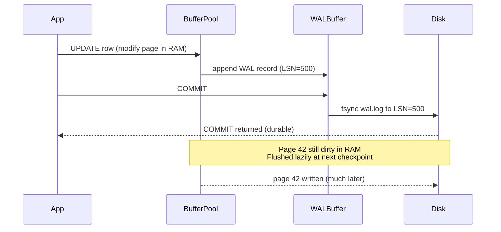
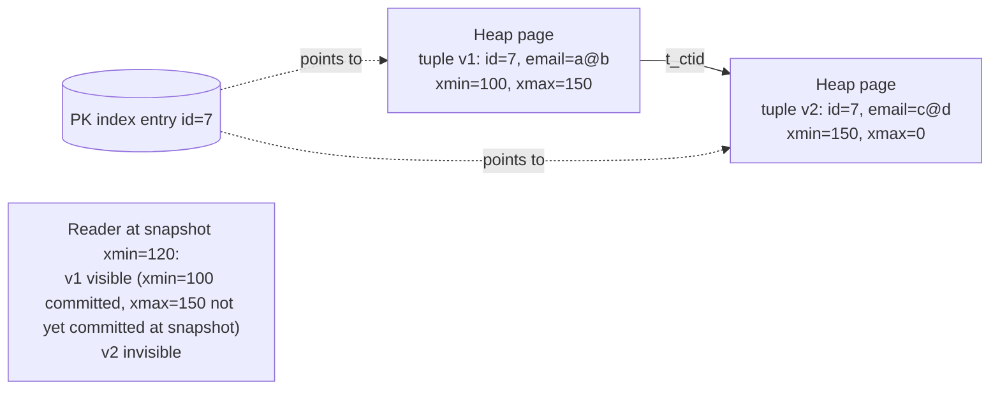

# SQL Internals — Part 2 of 3: WAL + MVCC + Isolation

> **Session 2026-04-29.** Builds directly on Part 1 (`notes/02-sql-internals.md` — pages, heap, btree, ctid, visibility map). Part 3 (`notes/02-sql-internals-part3.md`, future) will cover the query planner + locks + concurrency control on top of this.

## Sequence

- **Part 1** — `notes/02-sql-internals.md` — page-oriented storage, heap vs clustered, B+-tree internals.
- **Part 2 (this file)** — WAL + MVCC + isolation levels.
- **Part 3** — query planner + locks + concurrency.

## TL;DR

- **WAL (Write-Ahead Log)** is the universal durability trick: append a log record describing the change *before* the data page is written. On crash, replay the log from the last checkpoint. This converts random data-page writes into sequential log writes — the single biggest reason OLTP databases hit the throughput they do.
- **MVCC (Multi-Version Concurrency Control)** lets readers and writers stop blocking each other: every row carries `(xmin, xmax)` (the txns that created/deleted this version), and each transaction reads a *snapshot* — only versions visible at its start-time (or statement-time, depending on isolation level).
- **Postgres puts versions in the heap** (new tuple per UPDATE → dead tuples → VACUUM is mandatory). **InnoDB puts old versions in the undo log** (in-place update on the leaf, prior versions reconstructed by walking undo pointers). Same MVCC semantics, opposite implementation. Every operational difference flows from this one choice.
- **Isolation levels** are a leaky abstraction over which anomalies the engine permits. SQL standard names (READ COMMITTED, REPEATABLE READ, SERIALIZABLE) map to *different mechanisms* per engine — Postgres RR ≠ MySQL RR. Knowing the anomalies (dirty read, non-repeatable read, phantom, **write skew**) is the actual currency.
- **HOT (Heap-Only Tuple) updates** are Postgres's escape hatch from heap-MVCC's index-write tax. They only fire when (a) no indexed column changed and (b) the new tuple fits on the same page. Tune `fillfactor` and watch `pg_stat_user_tables.n_tup_hot_upd` in production.

## Why it exists

### Durability, before WAL

Pre-1990s, the obvious durability strategy was "fsync the data page on commit." Three failure modes made this untenable:

1. **Torn writes.** A 16 KB page write isn't atomic on disk — a crash mid-write leaves half-old, half-new bytes. No way to recover the page; you've corrupted data.
2. **Random I/O cost.** A transaction touching 50 random rows = 50 random page writes per commit. At ~10 ms per HDD seek, a single transaction's commit latency hit half a second.
3. **No way to roll back.** Without a record of "what the old value was," ABORT couldn't undo a partial transaction.

The WAL reframe (Mohan et al., **ARIES, 1992** — IBM Research): write a *log record* describing the change to a sequential log file, fsync the log on commit, and let the actual data pages drift. Data pages can be flushed lazily, batched, even reordered — recovery replays the log forward (`REDO`) and undoes losers backward (`UNDO`).

The economics flip: commit cost = one sequential fsync to the log. Hundreds of transactions can batch their log records into a single fsync (group commit). **Sequential disk I/O is 100-1000× faster than random**, so converting random data-page writes into a sequential log append is the entire game.

ARIES is still the textbook: every major OLTP engine (Postgres WAL, InnoDB redo + undo log, SQL Server transaction log, Oracle redo log) is an ARIES variant.

### MVCC, before snapshot isolation

The naive concurrency model was **two-phase locking (2PL)**: every read takes a shared lock, every write takes an exclusive lock, locks held to commit. Correct, simple, and **disastrous for read-heavy OLTP** — long readers blocked all writers; long writers blocked all readers. Reporting queries took down production.

The MVCC reframe (PostgreSQL borrowed it from POSTQUERES; InnoDB adopted it from Oracle): **readers don't take locks, they read a snapshot**. Each transaction sees the database as of some point in time; writers create new versions; old versions stay around until no living transaction can see them. Reads and writes stop fighting.

The cost is that "old versions" have to live somewhere, and somebody has to clean them up. Postgres put them in the heap → VACUUM. InnoDB put them in undo log → purge thread. Both pay the same conceptual cost; the operational pain shows up in different places.

### Isolation levels, the historical accident

The SQL-92 standard defined isolation in terms of three anomalies (dirty read, non-repeatable read, phantom) and four levels (READ UNCOMMITTED, READ COMMITTED, REPEATABLE READ, SERIALIZABLE). It was written assuming **2PL implementations** — and in 2PL, those four levels neatly partition the anomaly space.

Then MVCC happened. MVCC engines could prevent some anomalies "for free" (snapshot isolation prevents dirty + non-repeatable reads + most phantoms) but introduced **write skew** — an anomaly the SQL standard never named because 2PL prevents it incidentally. The result: every engine maps the standard names onto whatever mechanism it happens to implement.

- **Oracle** — there's no real REPEATABLE READ; SERIALIZABLE is actually snapshot isolation (so write skew slips through, despite the name).
- **Postgres** — REPEATABLE READ = snapshot isolation; SERIALIZABLE (since 9.1) = SSI on top of SI, the only real serializable in the lineup.
- **MySQL InnoDB** — REPEATABLE READ ≈ snapshot isolation **plus** next-key locks (gap locks) on writes to prevent phantoms. Default level. SERIALIZABLE = "select ... lock in share mode" implicitly on every read = effectively 2PL.

The interview takeaway: **don't trust the level name; ask which anomalies it prevents on this engine.**

## Mental model

**WAL = the bank's transaction journal.** A bank doesn't update every account ledger page in real time. Every transaction is an append to the journal: "Account 7 → Account 12, $50, 2026-04-29 14:23." The actual ledger pages get rewritten overnight (checkpointing). If the bank burns down, you reconstruct the ledgers from the journal. Commit = "the journal entry is signed and dated"; the ledger update is bookkeeping that follows.

**MVCC = a wiki with full history.** Every page (row) has a list of revisions, each tagged with the editor (transaction ID) and the timestamp of creation/deletion. When you open the wiki, you're shown the version that was current at the moment you opened it — even if other people are simultaneously editing. The site needs a janitor (VACUUM / undo purge) to eventually delete revisions nobody can possibly see anymore.

**Isolation levels = how recently you refresh the wiki page.** READ COMMITTED = you see whatever's current each time you click; REPEATABLE READ = the page is frozen as you opened it; SERIALIZABLE = the wiki engine guarantees that whatever the result of all your edits is, there's a single sequential order in which everyone's edits could have happened to produce that exact result — even if your edits were interleaved.

## How it works (internals)

### 1. WAL — write-ahead logging

The fundamental rule (the **WAL invariant**): a log record describing a change must be on stable storage *before* the corresponding data page is written.

```
Transaction T:                        Disk:
  UPDATE users SET email='x' …
  → modify page 42 in buffer pool     [page 42 dirty in RAM]
  → write WAL record (LSN=500):       wal.log: ... [LSN=500: page 42, before=..., after=...] ←
                                                                                        fsync on COMMIT
  COMMIT
  → page 42 may flush hours later     [page 42 still dirty in RAM]

Crash here.

Recovery:
  → read wal.log from last checkpoint
  → replay forward: page 42 reaches its committed state
  → roll back any uncommitted txns (their UNDO records)
```

Every WAL record carries an **LSN (Log Sequence Number)** — a monotonic byte offset into the log. Every data page header carries the LSN of the most recent WAL record that modified it. This is how recovery decides "do I need to replay this record?" — if `page.LSN >= record.LSN`, the change is already on disk; skip.

**Group commit.** Multiple concurrent transactions hitting COMMIT pile their records into the WAL buffer; one fsync flushes the buffer; everyone's commit returns. This is why a database's commit throughput is so much higher than `1 / fsync_latency` — at ~5 ms fsync, you'd cap at 200 commits/sec, but real systems do 10K+ commits/sec by batching.

**Checkpointing.** Periodically the engine forces all dirty data pages to disk and records a checkpoint LSN. On crash, recovery replays only from the last checkpoint forward. Checkpoint frequency is the classic trade-off:

- Frequent checkpoints → fast recovery, more I/O, write amplification.
- Rare checkpoints → slow recovery (long replay), less steady-state I/O.

Postgres: `checkpoint_timeout`, `max_wal_size`. InnoDB: `innodb_io_capacity`, fuzzy checkpointing (continuous background flush).

**Postgres: full-page writes.** First time a page is dirtied after a checkpoint, the *entire page image* is written to WAL (not just the diff) — to defend against torn writes. Once a page is in the log as a full image, recovery can always reconstruct it. This is the biggest single source of WAL volume in Postgres.

**InnoDB: separate redo + undo logs.** Redo log = "what the new value is" (for crash recovery). Undo log = "what the old value was" (for rollback **and MVCC reads of older versions**). Postgres has only redo — undo functionality is implicit in the heap (old tuple still there).

**WAL is also the replication carrier.** Every Postgres replica streams WAL from the primary and replays it. Logical replication (Postgres `pgoutput`, Debezium) parses WAL into row changes. This is the entire mechanism behind CDC. Topic 04 will go deep here.



### 2. MVCC — the mechanics

#### Postgres — heap-MVCC

Every heap tuple header carries:

| Field | Meaning |
|---|---|
| **xmin** | Transaction ID that created this tuple version |
| **xmax** | Transaction ID that deleted/superseded it (0 if still live) |
| **cmin / cmax** | Command IDs within that transaction (intra-txn ordering) |
| **t_ctid** | Pointer to the next version of this row (chains versions on UPDATE) |
| Hint bits | Cached "xmin/xmax committed?" — set lazily on first read |

**INSERT:** new tuple with `xmin = current_txn`, `xmax = 0`.
**UPDATE:** old tuple's `xmax = current_txn`; new tuple inserted with `xmin = current_txn`, `xmax = 0`. **Old tuple is not deleted.** Both physically exist. `t_ctid` of the old tuple points to the new one.
**DELETE:** tuple's `xmax = current_txn`. Tuple still physically there.

A reading transaction sees a tuple iff `xmin` is committed and visible to its snapshot, AND `xmax` is either 0 or not visible.

```
Snapshot = {xmin_lower, xmax_upper, in_flight_xids}
Tuple visible to snapshot S iff:
  - tuple.xmin committed AND tuple.xmin < S.xmax_upper AND tuple.xmin not in S.in_flight_xids
  - AND (tuple.xmax = 0 OR tuple.xmax aborted OR tuple.xmax >= S.xmax_upper OR tuple.xmax in S.in_flight_xids)
```

**Consequences (the operational reality):**

- **VACUUM is mandatory.** Dead tuples (those whose `xmax` is committed and older than every live snapshot) must be reclaimed or the heap grows unboundedly. Autovacuum is the daemon; tuning it is half of Postgres ops.
- **Bloat.** A long-running transaction (long-running report, paused replica with `hot_standby_feedback`, abandoned `psql` session, replication slot) holds back the global xmin → no tuple newer than that xmin can be vacuumed → table and indexes grow despite no net data growth. Single most common Postgres production incident.
- **XID wraparound.** Postgres XIDs are 32-bit. After 2 billion transactions, they wrap. The engine periodically must "freeze" old tuples (mark them as "always visible") before the wraparound horizon hits. If autovacuum can't keep up, Postgres halts writes (`emergency vacuum mode`). Mailchimp, Sentry, and others have shipped wraparound-incident postmortems.
- **Index entries don't get xmin/xmax.** They point to tuples; if the tuple is dead, the index entry is dead too. VACUUM cleans both. This is also why **index-only scans need the visibility map** (Part 1 teaser): the index doesn't know visibility on its own.



#### InnoDB — undo-log MVCC

Every clustered-index row carries:

| Field | Meaning |
|---|---|
| **DB_TRX_ID** | Transaction ID that last modified this row (6 bytes) |
| **DB_ROLL_PTR** | Pointer to undo record for the prior version (7 bytes) |
| **DB_ROW_ID** | Hidden row id if no PK (Part 1) |

**INSERT:** row written, `DB_TRX_ID = current_txn`, undo log records "delete me on rollback."
**UPDATE:** row updated **in place** in the clustered leaf; undo log records the prior column values + prior `DB_TRX_ID`. New version overwrites the old one on the page.
**DELETE:** row marked "delete-marker," still physically there until purge thread reclaims it.

A reading transaction at snapshot S, looking at row R:

```
if R.DB_TRX_ID is invisible to S:
    walk DB_ROLL_PTR → reconstruct prior version from undo log
    if that version's DB_TRX_ID still invisible: keep walking
```

**Consequences:**

- **No VACUUM.** Old versions live in undo log, not in the data file. InnoDB has a **purge thread** that reclaims undo records once no living txn could read them.
- **Undo log can blow up.** Long-running read transactions force the undo log to retain old versions → undo tablespace grows → eventually OOM-on-disk. Same root cause as Postgres bloat, different surface symptom (`information_schema.INNODB_TRX.trx_rows_modified` watches it).
- **Read of an old version walks undo.** Long-running readers see degraded performance because every row read might walk multiple undo records to reconstruct the version they're allowed to see. Postgres avoids this (old version is already in the heap, accessed directly), at the cost of bloat.
- **In-place updates mean secondary indexes don't necessarily change.** If you update a non-indexed column, secondary indexes are untouched (the PK didn't change → the secondary's PK reference is still valid). This is the structural reason Uber's 2016 post argued InnoDB's write amplification is lower.

#### Postgres heap-MVCC vs InnoDB undo-MVCC

| Dimension | Postgres (heap-MVCC) | InnoDB (undo-MVCC) |
|---|---|---|
| Old versions live in | Heap (next to live versions) | Undo log (separate tablespace) |
| Cleanup mechanism | VACUUM (autovacuum) | Purge thread |
| Operational pain mode | Table/index bloat | Undo log growth |
| Old-version read cost | Direct heap access (cheap) | Walk undo pointers (more expensive the older you go) |
| UPDATE affects index? | Always rewrites every index unless **HOT** fires | Only indexes whose columns changed |
| Long-running txn blast radius | Whole-instance bloat (global xmin holds) | Undo log size (can hit disk-full) |
| Recovery model | Redo-only WAL | Redo + undo log |
| In-place update? | No (always new tuple version) | Yes (in clustered leaf) |
| Wraparound concern | XID 32-bit → must freeze | TRX_ID 48-bit → not in practice |

#### HOT (Heap-Only Tuple) updates — Postgres's escape hatch

Naive heap-MVCC: every UPDATE writes a new tuple, gets a new ctid, and **every index** on the table must be updated to point at the new ctid (since the row "moved"). On a table with 10 indexes, an UPDATE that changed one column triggers 10 index inserts. This is the write-amp Uber complained about.

**HOT** fires when:
1. **No indexed column was changed.** (None of the changed columns are in any index, including the PK.)
2. **The new tuple version fits on the same page** as the old one.

If both hold:
- The new tuple goes into a free slot on the same page.
- The old tuple's `t_ctid` points to the new one (a "HOT chain").
- **Indexes are not touched** — they still point at the old ctid, which is the entry-point to the chain. Lookups walk the chain to find the live version.
- A subsequent VACUUM (or even an opportunistic mini-cleanup on the page during a read) can prune the chain in place.

Operational levers:
- **`fillfactor`** — Part 1 mentioned this; this is the deeper reason. Setting `fillfactor=70` on an UPDATE-heavy table reserves 30% per page for HOT-update slots. Without slack, HOT can't fire — the new version overflows to a different page, and the index update tax is back.
- **Monitoring** — `pg_stat_user_tables.n_tup_upd` (total updates) vs `n_tup_hot_upd` (HOT updates). HOT% = `n_tup_hot_upd / n_tup_upd`. Below ~70% on a hot table is a yellow flag — usually means fillfactor is too high or queries are touching indexed columns unnecessarily.

```java
// Schema design implication for a Java app:
// - Hot table where UPDATEs typically touch only `last_seen_at`, `status_payload`.
// - Don't index `status_payload`. Don't index `last_seen_at` unless you must.
// - If you must, accept that HOT won't fire on those updates.

@Table(name = "user_session", fillFactor = 70)  // hint via DDL
public class UserSession {
    @Id Long id;                            // indexed (PK)
    @Index String userId;                   // indexed (FK lookup)
    Instant lastSeenAt;                     // NOT indexed → HOT-eligible UPDATE target
    @Type(JsonbType.class) JsonNode payload;// NOT indexed → HOT-eligible
    String status;                          // NOT indexed → HOT-eligible
}
```

InnoDB doesn't need HOT — its in-place updates on the clustered leaf already skip secondary indexes when their columns didn't change. HOT is Postgres catching up to that ergonomic.

### 3. Isolation levels — by anomaly, not by name

The SQL standard defines four isolation levels in terms of three anomalies. Real engines add more anomalies and more (or fewer, despite the name) levels.

| Anomaly | What | Example |
|---|---|---|
| **Dirty read** | Read a value written by an uncommitted txn | T1 writes, T2 reads, T1 rolls back → T2 saw a value that never existed |
| **Non-repeatable read** | Re-read in same txn returns a different value | T1 reads X=10, T2 commits X=20, T1 reads X=20 |
| **Phantom read** | Re-execute same WHERE clause returns different rows | T1 `SELECT WHERE status='active'` returns 3, T2 inserts a 4th, T1 re-queries and sees 4 |
| **Lost update** | Two txns read the same value, both write back, one's update is lost | T1 reads balance=100, T2 reads balance=100, T1 writes 90, T2 writes 80 — T1's debit lost |
| **Write skew** | Two txns read overlapping data, write disjoint data, both pass their constraint individually but joint result violates an invariant | "Need ≥1 doctor on call" — T1 sees Alice & Bob on call, takes Alice off; T2 sees Alice & Bob on call, takes Bob off; both commit; nobody on call |

| Level | Postgres implementation | InnoDB implementation | Anomalies prevented |
|---|---|---|---|
| **Read Uncommitted** | Same as Read Committed (Postgres doesn't actually allow dirty reads) | Allows dirty reads | (varies) |
| **Read Committed** (Postgres default) | New snapshot **per statement** | New snapshot per statement; **gap locks not held** | dirty read |
| **Repeatable Read** | Snapshot at first statement, held through commit (snapshot isolation) | Snapshot at first statement + **next-key locks (gap locks)** for writes (prevents phantoms via locking) | dirty, non-repeatable, phantom (in PG: phantoms gone *for the snapshot*; SQL-level phantoms still possible via concurrent inserts), still allows write skew |
| **Serializable** | SI + **SSI (Serializable Snapshot Isolation)** — engine tracks read-write dependencies and aborts cycles | Implicit `SELECT ... LOCK IN SHARE MODE` on every read = effectively 2PL | All above + write skew (true serializable) |

#### The write-skew scenario (interview classic)

```sql
-- Schema: oncall(doctor TEXT, on_duty BOOLEAN). Invariant: COUNT(*) WHERE on_duty >= 1.
-- Initial state: Alice on_duty=true, Bob on_duty=true.

-- T1                                        T2
BEGIN ISOLATION LEVEL REPEATABLE READ;       BEGIN ISOLATION LEVEL REPEATABLE READ;
SELECT COUNT(*) FROM oncall WHERE on_duty;   SELECT COUNT(*) FROM oncall WHERE on_duty;
-- returns 2                                 -- returns 2
-- check: 2 >= 1, OK to remove one           -- check: 2 >= 1, OK to remove one
UPDATE oncall SET on_duty=false              UPDATE oncall SET on_duty=false
  WHERE doctor='Alice';                        WHERE doctor='Bob';
COMMIT;                                      COMMIT;

-- Final state: nobody on duty. Invariant violated.
```

- **Postgres RR (snapshot isolation):** allows this. Both txns see "2 doctors" in their snapshot, both commit disjoint writes, no version conflict.
- **Postgres SERIALIZABLE (SSI):** detects the read-write dependency cycle (T1 read what T2 wrote, T2 read what T1 wrote → cycle) and aborts one of them with `serialization_failure` (SQLSTATE 40001). App must retry.
- **InnoDB RR:** depends on whether the SELECT triggers gap locks. With `SELECT FOR UPDATE` it does; with a plain SELECT, MySQL's RR is *not* serializable and write skew is allowed.
- **InnoDB SERIALIZABLE:** plain SELECTs become `SELECT ... LOCK IN SHARE MODE` → S-locks on read rows → second txn's UPDATE blocks → deadlock or serialization → safe but lower throughput.

```java
// Java with JDBC — RR isn't enough for invariants like "≥1 doctor on duty"
try (Connection c = ds.getConnection()) {
    c.setTransactionIsolation(Connection.TRANSACTION_SERIALIZABLE);  // PG: SSI; InnoDB: 2PL-ish
    c.setAutoCommit(false);
    try {
        try (var ps = c.prepareStatement("SELECT COUNT(*) FROM oncall WHERE on_duty")) {
            // ...
        }
        // ... business check ...
        try (var ps = c.prepareStatement("UPDATE oncall SET on_duty=false WHERE doctor=?")) {
            ps.setString(1, doctor);
            ps.executeUpdate();
        }
        c.commit();
    } catch (SQLException e) {
        if ("40001".equals(e.getSQLState())) {
            // PG SSI serialization failure — retry with backoff
        }
        c.rollback();
    }
}
```

**The interview-grade answer:** "Use SERIALIZABLE if you have invariants over multiple rows, accept the retry-on-conflict pattern, and budget for ~10-20% throughput loss. If SERIALIZABLE is too expensive, downgrade to RR + explicit `SELECT ... FOR UPDATE` on the rows you're branching on — this promotes the read into a write-conflict and gets you write-skew safety surgically."

### 4. Putting WAL + MVCC together — the commit path

A typical UPDATE in Postgres:

1. Locate tuple via PK index → fetch heap page into buffer pool.
2. Write WAL record (UNDO + REDO data) to WAL buffer; assign LSN.
3. **Mutate the buffer page**: set old tuple's `xmax`, write new tuple in same/different page (HOT or non-HOT); update `t_ctid`.
4. Update affected indexes (only if not HOT).
5. On COMMIT: write commit WAL record; **fsync WAL up to that LSN** (group-batched).
6. Return success to client.
7. Buffer page eventually flushed at next checkpoint.

Three independent durability layers running concurrently:
- **WAL fsync** — synchronous, on commit. The bottleneck.
- **Dirty page flush** — asynchronous, at checkpoint. The throughput knob.
- **VACUUM / purge** — asynchronous, in background. The space-reclaim knob.

If any one is misconfigured, the symptom shows up as a different incident. Slow commits = WAL fsync (disk latency). Long startup time = checkpoint too rare (huge replay). Bloat = VACUUM behind. **Diagnosing prod requires knowing which axis you're on.**

## Trade-offs

### Heap-MVCC (Postgres) vs Undo-MVCC (InnoDB)

| Dimension | Postgres heap-MVCC | InnoDB undo-MVCC |
|---|---|---|
| Read of latest version | Cheap (heap fetch) | Cheap (in-place leaf) |
| Read of old version | Cheap (already in heap) | Walks undo log (worse with age) |
| UPDATE write amp | High unless HOT fires | Low (only touched indexes) |
| Cleanup mode | VACUUM (table-scope, blocking-ish) | Purge (background, log-scope) |
| Long-running readers' damage | Bloat (everyone pays) | Undo log size (easier to bound) |
| Schema-side mitigation | `fillfactor`, fewer indexes, monitor HOT% | Avoid huge UPDATE hotspots in long txns |
| Failure mode if cleanup falls behind | Wraparound emergency / disk-full from bloat | Undo log fills disk |

### WAL knobs

| Setting (PG / InnoDB) | Trade-off |
|---|---|
| `synchronous_commit=on` / `innodb_flush_log_at_trx_commit=1` | Safe (true ACID); commit waits for fsync. Default. |
| `synchronous_commit=off` / `=2` (fsync once/sec) | Up to 1s of committed txns lost on crash; commit ~10× faster. Ok for analytics, NOT for payments. |
| Larger WAL / log files | Less frequent rollover, more disk used; longer recovery if checkpoint is far behind. |
| `wal_compression=on` | CPU overhead, less WAL volume, smaller replication lag. |
| `full_page_writes=off` | DANGEROUS — only safe on filesystems guaranteeing atomic page writes (ZFS with right config). |

### Isolation level vs throughput

| Level | Anomalies prevented | Throughput cost | When to use |
|---|---|---|---|
| Read Committed | Dirty | Cheapest | Most app reads where staleness within a txn is fine |
| Repeatable Read | + Non-repeatable, phantom (PG) | ~1-5% over RC | Reports needing intra-txn consistency, accumulating sums |
| Serializable | + Write skew | ~10-20% + retry budget | Multi-row invariants, financial branching logic |

## When to use / avoid

**WAL-based durability is non-negotiable for OLTP.** The only reason to bypass it is intentional data-loss tolerance (e.g., MyISAM, tmpfs Postgres for tests).

**Postgres heap-MVCC is great when:**
- Long-running readers (analytical queries, replicas with `hot_standby_feedback`) are rare or budgeted.
- Update-heavy hot tables can be tuned with `fillfactor` + minimized indexes for HOT.
- Operational team owns autovacuum tuning.

**Postgres heap-MVCC hurts when:**
- Long-running transactions are unavoidable (legacy reporting, CDC slots) → bloat.
- Tables have many indexes AND updates touch indexed columns → no HOT → 10× write amp.
- Workload is XID-burning (high-velocity short txns) → wraparound horizon.

**InnoDB undo-MVCC is great when:**
- Update-heavy with secondary-index-stable columns (Uber-style hot tables).
- PK is monotonic (auto-inc / UUID v7) — clustered structure stays clean.

**InnoDB undo-MVCC hurts when:**
- Long-running readers stretch the undo log → reads get slow and disk fills.
- PK is wide (e.g., 36-byte UUID v4 string) — every secondary index leaf inflates.

**Use SERIALIZABLE when:**
- Multi-row invariant must hold (oncall, inventory, balance ≥ 0 on linked accounts).
- App can retry on `40001` (`serialization_failure`) — this MUST be in the data layer, not optional.

**Avoid SERIALIZABLE when:**
- Single-row updates with no cross-row invariant — RC + idempotency keys is cheaper.
- High contention, no retry tolerance — switch to explicit `SELECT FOR UPDATE` on the branching read.

## Real-world example

**Postgres bloat at scale: Sentry, 2015 ("Why Sentry no longer uses Postgres in some places").** Their high-write workloads hit autovacuum's limits — VACUUM couldn't keep up, tables bloated, queries degraded. Their fix involved partitioning + dropping old partitions instead of relying on UPDATE/DELETE+VACUUM. Pattern: when VACUUM is the bottleneck, replace UPDATE/DELETE with **append + DROP PARTITION**.

**XID wraparound: Mailchimp, 2019 incident.** Long-running replication slots + autovacuum throttled too aggressively → XID horizon advanced → emergency vacuum mode → write outage. The forensic shape: `pg_stat_database.datfrozenxid` minus current XID dropping toward 200M (the freeze warning threshold). **Every Postgres SRE on-call rotation watches this metric.**

**Aurora Postgres rebuilt the WAL boundary.** Aurora ships WAL records to a 6-node distributed storage layer; storage nodes replay WAL on demand to materialize pages. The compute node never writes data pages — only WAL. The clean separation lets Aurora scale read replicas without per-replica replay (every replica just reads the storage layer's already-applied state). This is the architectural punchline of Part 1's "the log is the database."

**MySQL InnoDB undo-log incident: Shopify, ~2019 — reported large undo log growth tied to long-running read replicas and analytics queries crossing into prod.** Mitigation was bounding analytical query duration. Same root cause shape as Postgres bloat (long readers), different surface (`information_schema.INNODB_TRX`).

**Postgres SSI in production: heroku-style migration tools** (and Joyent's Manta) use SERIALIZABLE for control-plane state mutations specifically so that "set this object's state to X if and only if it's currently Y" branches are write-skew-free without explicit locking. Throughput is fine because control-plane ops are low-rate.

**Write-ahead-log everywhere.** The pattern transcends databases:
- **Kafka** — the log *is* the database (Phase 3).
- **etcd / ZooKeeper** — Raft log = WAL (Phase 5).
- **Filesystems** — ext4/XFS journal = WAL.
- **LSM databases** (Cassandra, RocksDB) — commitlog before memtable flush.

Once you see WAL as the "make random durable-writes sequential" pattern, you see it in every storage system. That recognition is the senior-level signal in interviews.

## Common mistakes

- "Postgres SERIALIZABLE = MySQL SERIALIZABLE." Same name, different mechanism (SSI vs 2PL). Different perf profile, different failure modes (`40001` retry vs deadlock).
- "Snapshot isolation = serializable." False — write skew slips through. Oracle's "SERIALIZABLE" is actually SI; bring this up if asked.
- "VACUUM reclaims disk." It doesn't shrink files (returns space to free-space map for reuse). For actual disk reclamation: `VACUUM FULL` (locks the table) or `pg_repack` (online).
- "InnoDB doesn't need cleanup like Postgres." It does — purge thread on undo log. Same problem, different surface.
- "Just use READ COMMITTED, it's faster." Until you hit a multi-row invariant and silently violate it. Pick the level by anomalies, not perf.
- "Long-running transaction is fine, it's just a SELECT." Reads hold the global xmin → block VACUUM → bloat. Read-only doesn't mean cost-free.
- "WAL is just for replication." It's primarily for crash recovery; replication is a downstream consumer.
- Setting `synchronous_commit=off` on a payments DB to "speed up commits." 1s of acknowledged-but-lost transactions is unacceptable in financial workflows.
- Forgetting to retry on `40001`. SERIALIZABLE in PG **requires** retry logic; without it you're shipping random user errors.
- Treating `EXPLAIN ANALYZE` of a SERIALIZABLE query as ground truth without considering retry rate at concurrency.
- Conflating Postgres `CLUSTER` command with clustered index (Part 1 reminder — and `CLUSTER` interacts with MVCC because it rewrites the table).

## Interview insights

**Typical questions:**

- "Why does a database use a write-ahead log?" — sequential vs random I/O + crash recovery + the WAL invariant.
- "Walk through a commit." — buffer mutation → WAL append → fsync → return → lazy page flush.
- "Postgres or InnoDB — where do old row versions live?" — heap (PG) vs undo log (InnoDB) and the operational consequences of each.
- "What does VACUUM do, and what happens if it falls behind?" — bloat, eventually wraparound emergency.
- "Explain HOT updates." — same-page free slot + no indexed-col change + `fillfactor` lever.
- "What's snapshot isolation, and what anomaly does it permit?" — write skew + the oncall scenario.
- "Postgres SERIALIZABLE vs InnoDB SERIALIZABLE — both prevent write skew. Same mechanism?" — SSI vs 2PL.
- "What's an XID wraparound and how do you prevent it?" — 32-bit XID space, freeze, autovacuum.

**Follow-ups interviewers love:**

- "You set `synchronous_commit=off`. What did you give up?" — up to `wal_writer_delay` of acked-but-lost commits.
- "Your Postgres DB has a 500 GB table on disk but only 50 GB of live data. Diagnosis?" — bloat from long-running txn or replication slot holding xmin.
- "Why did adding a 6th secondary index slow down writes 2×?" — every UPDATE now hits all 6 unless HOT — and an index on the updated column kills HOT.
- "Two transactions both check `balance >= 100` and both deduct 100. Both succeed. What level were you on, and what would prevent it?" — RR/SI permits write skew; SERIALIZABLE or `SELECT ... FOR UPDATE` fixes it.
- "Replica lag is 30s. What does that imply about the primary?" — WAL throughput on primary > replica replay; usually replica I/O bound, not network.
- "Design idempotent writes on top of RC." — idempotency keys + unique constraint or `INSERT ... ON CONFLICT`.

**Red flags to avoid saying:**

- "MVCC means no locks." — it means *readers don't block writers*; writers still take row locks.
- "REPEATABLE READ is serializable." — only on Oracle is it falsely named; everywhere else, RR allows write skew.
- "WAL is just for replication." — primary purpose is recovery.
- "Just bump isolation to SERIALIZABLE if there's a bug." — without retry handling, you're trading one bug for another.
- "VACUUM FULL is fine to run anytime." — it takes ACCESS EXCLUSIVE; will lock prod.
- "Long-running queries don't affect writes." — they hold xmin → bloat.
- "Postgres updates the row in place." — it doesn't (always new tuple); InnoDB does.

## Related topics

- **Part 3 (next session)** — query planner, locks, deadlocks, lock escalation, optimistic vs pessimistic concurrency.
- **04 Replication** — Postgres physical replication = ship WAL; logical = parse WAL into row events; this part is the upstream of CDC.
- **15 Delivery semantics & idempotency** — `INSERT ... ON CONFLICT` + unique-key idempotency builds on Part-2 atomicity.
- **19 Consensus** — Raft log is conceptually a distributed WAL.
- **08 Caching patterns** — cache invalidation built on WAL/CDC.

## Further reading

- **"Database Internals"** — Alex Petrov, Chapters 4-6 (transactions, recovery, MVCC).
- **"Designing Data-Intensive Applications"** — Kleppmann, Chapter 7 (transactions). The write-skew section is canonical.
- **ARIES paper** — Mohan et al., 1992. *"ARIES: A Transaction Recovery Method Supporting Fine-Granularity Locking and Partial Rollbacks Using Write-Ahead Logging."* Dense but the source.
- **"Serializable Snapshot Isolation"** — Cahill, Röhm, Fekete, 2008. The paper PG's SSI is built on.
- **Postgres docs** → Internals → MVCC + WAL Internals.
- **Bruce Momjian's "MVCC Unmasked"** talk — Postgres heap-MVCC walkthrough.
- **Jepsen tests** — every modern DB has a Jepsen analysis pinpointing real isolation behavior vs documented. Read the Postgres and MySQL ones.

---

## Deep-Dive Revisit: Isolation Levels — Anomalies + Real-World Examples (2026-05-02)

> Added because the original section listed anomalies without grounding them in concrete scenarios. This section builds the mental model from the ground up.

### Why isolation levels exist — the fundamental tension

Imagine a bank database. Ideally, every transaction runs as if it's the only transaction in the world — fully isolated. In practice, a database at 50,000 TPS can't run transactions one-at-a-time without destroying throughput. Isolation levels are the engineered compromise: choose *which* failure modes you're willing to accept in exchange for concurrency.

Each level is defined by which **anomalies** it permits. An anomaly is a way concurrent transactions can produce a result that would be impossible if they'd run serially (one after the other).

---

### The 5 anomalies — grounded in real scenarios

#### 1. Dirty Read

**What it is:** Transaction T2 reads a value written by T1 *before T1 commits*. If T1 rolls back, T2 saw a value that never actually existed.

**Real scenario — e-commerce order:**
```
T1: BEGIN; UPDATE orders SET status='shipped' WHERE id=99;
    -- (T1 is mid-processing, hasn't committed yet)
T2: SELECT status FROM orders WHERE id=99;  -- sees 'shipped' (T1's uncommitted write)
T1: ROLLBACK;  -- shipping failed, order reverted to 'pending'
T2: sends confirmation email to customer: "Your order has shipped!"
-- Customer email sent for an order that never shipped.
```

**In production:** Analytics dashboards, monitoring queries, or decision logic built on uncommitted data. If the source transaction rolls back, the decision was wrong from the start.

**Which levels prevent it:** READ COMMITTED and above.

---

#### 2. Non-Repeatable Read

**What it is:** T1 reads row X (value=A). T2 commits an update to row X (value=B). T1 re-reads row X and now sees B. Within a single transaction, the same row returned a different value.

**Real scenario — pricing calculation:**
```
T1: BEGIN;
T1: SELECT price FROM products WHERE id=42;  -- returns 100
    -- T1 is building a multi-line invoice, takes 200ms
T2: BEGIN; UPDATE products SET price=120 WHERE id=42; COMMIT;
T1: SELECT price FROM products WHERE id=42;  -- now returns 120
T1: builds invoice total using mixed prices — line 1 at 100, line 5 re-reads at 120
T1: COMMIT;
-- Invoice total is internally inconsistent.
```

**In production:** Multi-step reports, billing calculations, any logic that reads the same row more than once expecting consistency. A fraud detection engine that reads account state at step 1 and step 5 — if the state changed between reads, the decision logic is corrupted.

**Which levels prevent it:** REPEATABLE READ and above (snapshot taken at transaction start, all reads within the transaction see the same snapshot).

---

#### 3. Phantom Read

**What it is:** T1 runs a `SELECT WHERE` query, gets a result set. T2 inserts (or deletes) rows that match T1's WHERE clause. T1 re-runs the same query — different rows appear (or disappear). The "phantom" is a row that didn't exist when T1 first looked.

**The key difference from non-repeatable read:** Non-repeatable = same row, different *value*. Phantom = same query, different set of *rows*.

**Real scenario — capacity check:**
```
T1: BEGIN;
T1: SELECT COUNT(*) FROM bookings WHERE room_id=5 AND date='2026-06-01';
    -- returns 1 (one existing booking)
    -- room capacity is 2, so there's room for 1 more
T2: INSERT INTO bookings (room_id, date, guest) VALUES (5, '2026-06-01', 'Bob'); COMMIT;
T1: SELECT COUNT(*) FROM bookings WHERE room_id=5 AND date='2026-06-01';
    -- now returns 2 (the phantom Bob appeared)
T1: decides room is now full — but this second check didn't inform any decision yet
T1: proceeds to book Alice anyway based on first count
-- Two bookings for a single-occupancy room.
```

**More dangerous phantom variant (the VIP slot problem):**
```
T1: SELECT COUNT(*) FROM vip_members;  -- returns 9. Max is 10. Add one more.
T2: SELECT COUNT(*) FROM vip_members;  -- also returns 9. Max is 10. Add one more.
T1: INSERT INTO vip_members (user_id) VALUES (101); COMMIT;
T2: INSERT INTO vip_members (user_id) VALUES (202); COMMIT;
-- 11 VIP members. Invariant violated.
```

**Which levels prevent it:** In Postgres, REPEATABLE READ prevents phantoms (snapshot is fixed; new rows committed by T2 aren't in T1's snapshot). In MySQL InnoDB, RR also prevents phantoms but via gap locks (locks the gap between rows so T2's INSERT blocks until T1 commits).

---

#### 4. Lost Update

**What it is:** T1 and T2 both read a value, both compute a new value based on it, both write back. T2's write overwrites T1's write. T1's update is lost as if it never happened.

**Real scenario — concurrent counter increment:**
```
T1: SELECT views FROM articles WHERE id=7;  -- returns 1000
T2: SELECT views FROM articles WHERE id=7;  -- returns 1000
T1: UPDATE articles SET views = 1001 WHERE id=7; COMMIT;
T2: UPDATE articles SET views = 1001 WHERE id=7; COMMIT;  -- overwrites T1!
-- views = 1001. Should be 1002. One increment was lost.
```

**Real scenario — inventory deduction (Q4 from the quiz):**
```
T1: reads balance=500, computes new_balance=400, writes balance=400, commits.
T2: reads balance=500 (snapshot), computes new_balance=400, writes balance=400, commits.
-- Final: 400. Should be 300. T1's deduction was overwritten.
```

**Which levels prevent it:** Not directly prevented by the SQL standard's level definitions. In Postgres:
- RC + literal `SET col = computed_value` → lost update possible.
- RC + expression `SET col = col - 100` → NOT a lost update (expression re-evaluated on current row at write time).
- RR + literal → still possible (snapshot makes T2 calculate the wrong literal).
- RR + expression → NOT a lost update (expression still re-evaluates on current committed row).
- `SELECT ... FOR UPDATE` → prevents it (T2 blocks until T1 commits, then T2 re-reads the committed value).
- SERIALIZABLE → prevents it (SSI detects the dependency cycle).

---

#### 5. Write Skew

**What it is:** T1 reads data set A, writes to data set B based on what it read. T2 reads the same data set A (overlapping read), writes to data set C (disjoint write). Both transactions individually satisfy the invariant, but their combined effect violates it.

This is the hardest anomaly because **neither transaction alone does anything wrong**. The violation emerges from the interleaving.

**Real scenario 1 — on-call scheduling (from Part 2 notes):**
```
Invariant: at least 1 doctor must be on call at all times.
State: Alice on_duty=true, Bob on_duty=true.

T1: SELECT COUNT(*) FROM oncall WHERE on_duty=true;  -- returns 2. OK to remove one.
T2: SELECT COUNT(*) FROM oncall WHERE on_duty=true;  -- returns 2. OK to remove one.
T1: UPDATE oncall SET on_duty=false WHERE doctor='Alice'; COMMIT.
T2: UPDATE oncall SET on_duty=false WHERE doctor='Bob';  COMMIT.
-- Nobody on call. Invariant violated.
-- T1 read {Alice, Bob}, wrote Alice→off. T2 read {Alice, Bob}, wrote Bob→off. Both saw 2, both OK alone.
```

**Real scenario 2 — username uniqueness:**
```
T1: SELECT COUNT(*) FROM users WHERE username='alice';  -- returns 0, username available
T2: SELECT COUNT(*) FROM users WHERE username='alice';  -- returns 0, username available
T1: INSERT INTO users (username) VALUES ('alice'); COMMIT.
T2: INSERT INTO users (username) VALUES ('alice'); COMMIT.
-- Duplicate usernames (if no UNIQUE constraint — or at a higher application layer).
```
(In practice, a DB UNIQUE constraint catches this at the storage layer, but write skew shows up at the application logic level for invariants that can't be expressed as a single-row constraint.)

**Real scenario 3 — hotel room booking (two people book the last room):**
```
T1: SELECT COUNT(*) FROM bookings WHERE room_id=5 AND date=today;  -- 0 of 1 max. Available.
T2: SELECT COUNT(*) FROM bookings WHERE room_id=5 AND date=today;  -- 0 of 1 max. Available.
T1: INSERT INTO bookings (room_id, date, guest) VALUES (5, today, 'Alice'); COMMIT.
T2: INSERT INTO bookings (room_id, date, guest) VALUES (5, today, 'Bob');  COMMIT.
-- Two people booked the same room.
```

**Which levels prevent it:** Only SERIALIZABLE. Write skew is invisible to snapshot-based isolation because T1 and T2 read the same snapshot (both see the "safe" state) and write to disjoint rows (no write-write conflict detected). Postgres SSI tracks anti-dependencies (T1 read what T2 would affect, T2 read what T1 would affect → cycle → abort one).

---

### The four isolation levels — what each one actually means

#### Intuition first, then mechanics

Think of a snapshot as a **photograph of the database at a point in time**. Different levels control how fresh your photograph is, and how aggressively the engine prevents you from acting on a stale photo.

```
READ UNCOMMITTED: You see other people's in-progress work (even if they'll undo it).
READ COMMITTED:   You see the latest committed photo at each statement.
REPEATABLE READ:  You see one photo, taken at transaction start. Frozen until you commit.
SERIALIZABLE:     Same photo as RR, but the engine checks that your photo + your writes
                  couldn't have produced a bad outcome in any serial ordering.
```

#### READ UNCOMMITTED

Postgres doesn't implement this at all — it behaves like READ COMMITTED. MySQL does implement it.

**Never use this** unless you explicitly need live in-progress data for approximate analytics and correctness doesn't matter (e.g., "show me the approximate queue depth right now, including uncommitted enqueues").

#### READ COMMITTED (Postgres default, most apps)

Each **statement** gets a fresh snapshot of committed data. Reads within a transaction can see different committed states at different points.

```sql
BEGIN;  -- no snapshot taken yet
SELECT balance FROM accounts WHERE id=1;  -- snapshot taken NOW, sees latest committed (say 500)
-- ... 200ms later, T2 commits an UPDATE that sets balance=400 ...
SELECT balance FROM accounts WHERE id=1;  -- NEW snapshot, sees 400. Non-repeatable!
COMMIT;
```

**When it's correct:** Most web request handlers. If your transaction reads a row once, makes a decision, and writes once — RC is fine. The whole transaction is so fast (< 5ms) that concurrent modifications are rare, and even if they happen, the unique-constraint or conditional-update handles it.

**When it fails:** Any multi-step logic where you read, compute, and write based on a value that could change between the read and the write. The Q4 scenario (balance check + deduct) is the canonical failure.

#### REPEATABLE READ (Postgres = Snapshot Isolation)

Snapshot taken at **first statement** of the transaction. All reads in the transaction see that snapshot until commit. No non-repeatable reads. No phantoms (in Postgres — because new rows committed by others aren't in your snapshot).

```sql
BEGIN;
SELECT balance FROM accounts WHERE id=1;  -- snapshot taken NOW: balance=500
-- T2 commits UPDATE balance=400
SELECT balance FROM accounts WHERE id=1;  -- still sees 500 (snapshot frozen)
-- T2 commits INSERT of new account id=99
SELECT * FROM accounts;  -- id=99 NOT seen (snapshot was before T2's insert)
COMMIT;
```

**Critical Postgres nuance — writes target current row, not snapshot:**

When you do a `UPDATE` or `DELETE` under RR, Postgres applies the write to the **current committed version** of the row, not your snapshot version. This is why:
- `SET balance = balance - 100` works correctly (expression re-evaluated on current row).
- `SET balance = 400` loses updates (literal was computed from stale snapshot read).

**Still vulnerable to:** Write skew (both T1 and T2 read the same snapshot, write to disjoint rows, jointly violate invariant).

**When to use:** Long-running reports that need a consistent view of the data (you don't want prices to change mid-calculation). Multi-step calculations where non-repeatable reads would corrupt the result.

#### SERIALIZABLE (Postgres = SSI, MySQL = 2PL-ish)

**Postgres SSI (Serializable Snapshot Isolation):**

Builds on snapshot isolation, adds **anti-dependency tracking**. During each transaction, Postgres records:
- Which rows T read (read-set).
- Which rows T wrote (write-set).

At commit time, it checks: is there a cycle where T1 read data that T2 wrote, and T2 read data that T1 wrote? If yes, one transaction is the "pivot" of an anomaly → it's aborted with `SQLSTATE 40001 (serialization_failure)`. The other transaction retries and succeeds.

```
On-call example with SSI:
T1 reads {Alice on_duty=true, Bob on_duty=true} — T1's read-set includes oncall rows.
T2 reads {Alice on_duty=true, Bob on_duty=true} — T2's read-set also includes oncall rows.
T1 writes Alice→off_duty — T1's write-set = Alice row.
T2 writes Bob→off_duty — T2's write-set = Bob row.

SSI detects: T1 read Bob's row (which T2 wrote), T2 read Alice's row (which T1 wrote) → cycle.
One of T1, T2 is aborted. The survivor's second read would see nobody-on-call → it would NOT proceed.
Result: invariant protected.
```

**MySQL InnoDB SERIALIZABLE:**

Takes `SELECT ... LOCK IN SHARE MODE` implicitly on every read. This is effectively 2PL for reads — every SELECT is a shared lock, every write is an exclusive lock, held until commit. It's correct but:
- Much higher lock contention.
- Deadlocks are common.
- Throughput drops significantly more than Postgres's SSI.

**Overhead of SERIALIZABLE:**
- Postgres SSI: ~10-20% throughput reduction; retry logic is mandatory.
- InnoDB SERIALIZABLE: often 30-50%+ throughput reduction; deadlocks need retry too.

**When to use Postgres SERIALIZABLE:**
- Multi-row invariants that can't be expressed as single-row constraints (on-call count, VIP slots, booking capacity).
- Financial logic where correctness is non-negotiable and the invariant spans multiple rows.
- **You MUST implement retry on 40001** — without it, SERIALIZABLE just randomly aborts transactions and surfaces errors to users.

---

### Isolation levels × anomalies — the full matrix

| Anomaly | READ UNCOMMITTED | READ COMMITTED | REPEATABLE READ (PG) | SERIALIZABLE (PG SSI) |
|---|---|---|---|---|
| Dirty read | ✗ possible | ✓ prevented | ✓ prevented | ✓ prevented |
| Non-repeatable read | ✗ possible | ✗ possible | ✓ prevented | ✓ prevented |
| Phantom read | ✗ possible | ✗ possible | ✓ prevented (PG snapshot) | ✓ prevented |
| Lost update (literal) | ✗ possible | ✗ possible | ✗ possible | ✓ prevented |
| Lost update (expression) | ✓ not possible | ✓ not possible | ✓ not possible | ✓ not possible |
| Write skew | ✗ possible | ✗ possible | ✗ possible | ✓ prevented |

> Note: "lost update with expression" is not possible under any level because DML always targets the current committed row — the expression is evaluated fresh regardless of isolation level.

---

### Decision guide — which level for your use case?

```
Is every write a single-row, idempotent operation?
    → READ COMMITTED + idempotency key (unique constraint)

Do you read a row and write to the SAME row based on what you read?
  → Is there a conditional check before writing?
      No  → READ COMMITTED + expression (SET col = col ± delta)
      Yes → READ COMMITTED + SELECT FOR UPDATE + expression
            (FOR UPDATE makes you re-read the current committed value under a lock)

Do you read MULTIPLE rows and write to ANY of them based on the collective state?
    (e.g., count-then-insert, check-invariant-then-update)
    → SERIALIZABLE + retry on 40001
    → Or: SELECT FOR UPDATE on all rows in the invariant check + READ COMMITTED

Are you running a long read-only report that needs a consistent snapshot?
    → REPEATABLE READ (reads only, no writes — no risk of serialization failures)
    → Or: start a read replica read with RR (no retry needed; no writes)
```

---

### Real-world isolation level choices in production systems

**Stripe (payments):** Uses SERIALIZABLE for idempotency key checks and balance operations where the invariant spans multiple rows (e.g., a transfer must deduct from one account and credit another atomically, with balance ≥ 0 on both). Retry on 40001 is baked into every database call in their infrastructure library.

**Postgres default (READ COMMITTED):** Almost every web framework's default connection pool uses RC. Django, Rails, Spring Boot — all RC by default. This is correct for most CRUD apps where transactions are short and single-row.

**Booking systems (hotels, airlines):** Either SERIALIZABLE + retry, OR optimistic locking (`version` column + `WHERE id=? AND version=?`), OR application-level distributed lock (Redis-based). The choice depends on contention level. Low contention (most seats available) → optimistic. High contention (last few seats) → SERIALIZABLE or explicit FOR UPDATE.

**Analytics/reporting:** Long-running reports that join many tables use REPEATABLE READ or a read replica. Read replicas in Postgres stream WAL from the primary — the replica's `READ COMMITTED` gives you a recent-but-consistent view without blocking the primary.

---

### Java code — all four levels with Postgres

```java
import java.sql.Connection;

// Most app code — default, correct for single-row CRUD
conn.setTransactionIsolation(Connection.TRANSACTION_READ_COMMITTED);

// Long-running consistent report
conn.setTransactionIsolation(Connection.TRANSACTION_REPEATABLE_READ);

// Multi-row invariant — must handle 40001 retry
conn.setTransactionIsolation(Connection.TRANSACTION_SERIALIZABLE);
try {
    conn.setAutoCommit(false);
    // ... reads + writes ...
    conn.commit();
} catch (SQLException e) {
    if ("40001".equals(e.getSQLState())) {
        // Postgres SSI serialization failure — retry with backoff
        conn.rollback();
        // retry the entire transaction
    } else {
        conn.rollback();
        throw e;
    }
}

// Pessimistic lock for "read then conditionally write" — READ COMMITTED is fine with FOR UPDATE
conn.setTransactionIsolation(Connection.TRANSACTION_READ_COMMITTED);
// SELECT ... FOR UPDATE  -- row is locked until commit
// ... check condition using locked value ...
// UPDATE ...
conn.commit();
```

