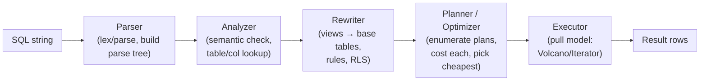
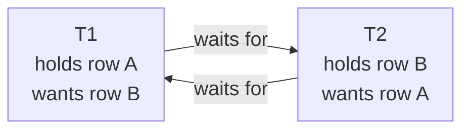

# SQL Internals — Part 3 of 3: Query Planner + Locks + Concurrency

> **Session 2026-05-01.** Builds on Part 1 (pages, heap, B+-tree) and Part 2 (WAL, MVCC, isolation). This part explains *how the engine decides how to execute your query*, *how concurrent writes coordinate without blocking reads*, and *how to not shoot yourself in production*.

## Sequence

- **Part 1** — `notes/02-sql-internals.md` — page storage, heap vs clustered, B+-tree, indexes.
- **Part 2** — `notes/02-sql-internals-part2.md` — WAL, MVCC (heap-MVCC vs undo-MVCC), isolation levels, HOT.
- **Part 3 (this file)** — query planner, cost model, NVMe tuning, lock taxonomy, deadlocks, concurrency patterns, OLTP vs OLAP.

---

## TL;DR

- The query planner picks an execution plan from an exponential plan space using a **cost model** fed by column statistics. Bad statistics → wrong plan → 1000× slower query. `EXPLAIN ANALYZE` is the diff between belief and reality.
- The cost model uses page-access costs: `seq_page_cost=1.0` (baseline), `random_page_cost=4.0` for HDD, **`random_page_cost=1.1` for NVMe**. On NVMe, the random:sequential ratio collapses — the planner's default is wildly wrong and it picks seq scans when it shouldn't.
- Postgres has **8 table-lock modes** and **4 row-lock modes** (`FOR KEY SHARE / FOR SHARE / FOR NO KEY UPDATE / FOR UPDATE`). MVCC means reads take no locks; row locks gate concurrent *writes*.
- A deadlock is a **cycle in the waits-for graph**. Postgres detects cycles by timing out then scanning; InnoDB detects immediately via wait-for graph traversal. Prevention: consistent lock ordering.
- `SELECT ... FOR UPDATE SKIP LOCKED` is the correct job-queue pattern. `SELECT ... FOR UPDATE` without SKIP LOCKED causes a thundering herd of lock waits on the same row.

---

## Why it exists

### The planner — exponential plan space

For a two-table join, there are two join orders. For 10 tables, there are 10! / 2 = 1.8 million join orders, and each can use Nested Loop, Hash Join, or Merge Join — 5.4 million plans. The planner has to pick the cheapest without trying all of them.

The mechanism: a **cost-based optimizer** (CBO). Each operator has a cost formula in terms of page reads and CPU ops. The planner enumerates plans (using dynamic programming up to a join threshold, then heuristics beyond it) and picks the one with the minimum estimated cost. The estimate accuracy depends entirely on the quality of column statistics. Stale statistics → wrong cardinality estimates → wrong plan selection → production incidents.

### Locks — writes need coordination

MVCC (Part 2) means *readers never block writers, writers never block readers*. But what about **writer vs writer**? Two transactions trying to UPDATE the same row at the same time — MVCC doesn't save you here. You need row-level locking: the second writer must wait for the first to commit or roll back.

Locks also enforce DDL safety. `ALTER TABLE ... ADD COLUMN NOT NULL DEFAULT` takes an `ACCESS EXCLUSIVE` lock that blocks everything. Understanding lock modes is what separates an engineer who can safely run DDL migrations in prod from one who causes 5-minute outages.

### OLTP vs OLAP — two incompatible query shapes

OLTP queries are **narrow and deep**: `SELECT * FROM orders WHERE id = 12345` — point lookup, 1 row. OLAP queries are **wide and aggregating**: `SELECT product_id, SUM(amount) FROM orders WHERE date > '2025-01-01' GROUP BY product_id` — full-scan, aggregation over millions of rows.

A row-store B+-tree is optimized for OLTP. For OLAP, you want to scan a single column across all rows without touching the others — a **column store** (Redshift, ClickHouse, DuckDB). The planner behaves completely differently in each context. Understanding when you're on the wrong storage model for the query shape is a senior-level signal.

---

## Mental model

**Query planner = a surgeon planning an operation based on X-rays (statistics).**

- The X-rays are statistics: column histograms, most-common values, null fractions, correlation with physical order.
- Bad X-rays (stale `ANALYZE`) → the surgeon thinks the tumor is 1 mm; it's actually 10 cm. Wrong incision.
- `EXPLAIN` = the surgeon's planned procedure. `EXPLAIN ANALYZE` = the procedure you actually did + outcome. The gap between planned rows and actual rows is the diagnostic.

**Locks = bathroom stall locks.** Reading doesn't need a lock (you can see if the stall is occupied). Writing does (you need to actually be inside). MVCC is what lets reads work without locks. Row locks are for "I'm about to change this row; nobody else can change it until I'm done." Table locks are for "I'm rewriting the whole building; everyone out."

**Deadlock = two people trying to enter each other's locked stall.** The only resolution: one person gives up and tries again.

---

## How it works (internals)

### 1. The query pipeline (parse → plan → execute)



**Executor model**: Postgres uses the classic **Volcano/Iterator pull model** — each node has a `GetNext()` call. The top node (e.g., `Sort`) calls `GetNext()` on its child (e.g., `Hash Join`), which calls `GetNext()` on its children (e.g., two `Seq Scan`s). Rows flow upward lazily. This is why `LIMIT 1` can short-circuit a sort — once one row arrives at the top, execution stops.

### 2. Column statistics — the planner's fuel

Postgres stores statistics in `pg_statistic`; the human-readable view is `pg_stats`.

| Statistic | What it captures | How the planner uses it |
|---|---|---|
| `null_frac` | Fraction of NULLs | Adjusts selectivity for IS NULL / IS NOT NULL |
| `n_distinct` | Estimated number of distinct values | Cardinality for GROUP BY / join sizes; -N means "N as fraction of rows" |
| `most_common_vals` (MCV) | Top 100 values by frequency | Selectivity for `WHERE col = <literal>` when the value is in MCV |
| `most_common_freqs` | Frequency of each MCV | MCV probability |
| `histogram_bounds` | ~100 bucket boundaries for non-MCV values | Range query (`WHERE col BETWEEN X AND Y`) selectivity |
| `correlation` | [-1, 1]: how physically ordered the column values are | `+1` = sequential index scans are cheap; `0` = random; affects Index vs Seq Scan cost |

**`statistics target`** (Postgres default: 100) = number of histogram buckets and MCV entries per column. For high-cardinality columns with skewed distributions, bump to 500:

```sql
ALTER TABLE orders ALTER COLUMN status SET STATISTICS 500;
ANALYZE orders;
```

**Multi-column statistics** (Postgres 10+): by default, Postgres assumes column independence. `WHERE country='US' AND state='TX'` is estimated as `P(country=US) × P(state=TX)`. But `state='TX'` is only relevant when `country='US'` — the real selectivity is higher. Fix:

```sql
CREATE STATISTICS stat_country_state ON country, state FROM orders;
ANALYZE orders;
```

This records **MCV lists for column combinations** so the planner knows the actual joint frequency.

**`ANALYZE`** gathers statistics via random sampling (~30,000 rows by default). Auto-`ANALYZE` fires when `n_live_tup * autovacuum_analyze_scale_factor + autovacuum_analyze_threshold` rows have changed. For a 100M-row table with scale_factor=0.05, that's 5M changes — stale statistics for a long time.

### 3. Cost model — what "cheaper" means

Every plan node has a formula for `startup_cost` (cost to produce the first row) and `total_cost` (cost to produce all rows). Units are abstract; the baseline is one **sequential page read = 1.0**.

| Cost parameter | Default | Represents |
|---|---|---|
| `seq_page_cost` | 1.0 | One sequential I/O (baseline) |
| `random_page_cost` | 4.0 | One random I/O (HDD: seek + rotational latency) |
| `cpu_tuple_cost` | 0.01 | Per-row CPU work |
| `cpu_index_tuple_cost` | 0.005 | Per-index-entry CPU work |
| `cpu_operator_cost` | 0.0025 | Per-operator evaluation (e.g., one comparison) |
| `effective_cache_size` | 4 GB | Planner's estimate of OS page cache size; affects whether index scans are expected to be cached |

**NVMe implications (interview trap):** On an HDD, random I/O is ~10 ms; sequential I/O is ~0.1 ms → ratio 100:1, well above `random_page_cost=4`. On **NVMe SSD**, random I/O is ~0.1 ms; sequential is ~0.04 ms → ratio ~2.5:1. The default `random_page_cost=4` makes the planner think random reads are 4× worse than sequential. On NVMe, they're actually 2.5× worse — so the planner over-penalizes index scans and picks sequential scans when an index scan would be faster.

```sql
-- For NVMe-backed databases (almost all cloud prod today):
ALTER SYSTEM SET random_page_cost = 1.1;
ALTER SYSTEM SET effective_cache_size = '75GB';  -- tune to actual RAM
SELECT pg_reload_conf();
```

This single change can flip plans from Seq Scan to Index Scan and cut p99 latency dramatically on OLTP queries. **Every Postgres deployment on SSD should set this.**

`work_mem` controls how much RAM each sort or hash operation can use before spilling to disk. A Hash Join uses `work_mem` for the inner relation's hash table; if the hash table overflows, it falls back to disk-based batching (look for `Batches > 1` in EXPLAIN ANALYZE). The cost of a sort is `N log N` on CPU, much higher if spilling. Default `work_mem=4MB` is historically tiny — modern systems set 64-256 MB.

### 4. Plan node types

| Node | What it does | When planner picks it |
|---|---|---|
| **Seq Scan** | Read every page of the table | No useful index, or fetching >5-10% of rows (random I/O would be worse) |
| **Index Scan** | Walk index tree, fetch heap pages by ctid | Selective predicate, small result set, `random_page_cost` low enough |
| **Index Only Scan** | Walk index tree, no heap — if covering | Covering index + visibility map allows it (Part 1) |
| **Bitmap Heap Scan** | Walk index → collect heap page references → sort them → read heap in order | Moderate selectivity: too many rows for Index Scan, too selective for Seq Scan; converts random heap I/O into sequential |
| **TID Scan** | Fetch a tuple by its ctid directly | Rare — `WHERE ctid = '(0,1)'` |

**Bitmap Heap Scan** is the nuanced one. It works in two phases:

```
Bitmap Index Scan → set bits for matching heap pages
Bitmap Heap Scan → read those pages in page-number order → check each tuple
```

This converts N random heap reads into N pages of mostly-sequential I/O. It's the middle ground between Index Scan (very selective) and Seq Scan (not selective at all). Two bitmap index scans can also be **OR'd or AND'd** — `WHERE a=1 OR b=2` can use two indexes via `BitmapOr`.

### 5. Join methods

| Method | Algorithm | Best when | Startup cost | Throughput |
|---|---|---|---|---|
| **Nested Loop** | For each outer row, scan inner (optionally via index) | Small outer, inner has a usable index | Low (starts immediately) | O(outer × inner) |
| **Hash Join** | Build hash table from smaller relation; probe with larger | Large relations, no useful index, inner fits in `work_mem` | Higher (must build hash table first) | O(M + N) |
| **Merge Join** | Both inputs sorted on join key; merge like merge sort | Both inputs already sorted (or have sorted indexes); large data | High if sort needed | O(M + N) |

**Interview nuance:** Nested Loop with an index on the inner table is the fastest plan for OLTP joins (single lookup per outer row). Hash Join is the workhorse for analytics. Merge Join is often picked when both sides have a sorted index — saves the hash build cost.

If the planner picks a Nested Loop for a large join, it usually means it underestimated the outer row count. The real execution is O(1M × N) instead of O(1 × N).

### 6. Reading EXPLAIN ANALYZE

```sql
EXPLAIN (ANALYZE, BUFFERS, FORMAT TEXT)
SELECT u.name, o.total
FROM users u JOIN orders o ON o.user_id = u.id
WHERE u.country = 'US' AND o.created_at > now() - interval '7 days';
```

```
Hash Join  (cost=1050.00..3200.00 rows=500 width=40)
           (actual time=45.3..210.8 rows=28000 loops=1)
  Buffers: shared hit=8200 read=1500
  ->  Seq Scan on orders o  (cost=0.00..1800.00 rows=50000 width=20)
                            (actual time=0.1..80.2 rows=142000 loops=1)
        Filter: (created_at > ...)
        Rows Removed by Filter: 158000
  ->  Hash  (cost=900.00..900.00 rows=12000 width=24)
            (actual time=30.1..30.1 rows=12000 loops=1)
        ->  Index Scan on users u  (cost=0.00..900.00 rows=12000 width=24)
                                   (actual time=0.2..25.0 rows=12000 loops=1)
              Index Cond: (country = 'US')
Planning Time: 2.3 ms
Execution Time: 215.0 ms
```

**Reading the diff:**

| Field | Planned | Actual | Implication |
|---|---|---|---|
| `rows` (orders) | 50,000 | 142,000 | 2.8× underestimate → Hash Join was correct but table underestimated; if the ratio were 100×, planner might have picked wrong join method |
| `rows` (Hash Join output) | 500 | 28,000 | 56× underestimate → this mismatch propagates to any outer node; if there were a GROUP BY on top, it would have too small a hash |
| `Buffers: read=1500` | — | — | 1,500 heap page cache misses; at 8 KB each = 12 MB from disk |
| `Rows Removed by Filter` | — | 158,000 | For every 1 row returned, 1.1 rows were read and thrown away — seq scan doing waste work |

**Pattern matching:**
- `rows=1 actual=10000` → stale statistics; run `ANALYZE`.
- `Buffers: read` is high → data not cached; increase `effective_cache_size` or add RAM.
- `Hash Batches=8` → hash spilled to disk 8 times; increase `work_mem`.
- `Loops=N` on Nested Loop inner → index scan was called N times; if N is huge and each is slow, wrong join method.

### 7. Planner failures and fixes

| Failure | Root cause | Fix |
|---|---|---|
| Wrong join order (huge outer loop) | Row count underestimate on outer | `ANALYZE`, multi-column statistics, bump `statistics target` |
| Seq Scan when index exists | Planner thinks result set too large | Check stats, `random_page_cost`, `enable_seqscan=off` (diagnosis only — never in prod) |
| Nested Loop on 1M × 1M join | Both row counts underestimated | Correct statistics; consider `JOIN` hints via `pg_hint_plan` extension if truly needed |
| Bad estimate on a literal value | Value not in MCV, histogram says rare | Check actual frequency; may need partial index or partition pruning |
| Plan regression after deploy | Parameter sniffing (generic plan vs custom plan) | `PREPARE` + `EXECUTE` let PG choose between generic and custom; `plan_cache_mode=force_custom_plan` forces per-execution stats |

**Postgres vs MySQL on parameter sniffing:** MySQL caches execution plans per-session. Postgres uses a mix: PREPARE'd statements get a generic plan after 5 executions; the first 4 executions get custom plans. The generic plan can be wrong for skewed parameters (a query with `WHERE status='deleted'` fetching 0.001% of rows vs `WHERE status='active'` fetching 95%).

### 8. OLTP vs OLAP — the storage mismatch

| Dimension | OLTP | OLAP |
|---|---|---|
| Query shape | Point lookups, small range, single row returned | Full scan, wide aggregation, many rows |
| I/O pattern | Random (specific rows via index) | Sequential (scan entire column across all rows) |
| Data layout | **Row store**: entire row is contiguous on a page (reads column X = reads all columns unnecessarily) | **Column store**: all values of column X are contiguous (reads column X = reads only X) |
| Indexes | Heavily used | Mostly unused; `min/max` indexes for zone maps |
| Compression | Low (mixed types per page) | High (single type per column = encoding schemes like dictionary, RLE, delta) |
| Postgres on OLAP queries | Struggles: no column store, EXPLAIN shows seq scan of entire table | Wrong tool — use ClickHouse, Redshift, DuckDB, Snowflake |
| Mitigation in Postgres | Partial indexes, partitioning + partition pruning, `BRIN` indexes for append-only time-series | Postgres `cstore_fdw` (extension), TimescaleDB columnar chunks |

**BRIN index** (Block Range INdex): for append-only time-series data, Postgres stores `min/max` per range of pages (not per row). `CREATE INDEX idx_created_brin ON events USING BRIN (created_at)`. For a query like `WHERE created_at > '2025-01-01'`, the BRIN index eliminates all page ranges whose `max < '2025-01-01'`. Zero index maintenance cost on INSERT (just updates the range's max); tiny index size. Works *only* when data is physically sorted by the indexed column — i.e., it was appended in order. Correlation must be ~1.

---

### 9. Lock taxonomy (Postgres)

#### Table-level lock modes

Postgres has 8 table-lock modes, ordered weakest → strongest:

| Mode | Acronym | Who takes it | Conflicts with |
|---|---|---|---|
| ACCESS SHARE | AS | `SELECT` | ACCESS EXCLUSIVE only |
| ROW SHARE | RS | `SELECT FOR UPDATE/SHARE` | EXCLUSIVE, ACCESS EXCLUSIVE |
| ROW EXCLUSIVE | RX | `INSERT`, `UPDATE`, `DELETE` | SHARE, SHARE ROW EXCLUSIVE, EXCLUSIVE, ACCESS EXCLUSIVE |
| SHARE UPDATE EXCLUSIVE | SUE | `VACUUM`, `ANALYZE`, `CREATE INDEX CONCURRENTLY` | SUE, SHARE, SHARE ROW EXCLUSIVE, EXCLUSIVE, ACCESS EXCLUSIVE |
| SHARE | S | `CREATE INDEX` (non-concurrent) | RX, SUE, SHARE ROW EXCLUSIVE, EXCLUSIVE, ACCESS EXCLUSIVE |
| SHARE ROW EXCLUSIVE | SRX | `CREATE TRIGGER` | RX, SUE, S, SRX, EXCLUSIVE, ACCESS EXCLUSIVE |
| EXCLUSIVE | E | Rare; some replication locking | All except ACCESS SHARE |
| ACCESS EXCLUSIVE | AE | `ALTER TABLE`, `TRUNCATE`, `DROP TABLE`, `LOCK TABLE` | Everything |

**The DDL migration trap:** `ALTER TABLE ... ADD COLUMN NOT NULL DEFAULT <value>` takes ACCESS EXCLUSIVE. It must wait for all existing transactions to finish, and during the wait, new SELECT statements queue behind it. A long ALTER can cause a complete outage. Fix: use `ADD COLUMN DEFAULT NULL` first (Postgres writes the default lazily to new rows only in PG 11+), then backfill and add NOT NULL separately, or use `pg_repack` / online schema change tools.

**`CREATE INDEX CONCURRENTLY`** takes SUE, which allows `SELECT`, `INSERT`, `UPDATE`, `DELETE` to proceed — it's why you use it in prod. Cost: two full table scans + overhead. Can fail if a lock conflict occurs (unlike non-concurrent, which doesn't retry).

#### Row-level lock modes

| Mode | SQL | Blocks |
|---|---|---|
| **FOR KEY SHARE** | `SELECT ... FOR KEY SHARE` | FOR NO KEY UPDATE, FOR UPDATE |
| **FOR SHARE** | `SELECT ... FOR SHARE` | FOR NO KEY UPDATE, FOR UPDATE |
| **FOR NO KEY UPDATE** | `SELECT ... FOR NO KEY UPDATE` | FOR SHARE, FOR KEY SHARE, FOR NO KEY UPDATE, FOR UPDATE |
| **FOR UPDATE** | `SELECT ... FOR UPDATE` | Everything |

`FOR KEY SHARE` is the implicit mode taken by a referencing FK check (`INSERT INTO orders WHERE user_id=?` — it key-shares the user row to ensure the user isn't deleted mid-insert). This is why `DELETE FROM users WHERE id=?` sometimes blocks: there are active FK-checking inserts holding FOR KEY SHARE, which conflicts with the DELETE's FOR NO KEY UPDATE.

`FOR UPDATE` is the most common: "I'm reading this row and intend to update it based on what I read." This is the pessimistic lock. The row is exclusively locked; other `FOR UPDATE` waiters block.

#### InnoDB lock types

InnoDB has more granular lock machinery than Postgres:

| Lock | What | Example |
|---|---|---|
| **Record lock** | Lock on a single index record | `WHERE id = 5` locks the record for id=5 |
| **Gap lock** | Lock on the *gap* between records | `WHERE id BETWEEN 5 AND 10` locks the gap (5,10) — prevents phantom inserts |
| **Next-key lock** | Record lock + gap lock below it | Default for range queries in REPEATABLE READ; combines gap + record |
| **Intention locks (IS, IX)** | Table-level intent signals (don't block each other; block table locks) | `SELECT FOR SHARE` → IS on table; `UPDATE` → IX on table |

Next-key locks are why MySQL REPEATABLE READ prevents phantom reads: a range scan locks both the rows *and* the gaps between them, so a concurrent INSERT into that range blocks.

The downside: **gap locks cause more deadlocks** than Postgres's approach. In Postgres RR, there are no gap locks — phantoms are possible (MVCC snapshot just doesn't see them until commit), but there's less lock contention.

### 10. Deadlocks — detection and prevention

**What it is:** A cycle in the waits-for graph. T1 holds lock A, waits for B. T2 holds lock B, waits for A. Neither can proceed.



**Postgres detection:** There is no continuous wait-for-graph monitor. Each blocked transaction waits for `deadlock_timeout` (default 1 second) before the deadlock detector wakes up and checks for a cycle. If a cycle is found, Postgres picks a victim (the transaction with less work done, roughly) and rolls it back with error code `40P01`. The survivor continues.

```
ERROR: deadlock detected
DETAIL: Process 12345 waits for ShareLock on transaction 67890
        Process 67890 waits for ShareLock on transaction 12345
HINT: See server log for query details.
```

**InnoDB detection:** MySQL has a continuous wait-for-graph that detects cycles immediately, without waiting for a timeout. The victim is the transaction with fewer undo log records (proxy for least work done). Advantage: faster resolution, no 1-second wait. Disadvantage: higher overhead on the detector thread under extreme concurrency.

**Prevention:**

1. **Consistent lock ordering.** If every transaction locks rows in the same order (e.g., always sort user_id ascending before locking), cycles are impossible by construction. The hardest part is enforcing this across services.

   ```java
   // Locking two accounts for a transfer — always in id order
   long fromId = 1001, toId = 9999;
   long first = Math.min(fromId, toId), second = Math.max(fromId, toId);
   // SELECT ... FOR UPDATE WHERE id = first; then WHERE id = second
   ```

2. **Short transactions.** The longer a transaction holds locks, the more likely it meets another transaction's lock request. Keep transactions minimal.

3. **`NOWAIT` / `SKIP LOCKED`** — bail out immediately instead of waiting, then retry.

4. **Idempotent retries.** At the application level, catch `40P01` (Postgres) or MySQL's ER_LOCK_DEADLOCK and retry with exponential backoff. Deadlocks are rare; retries fix them without exposing them to users.

### 11. Concurrency patterns

#### SKIP LOCKED — the job queue

Naive job queue in Postgres:

```sql
-- Worker A and Worker B both run this simultaneously
SELECT id FROM jobs WHERE status = 'pending' LIMIT 1 FOR UPDATE;
```

Worker A locks job 1. Worker B blocks waiting for job 1's lock. Both workers serialize on the same row — you've turned a concurrent queue into a single-threaded one.

**Fix:** `SKIP LOCKED`

```sql
SELECT id FROM jobs WHERE status = 'pending' LIMIT 1 FOR UPDATE SKIP LOCKED;
```

Worker A locks job 1. Worker B sees job 1 is locked, skips it, grabs job 2. 10 workers → 10 parallel jobs. The lock is held only for the duration of the SELECT, not the job processing (you UPDATE status='processing' immediately and COMMIT, then process the job outside a transaction).

```java
// Java: correct job queue pattern
try (var conn = ds.getConnection()) {
    conn.setAutoCommit(false);
    long jobId;
    try (var ps = conn.prepareStatement(
            "SELECT id FROM jobs WHERE status='pending' ORDER BY created_at LIMIT 1 FOR UPDATE SKIP LOCKED")) {
        var rs = ps.executeQuery();
        if (!rs.next()) { conn.rollback(); return; }
        jobId = rs.getLong(1);
    }
    try (var ps = conn.prepareStatement(
            "UPDATE jobs SET status='processing', worker_id=? WHERE id=?")) {
        ps.setString(1, workerId);
        ps.setLong(2, jobId);
        ps.executeUpdate();
    }
    conn.commit();  // lock released here — claim is now in the table
}
// Now process jobId outside any transaction
```

#### Advisory locks

User-defined named locks — not tied to any table row. Useful for "only one instance of this cron job should run at a time."

```sql
-- Lock id 12345 (application-defined) — returns true if acquired, false if not
SELECT pg_try_advisory_lock(12345);

-- Unlock
SELECT pg_advisory_unlock(12345);

-- Session-level: lock persists until session closes
-- Transaction-level: lock auto-released on commit/rollback
SELECT pg_advisory_xact_lock(12345);  -- blocks; auto-released at txn end
```

Used heavily for: distributed mutex on a cron job, ensuring only one migration runs, single-instance consistency without a separate locking service.

#### Optimistic locking — version column

Instead of locking a row for reading, read it + note the version, do computation, and on write verify the version hasn't changed.

```sql
-- Read
SELECT id, balance, version FROM accounts WHERE id = ?;

-- Write (conditionally)
UPDATE accounts
SET balance = ?, version = version + 1
WHERE id = ? AND version = ?;
-- if rowsAffected == 0 → someone else modified it → retry
```

```java
// Java + JDBC optimistic lock
int updated = ps.executeUpdate(); // UPDATE ... WHERE id=? AND version=?
if (updated == 0) {
    throw new OptimisticLockException("Concurrent modification detected, retry");
}
```

**When to choose optimistic vs pessimistic:**

| | Optimistic (`version` column) | Pessimistic (`SELECT FOR UPDATE`) |
|---|---|---|
| Contention | Low contention (conflicts rare) | High contention (conflicts frequent, retry costly) |
| Read:write ratio | Read-heavy (many reads, few writes) | Write-heavy |
| Transaction scope | Short compute between read and write | Long or multi-step logic |
| Failure mode | Retry on conflict (usually 1-2 retries) | Lock wait → potential deadlock |
| ORM support | Spring Data, Hibernate `@Version` | `@Lock(PESSIMISTIC_WRITE)` |

---

## Trade-offs

### Plan types

| Plan | I/O pattern | Best selectivity | Failure mode |
|---|---|---|---|
| Seq Scan | Sequential; one page per N rows | >5-10% of rows | Slow on large tables for selective queries (stats wrong) |
| Index Scan | Random; ctid fetch per matching row | <1% of rows | Slow when result set is moderate (many random I/Os); planner may wrongly prefer over Bitmap |
| Bitmap Heap Scan | Sort index hits → semi-sequential heap | 1-5% of rows | Sort overhead; `work_mem` matters |
| Index Only Scan | Index only; zero heap | Any, if covering | Visibility map staleness defeats "only" |
| Hash Join | Hash table build → probe | Large relations, no index | `work_mem` too small → spill to disk → 10× slower |
| Nested Loop | Index lookup per outer row | Small outer set | Catastrophic on underestimated row counts |

### Locking strategies

| Strategy | Throughput | Safety | Failure mode |
|---|---|---|---|
| No lock (`RC + idempotent key`) | Highest | Lost updates possible | Two concurrent inserts of same idempotency key: unique constraint catches it |
| `FOR UPDATE` | Medium | Safe; serializes the write | Thundering herd if all workers lock same row |
| `FOR UPDATE SKIP LOCKED` | High | Safe; distributes work | Workers can starve if items are slow to process |
| `SERIALIZABLE` | Lowest (~10-20% overhead + retries) | Safest | Must handle `40001` retry; write-skew free |
| Optimistic (version) | High (no lock on read) | Safe with retries | Retry storms under high contention |

---

## When to use / avoid

**Use `EXPLAIN ANALYZE` (not just `EXPLAIN`) always.** `EXPLAIN` is the planner's estimate; `EXPLAIN ANALYZE` is ground truth. The difference shows you where statistics are wrong.

**Tune `random_page_cost` for your hardware immediately.** NVMe → 1.1. Cloud SSD (gp2/gp3) → 1.5-2.0. HDD → 4.0. Default is wrong for most modern deployments.

**Use `CREATE INDEX CONCURRENTLY` in production.** Non-concurrent index creation takes `SHARE` lock — blocks all writes during the build.

**Use `SELECT FOR UPDATE SKIP LOCKED` for job queues.** Plain `FOR UPDATE` without SKIP LOCKED serializes all workers on the first available row.

**Use optimistic locking when:** reads are frequent, writes are rare, contention is low, and you have ORM support (`@Version`). Spring Data JPA + `@Version` is the idiomatic Java pattern.

**Use `SELECT FOR UPDATE` when:** you must guarantee the write succeeds based on what you read (e.g., financial balance check), and retrying is cheap.

**Never run `VACUUM FULL` in prod without a maintenance window.** It takes `ACCESS EXCLUSIVE` — total table outage. Use `pg_repack` for online table rebuilds.

**Never ignore `40001` errors.** If you use `SERIALIZABLE` without retry logic, you're silently dropping transactions under high concurrency. The framework must catch and retry.

---

## Real-world examples

**GitHub — query plan regression via stats staleness (2018 incident, referenced in GitHub engineering blog).** A large table received a burst of writes, autovacuum hadn't run `ANALYZE` in time, the planner used stale row-count estimates, chose a Nested Loop where a Hash Join was correct, query went from 10ms to 60 seconds. Fix: force `ANALYZE` after bulk loads and configure `autovacuum_analyze_scale_factor=0.01` (trigger at 1% change, not 20%) on hot tables.

**Booking.com — `SKIP LOCKED` for their task queue (documented in PGConf talks).** They replaced a Redis-based job queue with a Postgres table + `SKIP LOCKED` for reliability (no separate Redis cluster, no dual-write). Pattern: 20-50 workers, each grabs one job, marks it `processing`, commits, processes, marks `done`. The key insight: committing the status update immediately releases the page-level contention while still providing at-least-once delivery semantics.

**Notion — schema migration outage (2021).** Adding an index non-concurrently on a large table took a `SHARE` lock, blocked a cascade of queued writes, cascaded into timeout failures. Their postmortem: always use `CREATE INDEX CONCURRENTLY`; instrument DDL migration scripts to validate lock mode before executing.

**Shopify — gap lock deadlocks in MySQL (2020 engineering post).** InnoDB's next-key locks (gap + record) on INSERT ... SELECT caused deadlocks that weren't obvious from the query text. The fix involved rewriting the query to use explicit pk range lookups + `FOR UPDATE SKIP LOCKED` where feasible, and moving some write patterns to idempotent `INSERT ... ON CONFLICT` semantics.

**NVMe `random_page_cost` — Citus (CitusData) benchmark.** After setting `random_page_cost=1.1` on NVMe-backed Postgres, index scans were chosen for queries that had previously been seq-scanned, reducing query latency 3-5× on OLTP workloads. The planner had been ignoring indexes it should have used because it thought random reads were 4× worse than they actually were.

---

## Common mistakes

- **Forgetting `EXPLAIN ANALYZE`** — running `EXPLAIN` and trusting the plan without seeing actual rows.
- **Not tuning `random_page_cost` for NVMe** — the planner uses wrong costs; chooses seq scans over index scans.
- **Not tuning `work_mem`** for sort/hash-heavy queries — hash spill to disk causes 10× slowdown.
- **`SELECT FOR UPDATE` without `SKIP LOCKED` in a queue** — serializes workers on the same row, destroying parallelism.
- **Running `ALTER TABLE` without checking lock mode first** — ACCESS EXCLUSIVE on a live table = outage.
- **Using `CREATE INDEX` (non-concurrent) on a large prod table** — SHARE lock; blocks all writes during build.
- **Ignoring multi-column correlations** — `WHERE a=X AND b=Y` selectivity is wrong if a and b are correlated; `CREATE STATISTICS` fixes it.
- **Assuming optimistic locking works under high contention** — if 90% of writes retry 3 times, throughput craters. Switch to pessimistic under contention.
- **Not catching `40001` (SERIALIZABLE failure)** — transactions silently fail without retry.
- **Using wide PKs in InnoDB without knowing secondary index inflation** — every 36-byte UUID v4 string PK bloats every secondary index leaf by 36 bytes per entry.
- **`VACUUM FULL` in prod** — takes ACCESS EXCLUSIVE; all queries queue behind it. Use `pg_repack`.
- **Gap lock deadlocks in MySQL (REPEATABLE READ)** — next-key locks on range scans interact with concurrent INSERTs in non-obvious ways; be aware when doing `INSERT ... SELECT` or range UPDATEs.

---

## Interview insights

**Typical questions:**

- "How does the Postgres query planner decide between a seq scan and an index scan?" — cost model + statistics + `random_page_cost` (NVMe trap: say you'd tune it to 1.1).
- "Your query was fast yesterday, slow today. Same query, same data volume. What happened?" — stale statistics (most likely); also: plan cache, `work_mem` pressure, bloat.
- "`EXPLAIN` shows 10 rows; `EXPLAIN ANALYZE` shows 10,000. What does that tell you?" — statistics are stale; run ANALYZE; consider multi-column statistics.
- "Two workers both read a job and try to process it. How do you prevent duplicate processing?" — `SELECT FOR UPDATE SKIP LOCKED`; pessimistic lock, claim and commit immediately.
- "What's a deadlock and how do you prevent one?" — waits-for cycle; consistent lock ordering; `NOWAIT`; retry on `40P01`.
- "Why does `ALTER TABLE ADD COLUMN NOT NULL DEFAULT 'x'` cause an outage in old Postgres?" — ACCESS EXCLUSIVE + full table rewrite. In PG 11+ it's instant for constant defaults (stored as metadata); for expression defaults it still rewrites.
- "What is a gap lock in MySQL and when does it fire?" — protects the gap between records in RR; prevents phantom inserts into scanned range; often causes unexpected deadlocks.
- "When would you pick optimistic over pessimistic locking?" — low contention, read-heavy, retry is cheap.

**Follow-ups interviewers love:**

- "Your Hash Join is batching to disk (Batches > 1 in EXPLAIN ANALYZE). What do you do?" — increase `work_mem` for the session; if global, investigate the query shape.
- "You have 50 background workers all trying to grab jobs from a queue table. Walk me through the locking behavior with and without SKIP LOCKED." — without: everyone queues on row 1; with: workers fan out across pending rows.
- "Difference between Postgres deadlock detection and InnoDB deadlock detection?" — Postgres: timeout-based (1s), then cycle scan; InnoDB: continuous wait-for graph, immediate.
- "You need to do a zero-downtime schema migration adding a NOT NULL column. Walk through the steps." — add NULLABLE column, backfill in batches, add CHECK CONSTRAINT (NOT VALID), VALIDATE CONSTRAINT (SUE lock — allows reads/writes), then SET NOT NULL.
- "What's the difference between a correlated subquery and a lateral join, and how does the planner handle each?" — correlated subquery re-executes per outer row (implicit nested loop); LATERAL JOIN is explicit; planner can sometimes de-correlate.
- "On NVMe, what's the single most impactful `postgresql.conf` change for OLTP query performance?" — `random_page_cost=1.1`.

**Red flags to avoid saying:**

- "Just add EXPLAIN to see the problem" — without ANALYZE, it's just estimates.
- "SERIALIZABLE is too slow, I'll just use FOR UPDATE" — `FOR UPDATE` doesn't prevent write skew on multi-row invariants.
- "Deadlocks are a Postgres bug." — They're a normal concurrency artifact; the bug is not retrying.
- "I'll just use READ UNCOMMITTED to speed things up." — Postgres ignores it (treats it as RC); MySQL allows dirty reads.
- Treating `CLUSTER` as equivalent to InnoDB clustered index.
- "I'll add more indexes to speed up the JOIN" — more indexes = more write amplification; may not help if the join issue is row-count estimation.
- Claiming `VACUUM` reclaims disk space — it only returns pages to the free-space map; `VACUUM FULL` actually reclaims.

---

## Related topics

- **02 SQL internals Part 1** — pages, heap vs clustered, B+-tree (the storage the planner reasons about).
- **02 SQL internals Part 2** — WAL, MVCC, isolation levels (the transactional model the locks operate on top of).
- **03 NoSQL landscape** — LSM vs B+-tree; when column stores win over OLTP engines.
- **04 Replication** — WAL shipping; how replicas interact with lock and MVCC xmin.
- **05 Partitioning** — partition pruning by the planner; reduce Seq Scan scope dramatically.
- **15 Delivery semantics** — `INSERT ... ON CONFLICT` idempotency; builds on row-level locking.
- **22 Fault tolerance** — application-level retry on `40P01` (deadlock) and `40001` (serialization failure).

## Further reading

- **"Database Internals"** — Alex Petrov, Chapters 7-9 (transactions, locking, MVCC).
- **"Designing Data-Intensive Applications"** — Kleppmann, Chapter 12 (future of data systems; OLTP vs OLAP framing).
- **Postgres docs** → The Planner / Optimizer; Lock Monitoring; Statistics Used by the Planner.
- **`pg_locks` view** — live lock state; `pg_blocking_pids()` — which PIDs are blocking you.
- **"Use the Index, Luke"** — winand.ms. Concrete, engine-specific index + planner guide.
- **Markus Winand's "SQL Performance Explained"** — the best single practical resource on query planner behavior.
- **Jepsen analyses** of Postgres and MySQL for real isolation guarantees.
- **"Kill Your Slow Queries" — Percona blog** — `EXPLAIN` deep dives, `work_mem` tuning, gap lock incident analysis.
