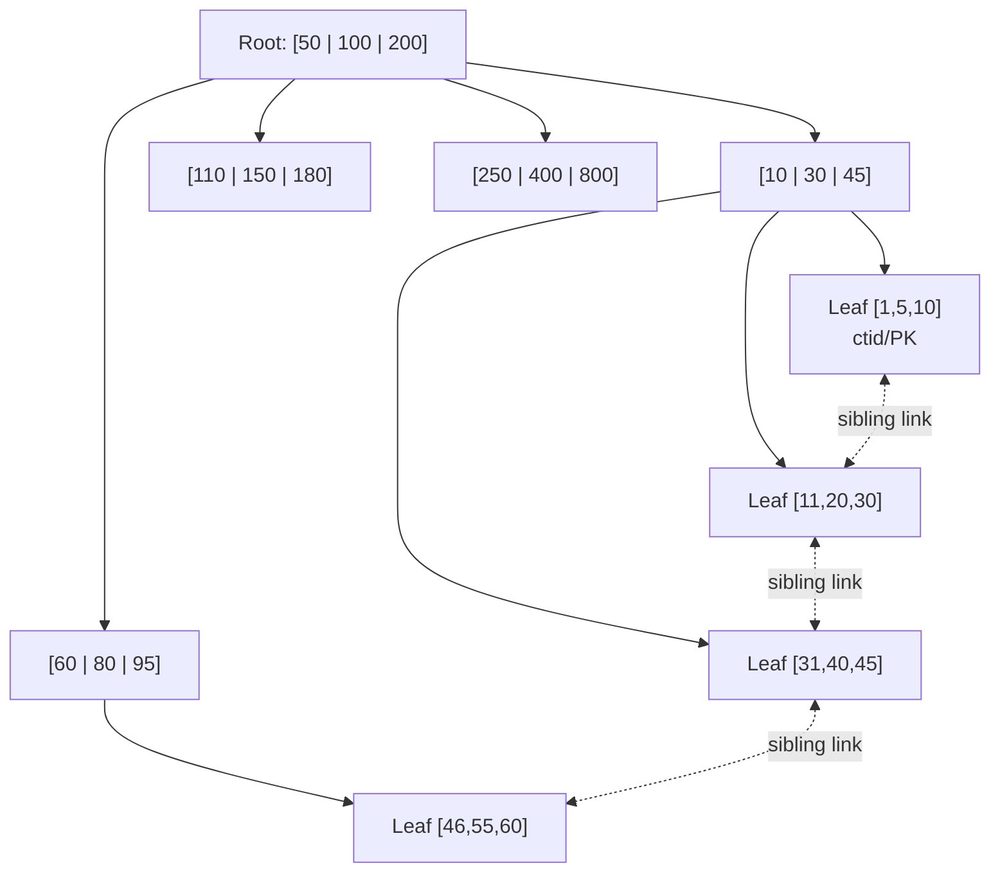

# SQL Internals — Part 1 of 3: Storage + B-tree indexes

> **Sequence (announced upfront):**
> - **Part 1 (this file, 2026-04-22)** — page-oriented storage, heap vs clustered, B+-tree internals.
> - **Part 2** — WAL + MVCC + isolation levels (how durability and concurrent visibility work).
> - **Part 3** — Query planner + locks + concurrency (how the optimizer chooses and what can go wrong).

## TL;DR

- A database is a pile of fixed-size **pages** on disk (Postgres 8 KB, InnoDB 16 KB). All I/O is in pages; heap, index, free-space map — everything lives on pages.
- **B+-tree** is the OLTP default because its height is `log_B N` with fanout `B ≈ 200-500`. A 1 B-row index is ~4 levels deep → ~4 page reads per point lookup, and the top 2-3 levels are almost always cached.
- Two table layouts dominate and they are **not interchangeable**:
  - **Heap-organized (Postgres)** — rows live wherever free space exists; every index (PK included) points to a physical tuple ID (`ctid`). PK index is "just an index."
  - **Clustered / index-organized (InnoDB, SQL Server, Oracle IOT)** — the table **is** the leaves of the PK B+-tree. Secondary indexes store the PK value, not a physical pointer.
- Indexes are a write tax: every INSERT/UPDATE pays `O(log N)` per affected index. Ten indexes on a hot table → ~10× write amplification on the touched columns.
- UUID v4 as PK wrecks InnoDB (random inserts split across the whole clustered tree, fragmenting the table); it's much milder in Postgres (heap is unordered anyway — only the PK btree fragments).

## Why it exists

Pre-B-tree, indexed storage had three bad options:

1. **Hash index** — O(1) point lookup, but zero range-query support, hostile to disk I/O patterns, and rehashing is a global pain event.
2. **Sorted file** — excellent range scan, catastrophic insert (shift every later tuple).
3. **Binary search tree** — height is `log_2 N`; for N = 1 B that's 30. And it imbalances under skewed keys.

The underlying constraint was (and still is) hardware: spinning-rust seeks are ~10 ms, even NVMe SSDs have page-level granularity, and CPU ops are ~1 ns. Seven orders of magnitude between "memory" and "disk." A data structure of height 30 means 30 random I/Os per lookup — unacceptable for OLTP.

**Bayer & McCreight, Boeing Research, 1970** — make nodes *page-sized* so each node holds hundreds of children. Tree height becomes `log_B N` with fanout `B = page_size / (key_size + pointer_size)`. For a 16 KB page, 8-byte keys and pointers, B ≈ 500-1000. Height collapses from 30 to 3-4. That single reframe — structure the tree around disk pages, not memory words — is why B-trees are still the default 55 years later.

The **B+-tree** variant pushed further:

- **Internal nodes hold only keys + child pointers, no data** → higher fanout → shorter tree.
- **All data lives in leaves.**
- **Leaves form a doubly linked list** → range scans become sequential leaf walks, not tree descents.

Every mainstream OLTP engine today (Postgres, MySQL InnoDB, SQL Server, Oracle, SQLite, DB2) uses B+-trees as the default index. The structure has survived because its I/O-per-op cost matches the hardware cost model almost perfectly.

Heap vs clustered is not "better vs worse" — they're **different priors**:

- **Heap** — simplest layout; every index is equal; MVCC is natural (write new tuple version in any free slot). Cost: every index read has an extra hop to fetch the heap tuple.
- **Clustered** — PK dictates physical order. PK point lookups and range scans are lightning fast. Cost: non-sequential PK inserts shred the tree; secondary indexes need two tree walks.

## Mental model

**A well-organized library.**

- **Heap layout** = books shelved wherever there's an empty slot when they arrive. Every catalog (title / author / year) is equally a separate lookup that ends with "go to shelf 4, slot 17." No catalog is special.
- **Clustered layout** = books shelved in alphabetical order by title (the primary key). The title catalog **is** the shelf layout. Title lookups are one step. But the author catalog has to store *titles* (not shelf numbers — shelves shift as new books get inserted), so "find Melville" = author catalog → "Moby Dick" → title catalog → shelf. Two catalog walks.

**B+-tree** = a multi-level catalog. Top level: "A-F on floor 1, G-M on floor 2, ..." Floor-2 catalog: "G-H rack 1, I-K rack 2, ..." Rack 3 has the leaf cards with actual book locations. Only leaves hold data; internal shelves just route. Neighboring racks (leaves) are linked, so "all books from M to P" is one descent plus a sideways stroll — no climbing back to the top.

Scale the library to a billion books: you still only descend ~4 floors.

## How it works (internals)

### 1. Pages — the atomic unit of I/O

Every relational DB reads and writes in fixed-size pages:

| Engine | Default page |
|---|---|
| Postgres | 8 KB |
| MySQL InnoDB | 16 KB |
| SQL Server | 8 KB |
| Oracle | 8 KB (configurable 2-32 KB) |

Why not row-level I/O? Seek + page fetch dominates; the marginal cost of transferring 8 KB vs 100 bytes is near zero. You might as well grab neighbors while you're there — they'll often be hit next.

Postgres page layout:

```
┌──────────────────────────────────────────┐
│ Page header (24 B: LSN, checksum, flags) │
├──────────────────────────────────────────┤
│ ItemIdData[] (line pointers) →           │  grows down
│   (4 B each, pointing into tuple area)   │
├──── ─────────────── ─────────────────────┤
│           (free space)                   │
├──────────────────────────────────────────┤
│ Tuples (row bodies)          ←           │  grows up
│   packed from the bottom                 │
├──────────────────────────────────────────┤
│ Special space (index-specific metadata)  │
└──────────────────────────────────────────┘
```

- **Line pointers (slots)** at the top are 4-byte indirections. They let the engine compact the tuple area inside a page without invalidating external references.
- **Tuple IDs** (`ctid` in Postgres) are `(pageno, slotno)` pairs — stable as long as the row stays in that slot, even if its body is relocated within the page.
- Tuple headers carry MVCC metadata (xmin, xmax, hint bits) — Part 2 territory.

### 2. Heap-organized tables (Postgres)

The table is a flat file of 8 KB pages. New rows go wherever the **fillfactor** permits free space. `ctid` is the physical address.

Every index — including the PK — is a separate B+-tree mapping `indexed_value → ctid`. There's no "primary" index. The PK is just an index with a UNIQUE constraint.

Read path for `SELECT * WHERE id = 42`:

1. Walk PK index (3-4 page reads).
2. Read the ctid at the leaf.
3. Fetch that heap page (1 more page read).
4. Check MVCC visibility on the tuple.

≈4-5 I/Os for a point lookup, mostly random.

### 3. Clustered / index-organized tables (InnoDB)

The table file **is** a B+-tree keyed on the primary key. Leaf pages contain the full rows. No separate heap exists — the clustered index is the table.

Secondary indexes map `indexed_value → PK`, not `indexed_value → physical_pointer`. Why? Because the clustered tree's physical locations shift on every page split — physical pointers would be invalidated constantly. Storing PK makes secondaries stable; the cost is the extra walk.

Read paths:

- `SELECT * WHERE id = 42` (PK lookup) — one tree walk, done. Row is in the leaf page. **~4 page reads.**
- `SELECT * WHERE email = 'x'` (secondary) — walk secondary (~4) → get PK → walk PK tree (~4) = **~8 page reads.**

The standard InnoDB optimization: **covering indexes**. If the secondary index contains all queried columns, skip the PK walk.

**If you don't declare a PK in InnoDB**, it picks the first non-null UNIQUE index. If none exists, it synthesizes a hidden 6-byte `DB_ROW_ID`. You always have a clustered index — you just may not know what it's ordered by. Classic interview trap.

### 4. B+-tree internals

A B+-tree is a balanced n-ary tree optimized for disk pages.

- **All data at the leaves.** Internal nodes are pure routing (keys + child pointers).
- **Leaves doubly linked.** Range scans walk sideways without climbing.
- **Node = page.** One node fits in one disk page.
- **Balanced by construction.** All leaves at the same depth; no degenerate shapes.

**Fanout math — the interview-critical calculation.**

```
fanout ≈ (page_size - header) / (avg_key_size + child_pointer_size)
```

For an 8 KB Postgres page, 24 B header, 20 B keys, 8 B child pointer:

```
fanout ≈ (8192 - 24) / (20 + 8) ≈ 292
```

Height: `log_fanout(N)`. For N = 1 B, fanout = 292 → `log_292(1e9) ≈ 3.5` → round to **4 I/O**.

| N rows | Height (fanout 292) |
|---|---|
| 1 K | 2 |
| 1 M | 3 |
| 1 B | 4 |
| 1 T | 5 |

Double the fanout to ~500 (shorter keys): `log_500(1e9) ≈ 3.3`. Still 4. The logarithm is brutally slow — that's why B+-trees scale to petabyte tables at depth 5-6.

**In-node search.** Once you've paid the I/O to fetch a page, finding the right child inside it is a binary search over hundreds of keys — pure CPU work, ~8-9 comparisons. Negligible against I/O.

```java
// Java: in-node search inside a B+-tree internal node.
// `node` is already in RAM; we've paid the I/O.
int findChild(InternalNode node, long key) {
    int lo = 0, hi = node.numKeys;
    while (lo < hi) {
        int mid = (lo + hi) >>> 1;
        if (node.keys[mid] <= key) lo = mid + 1;
        else hi = mid;
    }
    return node.children[lo]; // descend
}
```

Tree-walk I/O = 4 page reads. In-node CPU = 4 × ~9 comparisons = ~36 ops. Ratio ≈ 100,000:1 in favor of I/O. **Optimize for I/O.**

**Insert / split.** Find the leaf → insert in sorted order. If the leaf has no room, split it in half; the boundary key goes up to the parent. Parent full too? Recursive split. Root full? New root — tree height +1. That last event happens once per ~`fanout^(h-1)` inserts, so almost never on a large tree.



**Monotonic inserts (auto-increment BIGINT):** every new row lands in the rightmost leaf. Splits are right-edge and cheap; the rest of the tree is untouched. Excellent cache locality, high page density.

**Random inserts (UUID v4):** each new row lands in a different leaf. Mid-tree splits everywhere, poor cache locality, working-set balloons to fit the whole tree instead of the last few pages. **This is the exact mechanism behind "UUID PKs slow InnoDB."** In a clustered table, it fragments the table itself; in Postgres, it only fragments the PK btree (heap is unordered regardless).

**UUID v7 / ULID** encodes a millisecond timestamp prefix → nearly monotonic → splits stay on the right edge → you get UUID uniqueness without fragmentation. This is what modern codebases adopt when they want opaque IDs.

### 5. Fill factor

Leaf pages aren't packed to 100%. A **fillfactor** (e.g., 70) leaves slack so near-term inserts don't immediately trigger splits.

- Postgres btree default: **90**.
- InnoDB: ~15/16 (≈93%) with merge thresholds around 50%.
- **Append-only with monotonic PK:** set fillfactor = 100. No splits expected; don't waste space on slack.
- **Update-in-place workloads:** lower fillfactor (70-80) reduces split rate but wastes space.

### 6. Covering index (index-only scan)

If every column a query references is present in the index, the engine can answer without touching the heap. This is a **covering index** / **index-only scan**.

```sql
-- Postgres 11+
CREATE INDEX idx_users_email_name ON users(email) INCLUDE (name);
SELECT name FROM users WHERE email = 'a@b.com';  -- index-only
```

- **MySQL InnoDB:** every secondary index already contains the PK in its leaf. So `SELECT pk FROM t WHERE secondary = ?` is *automatically* covered. Add extra columns to the index key to cover more queries.
- **Postgres:** `INCLUDE (col)` stores columns only in leaves (not used for traversal) — doesn't widen internal nodes, so fanout is preserved.

**Postgres MVCC caveat (every interview asks this):** even an index-only scan may still need to visit the heap — to check **tuple visibility**. The **visibility map** is a bitmap per table: one bit per heap page, set to 1 when every tuple on that page is visible to every transaction.

```
for each matching index entry:
    if visibility_map[page(entry)] == all-visible:
        return entry (no heap I/O)          ← the "only" in "index-only"
    else:
        fetch heap tuple, check xmin/xmax    ← the "only" is defeated
```

`VACUUM` maintains the visibility map. If VACUUM is behind — long-running transactions, paused autovacuum, replication slots holding xmin — your "covering index" silently falls back to heap reads. This is the **Part 2 teaser**: MVCC and vacuuming are why a supposedly-fast Postgres query can degrade without any schema change.

### 7. When an index *hurts*

1. **Write amplification.** Every index costs `O(log N)` per indexed-column write. Ten indexes → ten extra B+-tree walks per affected INSERT/UPDATE.
2. **Low cardinality.** On a column with 2-10 distinct values (`gender`, `status`), the optimizer usually skips the index. Random I/O to fetch 30% of the table is slower than a sequential scan; the break-even is roughly **fetching >5-10% of rows**.
3. **Small tables.** If the whole table fits in 1-2 pages, scan > descent. The planner knows.
4. **Leading-wildcard LIKE.** `LIKE 'foo%'` is indexable (prefix known). `LIKE '%foo'` is not — the btree is ordered by prefix; without one, you can't narrow. Solutions: trigram indexes (Postgres `pg_trgm`), inverted indexes (Elasticsearch).
5. **Composite prefix rule.** Index `(a, b, c)` supports `WHERE a`, `WHERE a AND b`, `WHERE a AND b AND c`, and `WHERE a ORDER BY b`. It does **not** support `WHERE b`, `WHERE c`, `WHERE (b AND c)`. Left-to-right is strict. Columns after an inequality (`WHERE a = ? AND b > ? AND c = ?`) typically stop index usage at `b`; Postgres can still use `c` as a filter but not for seeking.
6. **Function on the column.** `WHERE LOWER(email) = 'x'` won't use a plain `email` index. Need a **functional index** on `LOWER(email)`, or normalize at write.
7. **Bulk loads.** Loading 100 M rows into a table with 5 indexes: **5-10× faster** to drop indexes, load (Postgres `COPY`, MySQL `LOAD DATA INFILE`), then rebuild.
8. **`SELECT *` with an otherwise-covering index.** You defeat covering — the engine must go to the heap for the missing columns.

## Trade-offs

### Heap vs Clustered — canonical interview table

| Dimension | Heap (Postgres) | Clustered (InnoDB) |
|---|---|---|
| PK point lookup | PK btree walk + heap fetch (~5 I/O) | Index walk only (~4 I/O, leaf = row) |
| PK range scan | Btree walk + random heap I/O per row (**painful**) | Sequential leaf scan (**fast**) |
| Secondary lookup | 1 btree walk + 1 heap fetch (~5 I/O) | 2 btree walks (secondary → PK → clustered, ~8 I/O) |
| Secondary index size | Compact — 6-byte ctid per entry | Fat — full PK per entry; bloats if PK is wide |
| INSERT | Cheap — append anywhere fillfactor allows | PK order enforced; random PKs cause splits & fragmentation |
| UPDATE (non-indexed col) | HOT update possible: in-place, no index touch (Part 2) | In-place in clustered leaf |
| UPDATE (indexed col) | New tuple + every index updated (since ctid changes, unless HOT) | Clustered updates only if PK changes; secondaries only if their col changed |
| UUID v4 PK impact | Mild — only PK btree fragments | Severe — whole table fragments |
| MVCC fit | Natural (Part 2) | Requires separate undo log |
| Storage efficiency | Index + heap (some duplication) | Clustered leaf = row (denser) |

### B+-tree vs alternatives

| Structure | Point lookup | Range scan | Writes | Best fit |
|---|---|---|---|---|
| **B+-tree** | `log N` (~4 I/O on disk) | great (linked leaves) | moderate — splits | OLTP default |
| **Hash** | O(1) ideal; collisions hurt on disk | impossible | rehash pain | niche exact-match |
| **LSM-tree** | `log N` with read amp (bloom filters help) | good via merge | **sequential writes, ~1000× faster inserts** | write-heavy (Cassandra, RocksDB) — Phase 1 |
| **Skip list** | `log N` | good | easier concurrency than B+ | in-memory (Redis sorted sets); not on disk |

## When to use / avoid

**Use B+-tree when:**

- OLTP with mixed point + range + ordered queries.
- Secondary indexes on moderate-cardinality columns.
- `ORDER BY` on an indexed column (free sort).
- Transactional workloads requiring predictable p99.

**Avoid / supplement when:**

- **Full-text search** → inverted index (Postgres `tsvector`, Elasticsearch).
- **Geospatial** → R-tree / GiST (Postgres), S2 / H3 cells.
- **Write-heavy time-series** → LSM (Cassandra, ScyllaDB) or TSDBs (InfluxDB, TimescaleDB hypertables).
- **Analytical aggregates over billions of rows** → columnstores (ClickHouse, Redshift, Snowflake, DuckDB).
- **Leading-wildcard LIKE** → trigram (`pg_trgm`).

**Postgres heap (default, not configurable per table):**

- Good fit: mixed workloads, heavy UPDATEs on non-indexed columns (HOT wins — Part 2), MVCC-heavy access.
- Pain: long PK range scans touch many random heap pages. Mitigate with `CLUSTER` (one-shot physical sort — **not** to be confused with clustered indexes; it takes `ACCESS EXCLUSIVE` and isn't maintained), or partitioning.

**InnoDB clustered:**

- Good fit: sequential or time-ordered PK (auto-increment BIGINT, UUID v7), PK range scans common (time-series), read-heavy.
- Pain: UUID v4 as PK shreds the clustered tree → fragmentation → bloat → slow range scans. Fix: UUID v7, ULID, or a BIGINT surrogate.

## Real-world example

**Uber's 2016 "Why we switched from Postgres to MySQL" (Evan Klitzke).** The core argument was write amplification on a heap + MVCC layout: in Postgres, an UPDATE that changes *any* indexed column creates a new tuple version and must update *every* secondary index (since the ctid changed). In InnoDB, secondary indexes point to the PK, so they're untouched unless the indexed column itself changed. On a write-heavy Uber table with ~10 indexes, that's ~10× the index write cost. Postgres's HOT updates (Part 2) mitigate this *when* no indexed column changes and the new tuple fits on the same page, but Uber's workload didn't fit. The post is controversial — Postgres rebuttals argue the workload was miscast — but **the mechanism is real** and it's the canonical "heap vs clustered" war story in interviews.

**GitHub (MySQL/InnoDB).** Uses BIGINT auto-increment PKs across the board specifically because clustered indexes thrash on UUIDs. They've publicly discussed clustered-index fragmentation incidents.

**Discord → ScyllaDB (2023).** Their Postgres → ScyllaDB migration was driven partly by **index bloat** — long-running transactions and replication slots prevented VACUUM from reclaiming dead index entries, and the btree grew faster than the live data. At trillion-message scale, Postgres's heap + btree model was the wrong shape; they moved to LSM for sustained write throughput.

**Aurora Postgres (AWS) — "the log is the database."** Aurora rewrites durability: instead of writing data pages to distributed storage, it ships WAL records (Part 2) to six storage nodes that reconstruct pages on demand. The B+-tree structure is still there, but the storage layer *is* the log replayed. An architectural bet that the log is the minimal truth.

## Common mistakes

- Thinking "B-tree = binary tree." It's n-ary with n ≈ 300.
- Confusing **clustered index** (InnoDB / SQL Server — maintained physical order) with Postgres's `CLUSTER` command (one-shot sort that drifts immediately after). Totally unrelated concepts, unfortunately identical word.
- UUID v4 as an InnoDB PK without knowing it fragments the clustered tree.
- Composite index `(a, b, c)` assumed to support `WHERE b = ?`. Prefix rule — it doesn't.
- `SELECT *` with a "covering" index — defeats covering.
- `WHERE LOWER(col) = ?` on a plain index — full scan; need a functional index.
- Running `EXPLAIN` without `ANALYZE`. `EXPLAIN` is the planner's *belief*; `EXPLAIN ANALYZE` runs it and shows reality. The estimated-vs-actual row delta exposes stale statistics.
- Treating Postgres UUID PK and InnoDB UUID PK as equivalent. They aren't.
- Forgetting that **every MySQL InnoDB secondary index implicitly contains the PK** — which is why a wide PK (e.g., a 36-byte UUID string) balloons every secondary index too.
- "Add an index, it'll speed things up." Every index is a write tax. Adding 5 indexes to a hot table can make writes 6× slower.

## Interview insights

**Typical questions:**

- "How does a relational DB find a row by PK?" — page + B+-tree walk + height math.
- "Why do we use B+-trees, not hash tables or red-black trees?" — fanout math + range scans + disk I/O cost model.
- "Explain clustered vs non-clustered indexes." — with the immediate follow-up: "What's the penalty on a non-PK lookup in InnoDB?" (two tree walks.)
- "Why does UUID v4 hurt MySQL more than Postgres?" — clustered fragmentation vs heap indirection.
- "What's a covering index, and what's a Postgres-specific pitfall?" — visibility map + VACUUM.
- "Composite index `(user_id, created_at, status)` — which queries benefit?" — prefix rule test.
- "When is a full table scan faster than an index?" — low cardinality, small table, >5-10% of rows.
- "You have a bulk load of 500M rows into a table with 5 indexes. Plan?" — drop → load → rebuild.

**Follow-ups interviewers love:**

- "How many disk reads for a 10-billion row PK lookup?" — forces tree-height math out loud.
- "Your covering index is slow in Postgres. Why?" — visibility map / VACUUM.
- "Switching from MySQL to Postgres — do you keep the same PK strategy?" — tests engine-aware thinking.
- "Add an index on `status` where values are `active`/`inactive`/`deleted`?" — low-cardinality pushback.
- "What's HOT, and when does it help?" — Part 2 material; teaser here.

**Red flags to avoid saying:**

- "Indexes make queries faster" (no qualifier — misses writes).
- "Just add more indexes" when the bottleneck is writes.
- "B-tree is just a balanced binary tree."
- "Clustered and non-clustered are the same, just naming."
- Can't back-of-envelope a lookup cost.
- Treating the Postgres `CLUSTER` command as "the way to make a clustered index."

## Related topics

- **Part 2 (next session)** — WAL, MVCC, isolation: *why* an index-only scan may still need heap I/O, what "committed" actually means, and the HOT mechanism.
- **Part 3** — Query planner + locks + concurrency.
- **03 NoSQL landscape** — LSM-tree (the write-optimized alternative, Cassandra/DynamoDB/RocksDB).
- **04 Replication** — Postgres physical replication ships WAL; logical replication parses WAL into row changes.
- **05 Partitioning** — range/hash partitioning on top of these structures.

## Further reading

- **"Database Internals"** — Alex Petrov. Chapters 1-3 cover everything here, rigorously. Best single reference.
- **Postgres docs** → Internals → Database Physical Storage.
- **Postgres source** → `src/backend/access/nbtree/README` — authoritative btree-implementation notes.
- **Percona blog** series on "InnoDB internals" — clustered index, adaptive hash index, change buffer.
- **Goetz Graefe, "Modern B-Tree Techniques" (2011)** — 200-page survey; dense but definitive.
- **Uber engineering blog, 2016: "Why we switched from Postgres to MySQL"** + the Postgres rebuttals. Read both for the interview-ready narrative on heap vs clustered.

<!-- Part 2 → notes/02-sql-internals-part2.md. Part 3 → notes/02-sql-internals-part3.md (future). -->
